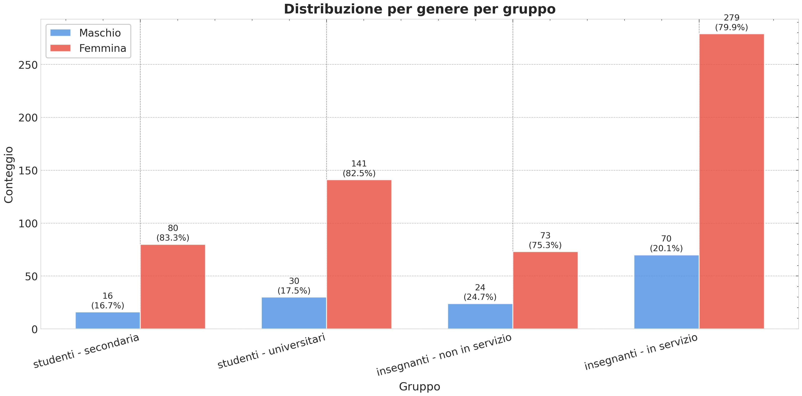

# Progetto Articolo: AI in Education

Progetto per la scrittura e conversione dell'articolo scientifico "Bridging the Gap: Trust, Competence, and Concern in the Integration of AI among Teachers and Students".

## 📁 Struttura del Progetto

```
articolo/
├── bridging-the-gap-article-draft.md              ⭐ ARTICOLO PRINCIPALE (Markdown)
├── Makefile                      🔧 Build system per conversioni
│
├── sources/                      📚 FONTI - Materiali di riferimento
│   ├── presentations/           # Presentazioni PowerPoint/PDF originali
│   ├── notes/                   # Note, schemi, discorsi
│   └── extracted/               # Dati estratti da presentazioni
│
├── references/                   📖 Bibliografia e citazioni
│   ├── references.bib           # Bibliografia BibTeX (principale)
│   ├── references.ris           # Bibliografia RIS (sorgente)
│   ├── apa.csl                  # Stile citazioni APA
│   └── references_summary.md    # Riepilogo riferimenti bibliografici
│
├── assets/                       🖼️ Risorse grafiche
│   ├── charts/                  # Materiali originali / bozze
│   └── figures/                 # Figure curate per la pubblicazione
│       ├── published/           # File referenziati nel Markdown
│       └── manifest.csv         # Mappa figure_id → sorgente export
│
├── data/                         📊 Dataset di ricerca
│   ├── raw/surveys/             # Questionari originali (studenti / insegnanti)
│   ├── interim/                 # CSV intermedi condivisi
│   └── processed/               # Tabelle finali pronte per la pubblicazione
│
├── analysis/                     📈 Export notebook
│   └── exports/                 # run-AAAA-MM-GG + symlink latest
│
├── templates/                    📄 Template di conversione
│   └── template_latex.tex       # Template LaTeX personalizzato
│
├── scripts/                      🔧 Script e tool
│   ├── conversion/             # md_to_latex, detect_citeproc, ris_to_bibtex, ecc.
│   ├── analysis/               # publish_figures, chart helpers
│   ├── language/               # marcatori bilingui
│   ├── audio/                  # generatore Edge TTS
│   └── legacy/                 # convert_to_pdf (storico)
│
├── output/                       📦 File generati (non versioned)
│   ├── latex/                  # File LaTeX generati
│   ├── pdf/                    # PDF generati
│   └── word/                   # File Word generati
│
└── docs/                         📚 Documentazione del progetto
    ├── README_LATEX.md         # Guida completa LaTeX
    ├── QUICK_START_LATEX.md    # Quick start LaTeX
    ├── CONVERSION_GUIDE.md     # Guide di conversione
    └── PROJECT_SUMMARY.md      # Riepilogo progetto
```

## 🚀 Quick Start

### 1. Modifica l'articolo

Lavora sul file principale:
```bash
nano bridging-the-gap-article-draft.md
```

### 2. Converti in LaTeX

```bash
# Usa Makefile (raccomandato)
make latex

# Oppure usa lo script direttamente
python3 scripts/conversion/md_to_latex.py bridging-the-gap-article-draft.md
```

### 3. Compila in PDF

```bash
# Sostituisci <slug_timestamp> con la cartella generata (es. bridging-the-gap-..._2025-11-09_12-18)
cd output/<slug_timestamp>
pdflatex <slug_timestamp>.tex
```

## 📝 Workflow di Lavoro

### Scrivere l'articolo

1. **Fonte principale**: [bridging-the-gap-article-draft.md](bridging-the-gap-article-draft.md) (Markdown)
2. **Fonti di riferimento**: Cartella [sources/](sources/)
   - Presentazioni originali
   - Note e schemi
3. **Bibliografia**: [references/references.bib](references/references.bib)
4. **Immagini**: Cartella [assets/figures/published/](assets/figures/published/)

### Conversioni disponibili

| Formato | Comando | Output (pattern) |
|---------|---------|-----------------|
| LaTeX | `make latex` | `output/<slug_timestamp>/<slug_timestamp>.tex` |
| PDF | `make pdf` | `output/<slug_timestamp>/<slug_timestamp>_both.pdf` |
| Word | `make docx` | `output/<slug_timestamp>/<slug_timestamp>_both.docx` |
| HTML | `make html` | `output/<slug_timestamp>/<slug_timestamp>_both.html` |

> **Naming**: `<slug_timestamp>` corrisponde al titolo inglese (solo la parte prima dei due punti) trasformato in slug (`bridging-the-gap`) seguito dal timestamp `YYYY-MM-DD_HH-MM`. Esempio completo:\
> `output/bridging-the-gap_2025-11-09_12-18/bridging-the-gap_2025-11-09_12-18_en.pdf`

### Collaborazione via Google Docs / DOCX

Puoi far lavorare editor esterni su Google Docs seguendo questo flusso:

1. Genera il DOCX più recente:
   ```bash
   make docx-both
   ```
2. Carica il file in Google Drive, abilita i commenti/modifiche e raccogli il feedback.
3. Scarica la nuova versione e importala nel Markdown sorgente:
   ```bash
   python scripts/analysis/docx_sync.py collab/versione_google.docx \
     --target bridging-the-gap-article-draft.md
   ```
   Lo script usa Pandoc per convertire il DOCX in Markdown, conserva il front matter e crea un backup automatico.

## 🛠️ Comandi Makefile

```bash
make latex      # Converti MD → LaTeX (con template personalizzato)
make pdf        # Genera PDF direttamente
make docx       # Genera Word/DOCX
make html       # Genera HTML
make clean      # Pulisci file generati
make help       # Mostra tutti i comandi disponibili
```

## 📖 Documentazione

- **[Quick Start LaTeX](docs/guides/QUICK_START_LATEX.md)** - Inizia subito con LaTeX
- **[Guida LaTeX Completa](docs/guides/README_LATEX.md)** - Documentazione dettagliata
- **[Guida Conversioni](docs/guides/CONVERSION_GUIDE.md)** - Tutte le conversioni disponibili
- **[Riepilogo Progetto](docs/PROJECT_SUMMARY.md)** - Panoramica del progetto
- **[Scripts Overview](scripts/README.md)** - Ruolo di ogni script e sottocartella

## 🎨 Personalizzazione

### Template LaTeX

Modifica il template LaTeX in [templates/template_latex.tex](templates/template_latex.tex):

- **Preambolo**: Pacchetti, margini, font
- **Stile citazioni**: BibTeX o BibLaTeX
- **Grafica**: Path immagini, didascalie
- **Comandi custom**: Macro LaTeX personalizzate

### Script di conversione

Gli script in [scripts/](scripts/) sono configurabili:

```bash
# Esempio: conversione personalizzata
python3 scripts/conversion/md_to_latex.py bridging-the-gap-article-draft.md \
  -t templates/custom_template.tex \
  -b references/references.bib \
  -o output/latex/custom.tex
```

## 📚 Gestione Bibliografia

### File principali

- **Sorgente**: [references/references.ris](references/references.ris) (formato RIS)
- **Convertito**: [references/references.bib](references/references.bib) (BibTeX)
- **Stile**: [references/apa.csl](references/apa.csl) (APA style)

### Convertire RIS → BibTeX

```bash
python3 scripts/conversion/ris_to_bibtex.py references/references.ris references/references.bib
```

Oppure usa il Makefile:
```bash
make bib
```

## 🖼️ Gestione Immagini e Grafici

- I grafici generati dal notebook finiscono in [analysis/exports/latest/](analysis/exports/latest/) (snapshot completo, inclusi CSV e SVG).
- Le figure utilizzate dall'articolo vengono promosse in [assets/figures/published/](assets/figures/published/) tramite lo script `python scripts/analysis/publish_figures.py`, che aggiorna anche il [manifest](assets/figures/manifest.csv).
- I materiali grezzi o mockup rimangono in [assets/figures/published/](assets/figures/published/).

Esempio di inclusione nel Markdown:

```markdown
{#fig:gender-dist-it}
```

## 📊 Gestione Dati

- I questionari originali (studenti / insegnanti) risiedono in [data/raw/surveys/](data/raw/surveys/). Non modificarli: eventuali nuove versioni vanno salvate qui mantenendo la cronologia.
- I dataset intermedi condivisi (es. `combined_insegnanti_studenti.csv`) vanno promossi in [data/interim/](data/interim/) se devono essere riutilizzati o condivisi senza rigenerazione.
- Tutti i percorsi utilizzati da notebook e script sono definiti in [config/paths.json](config/paths.json); aggiornando questo file si mantiene allineato l'intero workflow.

Il template LaTeX è già configurato per trovarle automaticamente.

## 📦 File Output

Tutti i file generati vanno in `output/`:

- **LaTeX**: `output/latex/*.tex`
- **PDF**: `output/pdf/*.pdf`
- **Word**: `output/word/*.docx`

Questi file possono essere ricreati in qualsiasi momento e non dovrebbero essere versionati (aggiungi a `.gitignore`).

## ⚙️ Requisiti

### Software necessario

- **Pandoc** (>= 2.5, raccomandato >= 2.11)
- **Python 3**
- **LaTeX** (texlive-full)

### Installazione dipendenze

```bash
# Ubuntu/Debian
sudo apt-get update
sudo apt-get install pandoc texlive-full python3

# Oppure usa il Makefile
make install-deps
```

### Verifica installazione

```bash
make check-deps
```

## 🔍 Fonti del Progetto

La cartella [sources/](sources/) contiene tutto il materiale di riferimento:

### Presentazioni
- Presentazione Palermo (PPTX + PDF)
- Dati estratti dalle presentazioni

### Note
- Discorso di Palermo
- Schema dell'articolo
- Appunti vari

Questi materiali servono come **fonte** per scrivere l'articolo principale in Markdown.

## 📊 Workflow Completo

1. **Raccogli fonti** → `sources/`
2. **Scrivi articolo** → `bridging-the-gap-article-draft.md`
3. **Aggiungi immagini** → `assets/figures/published/`
4. **Gestisci bibliografia** → `references/`
5. **Converti in LaTeX** → `make latex`
6. **Personalizza** → `templates/template_latex.tex`
7. **Compila PDF** → `pdflatex` o `latexmk`
8. **Output finale** → `output/pdf/`

## 🎯 Vantaggi della Struttura

✅ **Separazione chiara**: Source vs Output
✅ **Fonti organizzate**: Tutto il materiale di riferimento in un posto
✅ **Riproducibilità**: Output può essere ricreato da source
✅ **Manutenibilità**: Facile trovare e modificare file
✅ **Scalabilità**: Facile aggiungere nuovi materiali
✅ **Workflow pulito**: Makefile gestisce tutto

## 📝 Note

- Il file principale è `bridging-the-gap-article-draft.md` (root del progetto)
- Le fonti stanno in `sources/` (materiale di riferimento)
- I template stanno in `templates/` (riutilizzabili)
- L'output va in `output/` (file generati, temporanei)
- La documentazione sta in `docs/` (guide e README)

## 🆘 Aiuto

Per maggiori informazioni:

```bash
# Help Makefile
make help

# Help script conversione
python3 scripts/conversion/md_to_latex.py --help

# Leggi documentazione
cat docs/guides/README_LATEX.md
cat docs/guides/QUICK_START_LATEX.md
```

## 📄 Licenza

Progetto personale per articolo scientifico.

---

**Ultima modifica**: 2025-10-18
**Versione**: 2.0 (Struttura riorganizzata)
