<!-- lang:it -->
## Introduzione: La GenAI come Mediatore Culturale nell'Educazione
L’intelligenza artificiale generativa (GenAI) sta entrando nelle scuole e nelle università italiane in modo spontaneo, senza una pianificazione pedagogica strutturata. A differenza dei precedenti strumenti digitali, che si limitano a recuperare o visualizzare contenuti esistenti (motori di ricerca, database, siti web, e-book ecc.), la GenAI ricostruisce attivamente la conoscenza a ogni interazione. Quando, ad esempio, uno studente interroga ChatGPT sulla Rivoluzione francese, non riceve un documento o una fonte, ma una narrazione appena sintetizzata delle informazioni più rilevanti, recuperate dalla sua rete di conoscenze, che si presenta con una voce autorevole.

Questo processo è genuinamente creativo, nel senso espresso da Bruno Munari. Infatti, nella sua opera "Fantasia" [@Munari1977Fantasia], definisce la creatività come una ricombinazione di elementi esistenti in nuove configurazioni, in cui la cifra creativa consiste nel combinare in modo originale e nuovo cose molto diverse, ad esempio uno specchio elastico piuttosto che un'invenzione *ex nihilo*. La GenAI opera precisamente attraverso tali processi ricombinatori. 

Questa capacità creativa, che nei modelli è più propriamente associata al termine "generativa", consente a questi strumenti di svolgere molti compiti cognitivi di alto livello che fino a ieri erano prerogativa esclusiva dell'essere umano: la scrittura di saggi, la sintesi di documenti complessi, la traduzione di testi, la produzione di codice software, la selezione e gerarchizzazione di notizie, l'elaborazione di strategie argomentative ecc. Quando uno studente chiede a ChatGPT di riassumere un capitolo di filosofia o di proporre una struttura per un tema, il sistema esegue istantaneamente operazioni di selezione delle fonti rilevanti, estrazione e gerarchizzazione dei concetti più importanti e costruzione di nessi logici, producendo un testo strutturato e coerente.

È tuttavia proprio la capacità generativa della GenAI a suscitare le principali perplessità. Alcuni studiosi sostengono che tali sistemi possano operare come un “pappagallo stocastico” [@Bender2021DangersS], vale a dire come un pattern-matcher privo di autentica comprensione. Inoltre, la GenAI tende a incorporare e amplificare i bias sistematici presenti nei dati di addestramento, riflettendo e, talvolta, rinforzando le disuguaglianze della società che li ha prodotti. Si tratta di *bias* di genere che associano determinate professioni a specifici sessi, *bias* razziali che perpetuano stereotipi su culture e gruppi etnici, *bias* socioeconomici che privilegiano prospettive dominanti marginalizzando visioni alternative [@Navigli2023BiasesLLM; @Bender2021DangersS]. Quando uno studente chiede a un'IA di descrivere "un ingegnere" o "un'infermiera", le risposte riflettono sistematicamente questi pregiudizi, naturalizzandoli come verità neutre e rendendoli invisibili proprio attraverso l'apparente oggettività dell'output algoritmico.

Accanto a questo problema dei *bias*, si pone la questione della trasparenza e della *accountability*. Nei media tradizionali, libri, film, televisione, giornali, il lavoro di cura della conoscenza è svolto da autori, editori, curatori e *gatekeeper* giornalistici che facevano scelte deliberate e ne portavano la responsabilità. I *gatekeeper*, in particolare, svolgono un ruolo cruciale di filtro e validazione: decidendo quali notizie meritano l'attenzione, quale rilevanza attribuire agli eventi, quali fonti siano affidabili. Questo processo, pur non immune da *bias*, è trasparente nelle sue responsabilità—si può identificare chi ha preso le decisioni editoriali e chiamarlo a rispondere delle sue scelte. Negli strumenti di GenAI, questo compito è delegato a meccanismi computazionali che operano senza un intento autoriale, *accountability* o criteri di selezione trasparenti.

Si aggiunge a tutto ciò la prospettiva della sostituzione dell'insegnante. Alcuni visionari tecnologici immaginano che l'IA possa non solo automatizzare compiti intellettuali, ma sostituire completamente la figura del docente. Bill Gates, all'evento ASU+GSV di San Diego, ha prospettato che entro un anno e mezzo chatbot come ChatGPT potranno insegnare a leggere e scrivere ai bambini con l'efficacia di un tutor umano [@Clifford2023BillGates]. Questa visione trova eco anche nella fiction, come nella serie *Star Wars: Skeleton Crew*, dove bambini interagiscono con droidi educatori in contesti di apprendimento completamente automatizzati [@Watts2024StarWars]. Al di là delle questioni tecniche, se questi sistemi possano svolgere adeguatamente compiti che una volta erano di competenza umana, emerge una domanda pedagogica molto spinosa: *quando una macchina si sostituisce alla relazione educativa, che effetti ha questo processo sulla formazione intellettuale e umana?*

Un'altra questione riguarda la dimensione epistemologica, legata al modo in cui conosciamo il mondo. Questi sistemi non si limitano a impacchettare informazioni e darcele in maniera che sembra neutra: come molti media prima di loro ma in maniera più raffinata modificano attivamente il nostro modo di percepire la realtà, ci fanno vedere le cose diversamente, ci spingono verso ragionamenti che non avremmo sviluppato autonomamente. Quando uno studente chiede a ChatGPT di spiegare un concetto complesso, non riceve solo dati, riceve una particolare interpretazione, una specifica cornice cognitiva, un modo di pensare che diventa invisibilmente parte del suo processo di apprendimento.Il rischio, da una parte, è di essere condizionati in maniera velata nel nostro modo di pensare; dall’altra, che la delega sistematica dei processi cognitivi possa atrofizzare le nostre capacità di pensiero critico, di analisi autonoma e di sintesi originale, trasformandoci da pensatori attivi in consumatori passivi di elaborazioni algoritmiche.

Strettamente connesso alla questione epistemologica è il problema della velocità e dell'efficienza, valori sempre più dominanti nella nostra società. Se gli aspetti che abbiamo menzionato modificano *cosa* pensiamo, l'accelerazione radicale elimina il *tempo* necessario per pensare. Infatti, La GenAI contibuisce ad amplifica la spinta verso tempi di risposta sempre più ridotti. Uno studente che un tempo avrebbe impiegato ore o giorni per elaborare una tesina, leggendo fonti, prendendo appunti, riorganizzando le idee, scrivendo bozze successive, può ora ottenere un testo completo in pochi secondi. Questa accelerazione radicale elimina quello che gli educatori chiamano "tempo di incubazione" [@Wallas1926TheArt]: quel periodo apparentemente improduttivo ma cognitivamente cruciale in cui le idee sedimentano, si connettono, maturano. La riflessione profonda richiede lentezza; richiede momenti di sospensione, di dubbio, di ritorno critico sul proprio ragionamento—pause, un diritto al silenzio [@Caligiore2024Curarsicon] che nel contesto contemporaneo vengono sempre più percepite come lussi ingiustificabili. La GenAI, offrendo soluzioni istantanee, rischia di far percepire questa lentezza riflessiva non come una risorsa cognitiva essenziale ma come un'inefficienza da eliminare. Il messaggio implicito è chiaro: perché impiegare tre giorni quando puoi ottenere lo stesso risultato in tre minuti? *Ma il risultato è davvero lo stesso?* Il processo conta, non solo il prodotto—e un processo che salta la fase della rielaborazione personale produce apprendimenti superficiali, privi di quella sedimentazione che trasforma l'informazione in conoscenza autentica. Inoltre, la velocità ci spinge anche ad accettare testi o soluzioni "buone abbastanza" [@Simon1956Rationalch] ma non perfette, aumentando l'accettazione passiva di errori o addirittura portandoci a non controllare affatto gli output. Questa combinazione di accelerazione e abbassamento degli standard qualitativi rischia di normalizzare una superficialità che, nel tempo, erode le capacità critiche necessarie per discernere quando un risultato è genuinamente valido e quando è solo apparentemente plausibile.

Eppure, sarebbe riduttivo considerare la GenAI solo attraverso la lente dei rischi. Questi stessi strumenti, usati con consapevolezza critica, possono fungere da *amplificatori cognitivi* [@Rizzo2025Pensarecon]: supportare la strutturazione del pensiero, offrire prospettive alternative, accelerare la ricerca bibliografica, facilitare la revisione di testi complessi. L'IA può diventare un *partner dialogico* nel processo di riflessione e scrittura, aiutando non a sostituire il pensiero critico ma a esercitarlo più efficacemente. Studenti e docenti possono utilizzare questi strumenti per esplorare approcci metodologici diversi, verificare la coerenza argomentativa, generare ipotesi da vagliare criticamente. 

Perché la GenAI possa funzionare come amplificatore cognitivo anziché come sostituto del pensiero, è necessaria una competenza specifica—quella che potremmo chiamare *alfabetizzazione critica all'IA* [@Agrusti2023LAIlitera]. Non basta saper operare tecnicamente questi strumenti; occorre sviluppare capacità di valutazione critica degli output, riconoscimento dei limiti, identificazione di allucinazioni e *bias*, comprensione dei contesti d'uso appropriati. Uno studente che usa ChatGPT per scrivere un saggio deve saper distinguere tra un'argomentazione solida e una formulazione plausibile ma superficiale; deve saper verificare le fonti, integrare criticamente i suggerimenti dell'IA con la propria riflessione, riconoscere quando l'output riproduce stereotipi o semplificazioni eccessive. Analogamente, un docente che utilizza l'IA per generare materiali didattici—quiz personalizzati, prove di autoverifica, simulazioni interattive, contenuti multimediali—deve possedere criteri di valutazione pedagogica per discernere cosa funziona effettivamente in termini di apprendimento e cosa è solo tecnicamente impressionante. La competenza nell'uso dell'IA, quindi, non è meramente strumentale: è una meta-competenza che richiede pensiero critico, capacità di giudizio, e consapevolezza epistemologica. Questa alfabetizzazione critica non si sviluppa spontaneamente attraverso l'uso; richiede formazione esplicita, pratica guidata, e opportunità strutturate di riflessione sui propri processi di interazione con l'IA. La sfida educativa diventa quindi doppia: formare studenti competenti nell'uso critico dell'IA, e formare docenti capaci di insegnare questa competenza mentre la esercitano essi stessi.

 Vista la complessità del fenomeno—che Morin [@Morin2008PenserCompl] definirebbe irriducibile a semplificazioni—è comprensibile che le posizioni rispoetto all'adozioni dell'IA nel contesto educativo oscillino tra "integrati" e "apocalittici" [@Eco1964Apocalittici], spesso nella stessa persona: chi vede nell'IA una rivoluzione pedagogica democratizzante può al contempo temere l'erosione del pensiero critico; chi riconosce i rischi per il rapporto educativo umano può contemporaneamente apprezzarne le potenzialità. Da qui la posizione prudente e di attesa di molti insegnanti. 

La questione centrale diventa quindi: il mondo dell'educazione è pronto ad affrontare questa trasformazione? Per rispondere occorre interrogarsi su molteplici dimensioni: come e quanto vengono effettivamente utilizzati questi strumenti nelle pratiche quotidiane? Studenti e docenti si sentono competenti nell'usarli e nel comprenderne i meccanismi? C'è fiducia nella tecnologia e nella capacità degli attori educativi di usarla responsabilmente? Quali preoccupazioni e barriere frenano l'adozione? Le istituzioni offrono un supporto formativo adeguato? Come viene percepito il cambiamento nelle pratiche didattiche?
<!-- /lang:it -->

<!-- lang:it -->
## Obiettivi di ricerca

Per rispondere a queste domande, questo studio adotta un approccio quantitativo che investiga il grado di integrazione dell'Intelligenza Artificiale nelle pratiche didattiche di scuole e università italiane. Nello specifico, l'indagine si propone di misurare sei dimensioni fondamentali, che insieme restituiscono un quadro dello stato attuale di questa trasformazione.

1. **Practice patterns (P)** (uso): uso di strumenti di IA nel contesto della propria vita quotidiana e di.quello educativo.

2. **Readiness beliefs (R)** (competenza percepita): percezione della prorpria competenza pratica e teorica degli strumenti di IA.

3. **Adequacy of support (A)** (adeguatezza della formazione): valutazione della preparazione e supporto istituzionale formale.

4. **eXpectations (X)** (cambiamento percepito): aspettative sull'impatto trasformativo dell'IA sulle pratiche di insegnamento e apprendimento.

5. **Interpersonal & Institutional trust (I)** (fiducia e confidenza): convinzione sull'affidabilità dell'IA  e nella capacità degli attori umani di usarla responsabilmente.

6. **Skepticisms (S)** (preoccupazioni): ansie sui rischi e barriere all'adozione.

Ciascuna dimensione affronta un aspetto critico dell'integrazione: comportamento, conoscenza, supporto istituzionale, anticipazione del cambiamento, facilitatori psicologici e barriere psicologiche. La fondazione teorica per ciascuna dimensione, e i framework che spiegano le loro interrelazioni, sono elaborati nella sezione seguente.
<!-- /lang:it -->

<!-- lang:it -->
## Quadro Teorico: Il Framework PRAXIS per l'Integrazione dell'IA
In questa sezione dell'articolo spieghieremo il motivo per cui abbiamo costruito questo il framework PRAXIS e quali sono le sue basi teoriche.

**Perché queste sei dimensioni?** La scelta non è arbitraria ma emerge da tre considerazioni convergenti. Primo, **sul piano empirico**: le ricerche sull'adozione tecnologica in ambito educativo mostrano che questi sei fattori predicono costantemente successo o fallimento dell'integrazione. Secondo, **sul piano teorico**: ciascuna dimensione corrisponde a un costrutto consolidato nelle scienze cognitive e sociali—il Technology Acceptance Model (TAM) per uso e fiducia, la teoria dell'autoefficacia di Bandura per la competenza percepita, il modello socio-cognitivo della fiducia di Castelfranchi e Falcone, il Concerns-Based Adoption Model (CBAM) per le preoccupazioni evolutive, la teoria della diffusione di Rogers per il cambiamento percepito. Terzo, **sul piano pragmatico**: queste dimensioni sono *azionabili*—possono essere modificate attraverso interventi istituzionali (formazione, supporto, policy), a differenza di variabili puramente demografiche. Insieme, coprono l'intero spettro dell'integrazione: *cosa fanno* (uso),*cosa sanno* (competenza), *cosa ricevono* (formazione), *cosa credono* (fiducia),*cosa temono* (preoccupazioni), *cosa anticipano* (cambiamento). Questo framework multidimensionale permette di superare classificazioni binarie semplicistiche (adottanti vs non adottanti) e di restituire un quadro articolato dell'integrazione dell'IA come intreccio complesso di comportamenti, conoscenze, supporti istituzionali, credenze cognitive, stati emotivi e traiettorie evolutive.

**Il framework PRAXIS.** Per rendere questo modello più memorabile e facilmente referenziabile, designiamo queste sei dimensioni come il **PRAXIS Framework**—un acronimo che riflette il concetto pedagogico fondamentale di praxis, dove teoria e pratica si integrano nell'azione educativa. Ciascuna lettera corrisponde a una dimensione chiave:

- **P**ractice patterns — modelli d'uso (usage patterns)
- **R**eadiness beliefs — competenza percepita (perceived competence)
- **A**dequacy of support — adeguatezza della formazione (training adequacy)
- e**X**pectations — cambiamento percepito (perceived change)
- **I**nterpersonal & Institutional trust — fiducia e confidenza nella tecnologia e negli attori umani (trust and confidence)
- **S**kepticisms — preoccupazioni (concerns)

Questa denominazione sottolinea che l'integrazione dell'IA nell'educazione non è un fenomeno puramente tecnico ma una trasformazione della praxis educativa che richiede allineamento tra credenze cognitive, supporto istituzionale, competenze operative e consapevolezza critica. Il framework PRAXIS funziona sia in italiano sia in inglese, facilitando la comunicazione scientifica internazionale e la citabilità del modello.

### Practice Patterns (P): Fondamenti Comportamentali dell'Integrazione dell'IA

Stabilire i *practice patterns* (modelli d'uso) fornisce la base empirica dell'intera indagine. Senza ancorare l'analisi alla realtà comportamentale—capire con quanta frequenza, con quanta intensità e con quanta varietà gli strumenti di IA vengono effettivamente impiegati—le valutazioni su competenza, fiducia o preoccupazioni rischiano di rimanere astratte. Questa dimensione rivela l'ampiezza della diffusione dell'IA nelle pratiche educative, costruendo la linea di riferimento rispetto a cui valutare se lo stato di integrazione psicologico di studenti e docenti sia coerente con il loro coinvolgimento reale. Misurare l'uso consente inoltre di individuare eventuali disparità fra gruppi, elemento essenziale per comprendere se l'integrazione dell'IA proceda in modo uniforme o stia generando nuove fratture.

Da una prospettiva teorica, i modelli d'uso rappresentano l'esito comportamentale di tutte le dimensioni psicologiche esaminate in questo studio. Il Technology Acceptance Model (TAM) [@Davis1989PerceivedU] colloca l'utilizzo effettivo come manifestazione culminante delle credenze cognitive (utilità percepita e facilità d'uso percepita) e delle intenzioni comportamentali. Nel nostro quadro, i modelli d'uso funzionano come variabile dipendente del TAM: il comportamento osservabile che emerge quando credenze di competenza, fiducia, supporto istituzionale e livelli gestibili di preoccupazione si allineano per facilitare l'adozione. Misurando l'uso insieme ai suoi antecedenti psicologici possiamo verificare se il percorso del TAM—variabili esterne → credenze → intenzioni → comportamento—si manifesti nei contesti educativi dell'IA.

Tuttavia, l'uso da solo dice poco sulla qualità del coinvolgimento o sui percorsi attraverso cui si sviluppano le competenze. La ricerca sulla *participatory culture* e sull'apprendimento digitale informale [@Jenkins2009Confrontin; @Jenkins2015Participat] mostra che gli utenti acquisiscono spesso abilità pratiche attraverso apprendimenti guidati dai pari, comunità di pratica e sperimentazione condivisa piuttosto che tramite istruzione formale. Jenkins e collaboratori documentano come i giovani sviluppino alfabetizzazioni mediali sofisticate grazie a pratiche partecipative—remix, comunità di fan, costruzione collaborativa di conoscenza—senza un'esplicita impalcatura pedagogica. Questa prospettiva suggerisce che l'adozione tecnologica possa procedere per canali informali anche in assenza di formazione istituzionale strutturata, con potenziali implicazioni per lo sviluppo di competenze critiche accanto a quelle operative.

### Readiness Beliefs (R): Autoefficacia e Comprensione Critica

L'uso da solo non permette di capire se il coinvolgimento sia superficiale o consapevole. Le *readiness beliefs* (competenza percepita) colmano questa lacuna distinguendo tra abilità pratica (uso operativo degli strumenti) e comprensione teorica (conoscenza di meccanismi, capacità e limiti). La distinzione è cruciale: un uso intenso accompagnato da bassa competenza teorica suggerisce un'adozione potenzialmente acritica, mentre un'elevata conoscenza teorica con scarse competenze pratiche indica un potenziale non realizzato. Misurare entrambe le dimensioni fra studenti e docenti consente di individuare se possiedono la profondità di comprensione necessaria per un uso critico e responsabile, anziché una mera familiarità strumentale.

La teoria dell'autoefficacia di Bandura [@Bandura1977Selfeffic; @Bandura1986SocialFoun] fornisce il quadro di riferimento per comprendere la competenza percepita. L'autoefficacia—le convinzioni degli individui circa la propria capacità di svolgere compiti specifici—influenza in modo determinante motivazione, comportamento e resilienza di fronte alle difficoltà. Essa deriva da quattro fonti principali: esperienze di padronanza (portare a termine con successo un compito), esperienze vicarie (osservare altri), persuasione sociale (incoraggiamento da parte di figure significative) e stati fisiologici (stress o fiducia). Nei contesti tecnologici, l'autoefficacia tecnologica—la convinzione di saper usare con successo strumenti tecnologici—predice costantemente l'adozione, il coinvolgimento nel tempo e la disponibilità a esplorare funzionalità avanzate [@Compeau1995ComputerSelfEfficacy].

Nel nostro quadro, l'autoefficacia spiega la distinzione tra competenza pratica (abilità operativa) e competenza teorica (comprensione concettuale). Chi possiede un'elevata autoefficacia pratica ritiene di poter utilizzare con successo gli strumenti di IA, mentre chi ha un'elevata autoefficacia teorica ritiene di comprenderne i meccanismi e di poter valutare criticamente gli output. È importante ricordare che l'autoefficacia è specifica del dominio: si può essere fiduciosi nell'uso pratico pur dubitando delle proprie conoscenze teoriche, o viceversa. Gli individui con autoefficacia alta in entrambi i domini sono più propensi a superare l'uso superficiale e a ingaggiare un rapporto critico più profondo con gli strumenti di IA—ponendo domande su come vengono generati gli output, riconoscendo quando l'IA produce risultati inaffidabili e comprendendo i confini di impiego appropriati.

Il Technology Acceptance Model (TAM) [@Davis1989PerceivedU] collega l'autoefficacia al comportamento di adozione attraverso il costrutto della facilità d'uso percepita (PEOU). Il modello sostiene che chi percepisce una tecnologia come facile da usare—cioè poco dispendiosa in termini di sforzo—è più propenso ad adottarla. L'autoefficacia agisce come antecedente psicologico del PEOU: chi si sente competente percepisce gli strumenti come più accessibili e meno onerosi. Nel nostro studio la *competenza pratica percepita* operazionalizza questo percorso autoefficacia-TAM, misurando se studenti e docenti credono di poter utilizzare efficacemente gli strumenti di IA. Tale credenza predice se la sperimentazione iniziale si tradurrà in un'adozione duratura oppure se la bassa fiducia creerà barriere che frenano il coinvolgimento anche quando gli strumenti sono disponibili.

Fondamentalmente, l'autoefficacia interagisce con la fiducia: mentre la fiducia (discussa più avanti) riguarda *ciò che la tecnologia può fare in modo affidabile*, l'autoefficacia riguarda *ciò che io posso fare con la tecnologia in modo competente*. Entrambe le convinzioni sono necessarie per l'adozione: anche una fiducia totale nelle capacità dell'IA non supera una scarsa autoefficacia, e un'elevata autoefficacia non compensa una sfiducia di fondo nell'affidabilità o nell'appropriatezza della tecnologia.

### Adequacy of Support (A): Supporto Istituzionale come Moderatore

Il divario tra competenze attuali e competenze necessarie rimanda direttamente alla responsabilità istituzionale, rendendo l'*adequacy of support* (adeguatezza della formazione) una dimensione cruciale. Valutare se gli interventi di preparazione formale soddisfino i bisogni di studenti e docenti permette di misurare l'efficacia con cui i sistemi educativi stanno rispondendo alla trasformazione generata dall'IA. *Le istituzioni stanno equipaggiando proattivamente le proprie comunità o, al contrario, studenti e docenti navigano questo scenario senza un supporto adeguato?* Questa dimensione individua dove le politiche e l'allocazione di risorse sono più urgenti, distinguendo fra contesti in cui esistono infrastrutture ma risultano insufficienti e contesti in cui il supporto istituzionale è pressoché assente.

Da un punto di vista teorico, l'adeguatezza della formazione funziona come variabile esterna del TAM—fattori esterni alla tecnologia che influenzano utilità percepita e facilità d'uso [@Davis1989PerceivedU; @Scherer2019TechnologyAcceptance]. La ricerca sul TAM mostra costantemente che il supporto istituzionale, che comprende programmi di formazione, assistenza tecnica e incoraggiamento organizzativo, modella le credenze degli utenti nei confronti della tecnologia. Una formazione adeguata aumenta la facilità d'uso percepita rafforzando le competenze effettive e accresce l'utilità percepita mostrando come gli strumenti sostengano obiettivi ritenuti di valore. Al contrario, una formazione inadeguata lascia gli utenti incerti su come utilizzare gli strumenti in modo efficace (basso PEOU) e scettici sul fatto che lo sforzo richiesto giustifichi i benefici (basso PU). Nel nostro quadro, *adeguatezza della formazione* opera dunque come questa variabile esterna, aprendo percorsi attraverso cui gli interventi istituzionali possono facilitare l'adozione.

La formazione svolge inoltre il ruolo di moderatore nello sviluppo dell'autoefficacia. Come ricorda Bandura [@Bandura1986SocialFoun], l'autoefficacia si alimenta attraverso esperienze di padronanza, esperienze vicarie, persuasione sociale e gestione degli stati fisiologici. I programmi formativi efficaci forniscono tutte e quattro le componenti: opportunità strutturate di successo, dimostrazioni di uso efficace da parte di docenti o pari, incoraggiamenti e feedback costruttivi, riduzione dell'ansia grazie a contesti di supporto. Al contrario, una formazione carente rischia di minare l'autoefficacia generando esperienze frustranti, offrendo modelli inadeguati, fornendo feedback critici anziché costruttivi e alimentando ansia rispetto alle proprie competenze. La nostra misura di adeguatezza della formazione rileva se le istituzioni stanno costruendo l'autoefficacia o, involontariamente, la stanno indebolendo.

È importante sottolineare che la relazione tra formazione e competenza non è deterministica. Il lavoro di Jenkins sulla *participatory culture* [@Jenkins2009Confrontin; @Jenkins2015Participat] mostra che è possibile sviluppare notevoli competenze pratiche attraverso apprendimenti informali guidati dai pari anche in assenza di istruzione formale. Questo quadro teorico suggerisce che l'adozione tecnologica possa procedere attraverso canali informali di apprendimento partecipativo anche quando il supporto istituzionale formale risulti carente. Tuttavia, l'apprendimento informale eccelle nel trasmettere il know-how operativo ma raramente fornisce i quadri critici strutturati che l'educazione formale dovrebbe garantire. La sfida istituzionale non è sostituire l'apprendimento informale, bensì affiancarlo—valorizzando entusiasmo e competenze pratiche sviluppate dagli utenti e aggiungendo profondità teorica, strumenti di valutazione critica e considerazioni etiche che l'apprendimento tra pari affronta solo in modo sporadico.

### eXpectations (X): Consapevolezza Meta-Cognitiva e Integrazione

Le *expectations* (cambiamento percepito) rilevano se gli attori educativi si aspettano una trasformazione e in che modo la concettualizzano. Le aspettative sull'impatto dell'IA sulle pratiche didattiche e sulle modalità di apprendimento rivelano il grado di preparazione all'adattamento: un'attesa realistica del cambiamento segnala una preparazione psicologica, mentre negare l'impatto o nutrire aspettative irrealistiche (sia utopiche sia distopiche) indica possibili resistenze o future delusioni. Per i docenti misuriamo sia le aspettative auto-riferite (l'impatto sulla *propria* didattica) sia le percezioni etero-riferite (l'impatto sulla didattica in generale), perché eventuali discrepanze tra le due possono indicare atteggiamenti difensivi verso il cambiamento. Comprendere queste aspettative aiuta le istituzioni a gestire il processo di trasformazione, allineando le attese degli attori educativi con traiettorie realistiche.

Il cambiamento percepito operazionalizza la consapevolezza meta-cognitiva della trasformazione: la capacità di riconoscere e anticipare in che modo l'integrazione dell'IA modificherà pratiche consolidate, ruoli e relazioni. Questa dimensione si collega allo stadio più alto del CBAM, la *consequence concern*, in cui l'attenzione si sposta dalle preoccupazioni auto- o task-oriented alla considerazione degli impatti più ampi [@Hall1987CBAM]. I docenti che prevedono cambiamenti significativi mostrano di riconoscere che l'IA è più di un nuovo strumento operativo: è una forza trasformativa capace di ridefinire pedagogia, valutazione e rapporto docente-studente. Viceversa, negare il cambiamento—liquidandolo con "l'IA non influirà davvero sul mio insegnamento" o non cogliendone l'ampiezza—suggerisce resistenze psicologiche o scarso coinvolgimento nell'innovazione.

Il cambiamento percepito è inoltre legato alle teorie sulla resistenza e sulla diffusione delle innovazioni. Secondo Rogers [@Rogers2003DiffusionI], il vantaggio relativo percepito—ossia il grado in cui un'innovazione è ritenuta migliore rispetto alle pratiche esistenti—è un predittore chiave dell'adozione. Chi si attende cambiamenti positivi (maggiore efficienza, migliori esiti di apprendimento, nuove possibilità pedagogiche) percepisce un alto vantaggio relativo ed è psicologicamente pronto ad adottare. Chi anticipa cambiamenti negativi (atrofia delle competenze, sostituzione di ruoli, perdita di autenticità pedagogica) percepisce invece svantaggi che alimentano resistenze. Misurando le aspettative di cambiamento valutiamo se gli attori educativi interpretano l'integrazione dell'IA come opportunità o come minaccia—un orientamento psicologico fondamentale che plasma tutte le altre dimensioni dell'integrazione.

È particolarmente significativo distinguere tra aspettative auto-riferite (impatto sul *mio* insegnamento) e percezioni etero-riferite (impatto sull'insegnamento *in generale*). Questa distinzione mette in luce possibili meccanismi difensivi: i docenti possono riconoscere che l'IA trasformerà l'educazione nel suo complesso pur sostenendo che la propria pratica resterà immutata. Tali discrepanze possono segnalare strategie psicologiche di distanziamento—riconoscere l'inevitabilità esterna mantenendo un senso di eccezionalità personale—che rischiano di ostacolare un coinvolgimento autentico e un reale adattamento.

### Interpersonal & Institutional Trust (I): Fondamenti Cognitivi dell'Adozione

Anche una formazione adeguata non garantisce un'integrazione efficace se persistono barriere psicologiche. *Interpersonal & institutional trust* (fiducia e confidenza) agiscono come guardiani dell'adozione: gli attori educativi che non sono convinti dell'affidabilità o dell'appropriatezza dell'IA in contesti educativi—o, nel caso dei docenti, che dubitano della capacità degli studenti di usarla responsabilmente—resisteranno all'integrazione a prescindere dalla competenza o dalla formazione disponibili. Misuriamo la fiducia sia come fattore abilitante sia come ostacolo, riconoscendo che l'adozione razionale dipende non solo dalla capacità ma anche dalla convinzione nel valore della tecnologia e nella capacità degli attori umani di utilizzarla in modo appropriato. Questa dimensione permette di capire se la resistenza derivi da lacune di conoscenza (colmabili con la formazione) o da uno scetticismo più profondo sul ruolo dell'IA nell'educazione (che richiede un dialogo pedagogico più articolato).

Il riferimento teorico per comprendere la fiducia è il modello socio-cognitivo elaborato da Castelfranchi e Falcone [@Castelfranchi2017RischioFidarsi; @Falcone2008Fiducia], radicato a sua volta nel più ampio quadro cognitivo e sociale sviluppato dagli stessi autori e dai loro collaboratori [@Castelfranchi1980Linguaggio; @Conte1995CognitiveAction; @Miceli1989CognitiveValues; @Miceli1995DifeseMente; @Miceli2002MindFuture; @Castelfranchi1998Bugie; @Castelfranchi2002Fondamenti; @Poggi2006ParoleCorpo; @Poggi2008MenteCuore; @Poggi2022PsicologiaComunicazione]. Questo modello fornisce strumenti analitici per interpretare atteggiamenti mentali, cognizione sociale e dinamiche comportamentali in contesti sociali complessi—esattamente il quadro interpretativo necessario per comprendere le reazioni cognitive ed emotive dei partecipanti all'integrazione dell'IA.

Secondo Castelfranchi e Falcone, la fiducia è un atteggiamento mentale complesso fondato sulle credenze e sugli obiettivi del soggetto che si fida. Ci si affida a qualcun altro quando si ritiene che l'altro possieda sia la *capacità* di svolgere il compito sia la *volontà* di farlo in modo coerente con i propri scopi. Questa struttura a due componenti—capacità e volontà—risulta particolarmente utile nei contesti educativi dell'IA, dove la fiducia opera su più livelli. I docenti devono confidare che i sistemi di IA abbiano la capacità di generare contenuti affidabili e pedagogicamente appropriati e la volontà (intesa, in termini antropomorfici, come intenzione progettuale e qualità dei dati di addestramento) di servire finalità educative anziché commerciali o manipolatorie. Devono inoltre potersi fidare del fatto che gli studenti abbiano sia la competenza sia il senso di responsabilità e l'attenzione etica necessari per utilizzare l'IA in modo appropriato, evitando impieghi scorretti o disonesti.

Questa struttura di fiducia a doppio oggetto—fiducia nella tecnologia e fiducia negli attori umani—differenzia il nostro quadro dagli studi che analizzano esclusivamente la fiducia tecnologica. La ricerca mostra che la fiducia influenza l'accettazione delle tecnologie di IA: solo quando sono percepite come affidabili e allineate agli obiettivi educativi docenti e studenti le integrano nelle pratiche quotidiane [@Allison2025CommitmentTrust]. Nei contesti educativi, tuttavia, la fiducia nella tecnologia non basta; agli educatori serve anche fiducia nel giudizio e nelle decisioni etiche degli studenti. Il nostro studio rileva entrambe le dimensioni: fiducia nell'integrazione dell'IA (trust nella tecnologia) e fiducia nell'uso responsabile da parte degli studenti (trust negli attori umani).

Il Technology Acceptance Model (TAM) collega la fiducia all'adozione attraverso il costrutto dell'utilità percepita (PU) [@Davis1989PerceivedU]. Il modello sostiene che gli utenti adottano tecnologie che ritengono in grado di migliorare le proprie prestazioni e di raggiungere obiettivi di valore. L'utilità percepita si allinea concettualmente con la fiducia di Castelfranchi e Falcone: credere che l'IA possa sostenere in modo affidabile gli obiettivi educativi equivale, di fatto, a fidarsi della sua capacità e del suo allineamento con i propri scopi. Nel nostro quadro, *fiducia e confidenza* operazionalizzano questo costrutto del TAM, misurando se gli attori educativi ritengono che l'IA supporti realmente gli obiettivi educativi. Tale convinzione, combinata con la competenza percepita (facilità d'uso), predice le intenzioni di adozione e i modelli d'uso effettivi.

Fondamentalmente, la fiducia interagisce con la competenza: una fiducia elevata senza competenza genera potenziale inespresso (si riconosce il valore della tecnologia ma mancano le abilità per usarla), mentre una competenza elevata senza fiducia produce un'esperienza resistente (si possiedono le abilità ma si rifiuta di impiegarle per scetticismo). Le due convinzioni devono allinearsi per ottenere un'adozione efficace e sostenuta.

### Skepticisms (S): Barriere Psicologiche all'Integrazione

La controparte della fiducia è lo *skepticism* (preoccupazione): mentre la fiducia misura la convinzione in esiti positivi, gli skepticisms catturano le ansie legate ai rischi. Comprendere natura e intensità di queste inquietudini—che si concentrino su integrità accademica, impoverimento delle competenze, bias, privacy o discontinuità pedagogica—aiuta a individuare le barriere psicologiche che frenano l'adozione. Le preoccupazioni indicano inoltre il grado di urgenza percepita: livelli elevati segnalano che gli attori educativi riconoscono l'integrazione dell'IA come una questione pressante che richiede attenzione immediata, mentre livelli bassi possono suggerire compiacenza o mancanza di consapevolezza. Mappare il panorama delle ansie permette di affrontare le paure specifiche con interventi mirati anziché con rassicurazioni generiche.

Nel quadro di Castelfranchi e Falcone le preoccupazioni rappresentano il rovescio della fiducia: riguardano il dubbio che l'IA sia affidabile (preoccupazioni legate alla tecnologia) o che gli attori umani abbiano la volontà di usarla responsabilmente (preoccupazioni legate agli attori). Le ricerche recenti sull'ansia da IA mostrano una relazione sfumata fra uso e apprensione: emerge un andamento a U in cui un impiego minimo scatena ansie anticipatorie (paura delle conseguenze sconosciute), un uso moderato riduce l'ansia grazie a familiarità e controllo, mentre un uso eccessivo può generare ansia da dipendenza (timore di un'eccessiva delega e perdita di autonomia) [@Frenkenberg2025PsychologicalDimensions]. Questo quadro teorico aiuta a interpretare natura e intensità delle preoccupazioni rilevate: derivano da scarsa familiarità—affrontabile con esposizione e formazione—oppure da paure etiche ed esistenziali più profonde che richiedono un dialogo sostanziale su valori, agenzia e ruoli appropriati dell'IA nell'educazione?

Il Concerns-Based Adoption Model (CBAM) [@Hall1987CBAM], sviluppato specificamente per le innovazioni educationali, offre un quadro evolutivo per comprendere come cambiano le preoccupazioni. Il modello identifica una progressione di stadi: in un primo momento prevalgono le *preoccupazioni auto-riferite* ("Riuscirò a imparare? Quale impatto avrà sul mio carico di lavoro?"), che gradualmente si spostano verso *preoccupazioni legate al compito* ("Come gestisco l'implementazione in modo efficace?") e infine verso *preoccupazioni sull'impatto* ("Quali benefici comporta per gli studenti? Quali implicazioni etiche comporta? Come posso perfezionare la mia pratica?"). Questa progressione suggerisce che le preoccupazioni non sono ostacoli statici ma stati psicologici in evoluzione che si modificano con l'esperienza e il supporto.

La lente evolutiva del CBAM è cruciale per interpretare i nostri risultati. Le preoccupazioni auto-riferite ("Posso usare questo strumento?") segnalano ansie tipiche delle fasi iniziali di adozione che possono essere affrontate con formazione e pratica guidata. Le preoccupazioni legate al compito ("Come lo implemento nel modo migliore?") indicano che gli individui hanno superato i dubbi sulla propria competenza e stanno affrontando le sfide dell'integrazione pratica—un segno di progresso. Le preoccupazioni sull'impatto ("Quali conseguenze produce sugli studenti?") rappresentano il livello di coinvolgimento più maturo, nel quale si considerano implicazioni etiche, pedagogiche e sociali più ampie. Misurando le preoccupazioni di docenti e studenti in fasi diverse dell'adozione possiamo diagnosticare la loro posizione lungo questa traiettoria evolutiva e individuare quali interventi favoriscano il passaggio verso un coinvolgimento centrato sull'impatto anziché restare bloccati su ansie auto-riferite.

L'andamento a U dell'ansia [@Frenkenberg2025PsychologicalDimensions] suggerisce che practice patterns moderati dovrebbero correlare con livelli più bassi di preoccupazione, mentre usi molto scarsi o molto intensi possono amplificarle—un'ipotesi che i nostri dati consentono di verificare. Tale pattern è coerente con gli stadi del CBAM: chi non utilizza la tecnologia sperimenta ansie anticipatorie auto-riferite, chi la usa moderatamente riduce l'ansia grazie alla familiarità (pur affrontando possibili preoccupazioni legate al compito), mentre gli utilizzatori intensivi possono sviluppare preoccupazioni sull'impatto relative a un'eccessiva dipendenza o a implicazioni etiche.

### Integrare il Framework: Interconnessioni e Coerenza Teorica

Queste sei dimensioni costituiscono un modello teorico interconnesso, radicato in cornici consolidate della psicologia cognitiva (autoefficacia di Bandura, teoria della fiducia di Castelfranchi e Falcone), della ricerca sull'adozione tecnologica (utilità e facilità d'uso del TAM), degli studi sulla diffusione dell'innovazione (stadi evolutivi del CBAM, teoria della diffusione di Rogers) e della ricerca sulla cultura digitale (apprendimento partecipativo di Jenkins). Piuttosto che trattare questi framework come spiegazioni in competizione, il nostro modello li integra per cogliere la natura multidimensionale dell'integrazione dell'IA.

- **Practice patterns (P)** (modelli d'uso) rappresentano la manifestazione comportamentale: l'esito osservabile che emerge quando fattori psicologici, cognitivi e istituzionali si allineano per rendere possibile l'adozione. Il TAM considera l'uso la variabile dipendente; il nostro studio indaga che cosa lo predica.

- **Readiness beliefs (R)** (competenza percepita) cattura le convinzioni di autoefficacia (pratica e teorica), che agiscono come antecedenti psicologici della facilità d'uso percepita del TAM e predicono il mantenimento o l'abbandono dell'engagement.

- **Adequacy of support (A)** (adeguatezza della formazione) opera come variabile esterna del TAM e come contesto di sviluppo dell'autoefficacia, potenziando le credenze di competenza e riducendo l'ansia attraverso esperienze di padronanza e supporto sociale.

- **eXpectations (X)** (cambiamento percepito) operazionalizza la consapevolezza meta-cognitiva e la disponibilità alla trasformazione, rivelando se gli attori educativi anticipano l'impatto (preparandosi psicologicamente all'adattamento) o se resistono a riconoscere la portata trasformativa dell'IA.

- **Interpersonal & Institutional trust (I)** (fiducia e confidenza) traducono l'utilità percepita e i costrutti di fiducia di Castelfranchi e Falcone nei contesti educativi dell'IA, misurando la convinzione nella capacità della tecnologia di allinearsi agli obiettivi educativi e la fiducia negli attori umani che la impiegano.

- **Skepticisms (S)** (preoccupazioni) riflettono gli stadi del CBAM e gli studi sull'ansia da IA, catturando le barriere psicologiche che frenano l'adozione. Si evolvono da preoccupazioni auto-riferite (competenze), a preoccupazioni legate al compito (implementazione), fino a preoccupazioni sull'impatto (implicazioni etiche).

Insieme, queste dimensioni ci permettono di andare oltre classificazioni binarie semplicistiche (adottanti vs non adottanti) e di restituire un quadro sfaccettato dell'integrazione dell'IA come intreccio complesso di comportamenti, conoscenze, supporti istituzionali, credenze cognitive, stati emotivi e percorsi evolutivi. Le evidenze empiriche presentate nelle sezioni successive vengono interpretate attraverso queste lenti teoriche, mettendo in luce non soltanto *che cosa accade* nei contesti educativi italiani, ma anche *perché* accade e quali interventi possano sostenere efficacemente l'integrazione nei diversi gruppi coinvolti.
<!-- /lang:it -->

<!-- lang:it -->
## Materiali e Metodi

È stato adottato un disegno di ricerca quantitativa cross-sezionale basato su questionario strutturato per rilevare modelli di adozione dell'IA, competenze percepite, fiducia, preoccupazioni e aspettative di cambiamento tra studenti e docenti. L'approccio quantitativo è stato scelto per la sua capacità di catturare tendenze numeriche su larga scala, consentire confronti statistici tra gruppi e quantificare relazioni tra le sei dimensioni teoriche del modello di integrazione all'IA.

### Progettazione del questionario

Il questionario online è stato progettato per rispecchiare le sei dimensioni teoriche dell'integrazione all’IA, con item paralleli per studenti e docenti ove possibile. Di seguito ogni dimensione è mappata sui numeri di domanda e sui formati di risposta utilizzati nei due strumenti:

1. **Modelli d’uso** — Domande binarie e numeriche rilevavano se e quanto intensamente l’IA viene impiegata, integrate da batterie a scelta multipla su pratiche e ostacoli.  
   - *Item studenti*: uso quotidiano (#16), uso specifico per lo studio (#19), ore settimanali per attività quotidiane/formative e per aggiornamento (#17, #20–#22), stima delle ore risparmiate (#23), strumenti e finalità (#24–#27), difficoltà e pro/contro percepiti (#33, #35).  
   - *Item docenti*: uso quotidiano (#20), uso didattico (#23), ore settimanali dedicate a uso personale, formazione e integrazione in lezione (#21, #24–#25), attività da evitare (#19), strumenti e finalità (#26–#27), difficoltà incontrate (#34).

2. **Competenza percepita** — Scale Likert a sette punti valutavano la padronanza auto-riferita.  
   - *Studenti*: competenza pratica (#8), competenza teorica (#9).  
   - *Docenti*: competenza pratica (#10), competenza teorica (#11).

3. **Adeguatezza della formazione** — Valutazioni Likert e domande su allocazione del tempo misuravano il supporto istituzionale.  
   - *Studenti*: adeguatezza della formazione formale (#11), preparazione percepita degli insegnanti attuali (#13).  
   - *Docenti*: adeguatezza della formazione ricevuta (#14), ore settimanali investite nello sviluppo professionale focalizzato sull’IA (#24).

4. **Fiducia e confidenza** — Item Likert rilevavano la fiducia nell’integrazione dell’IA e nel comportamento degli attori coinvolti.  
   - *Studenti*: fiducia nell’integrazione dell’IA (#12).  
   - *Docenti*: fiducia nell’integrazione istituzionale dell’IA (#15), fiducia nell’uso responsabile da parte degli studenti (#16).

5. **Preoccupazioni** — Item Likert paralleli misuravano le apprensioni sull’IA nell’educazione e sull’uso da parte degli studenti.  
   - *Studenti*: preoccupazione per l’integrazione istituzionale dell’IA (#14), preoccupazione per l’uso dei pari (#15).  
   - *Docenti*: preoccupazione per l’IA nel sistema educativo (#17), preoccupazione per l’uso degli studenti (#18).

6. **Cambiamento percepito** — Item Likert dedicati misuravano le aspettative di trasformazione.  
   - *Studenti*: cambiamento atteso nelle proprie pratiche di studio (#10).  
   - *Docenti*: cambiamento atteso nella didattica in generale (#12) e nella propria pratica (#13).

La formulazione degli item è stata mantenuta parallela fra i due gruppi per consentire confronti diretti, anche quando la numerazione differiva. Il questionario è stato testato con un campione di convenienza per perfezionare la formulazione, verificare la distribuzione delle risposte e stimare i tempi di compilazione prima della somministrazione su larga scala.

### Partecipanti
Lo studio ha coinvolto quattro gruppi principali, con i docenti a costituire la maggioranza del campione. La maggior parte dei docenti partecipanti era impegnata in percorsi di sviluppo professionale al momento della raccolta dati, inclusi i percorsi abilitanti introdotti dalle recenti riforme italiane (ad esempio PEF30 e PEF60), il TFA (Tirocinio Formativo Attivo) e corsi specialistici di sostegno. Una quota consistente seguiva inoltre corsi di aggiornamento dedicati all’integrazione dell’IA e alle competenze digitali. Questo segmento è strategico per comprendere i bisogni di sviluppo della docenza, poiché gli insegnanti stavano aggiornando attivamente conoscenze professionali e pratiche pedagogiche per incorporare tecnologie emergenti.

Il secondo sottogruppo docenti era composto da futuri insegnanti: studenti universitari iscritti a corsi di formazione iniziale al ruolo. Questo gruppo integra i partecipanti in servizio rappresentando un’altra fase della formazione docente—quella iniziale, distinta dall’aggiornamento continuo.

Gli studenti provenivano da due contesti educativi. Gli studenti della scuola secondaria sono stati reclutati tramite i docenti in servizio coinvolti nell’indagine, creando un collegamento diretto tra i percorsi di sviluppo professionale degli insegnanti e gli ambienti di apprendimento degli studenti. Gli studenti universitari, prevalentemente iscritti a corsi di psicologia, hanno fatto da contraltare ai partecipanti dei percorsi PEF e TFA, rappresentando un ulteriore ambito della formazione terziaria. Insieme, questi gruppi hanno permesso di analizzare i pattern di adozione dell’IA a diversi livelli educativi e in differenti contesti istituzionali.

Il reclutamento è avvenuto principalmente attraverso corsi di formazione docenti, programmi di abilitazione, reti educative e corsi universitari, con ulteriori inviti online per ampliare le opportunità di partecipazione. La strategia campionaria ha deliberatamente privilegiato educatori impegnati in contesti di apprendimento professionale, poiché questa popolazione si colloca nel punto di intersezione tra pratica corrente e trasformazione istituzionale: affronta le sfide dell’integrazione dell’IA nella didattica mentre sviluppa le competenze necessarie per farlo in modo efficace. Tale focus è in linea con l’obiettivo dello studio di comprendere l'integrazione, gap di competenza e bisogni di capacity building durante l’integrazione dell’IA nell’educazione.

### Procedure di raccolta dati

La raccolta dati si è svolta nell’arco di alcune settimane del periodo accademico, adottando un approccio duale pensato per bilanciare accessibilità e valore pedagogico. Una parte dei partecipanti ha compilato il questionario in autonomia attraverso la piattaforma web, mentre la maggioranza lo ha completato durante lezioni universitarie e corsi di formazione professionale. Questa somministrazione in presenza si è rivelata particolarmente preziosa: dopo la compilazione, i partecipanti hanno preso parte a riflessioni guidate di gruppo sull’uso dell’IA nei contesti educativi. Le discussioni hanno trasformato la raccolta dati da attività puramente estrattiva a opportunità pedagogica generativa, permettendo di esaminare criticamente pratiche e assunzioni sull’integrazione dell’IA contribuendo al tempo stesso alla ricerca. L’approccio ha garantito tassi di risposta più elevati e un ritorno immediato per i partecipanti, che hanno dichiarato come il momento di riflessione avesse aumentato la consapevolezza delle sfide e delle opportunità legate all’IA.

Tutte le risposte sono state raccolte nel pieno rispetto del GDPR, applicando protocolli di anonimizzazione totale tali da impedire l’identificazione dei singoli. La partecipazione era completamente volontaria, senza incentivi economici né crediti formativi, riducendo il rischio di bias legati a coercizione o ricompense esterne. I partecipanti potevano saltare le domande che non desideravano compilare e ritirarsi in qualsiasi momento senza conseguenze.


### Considerazioni Etiche

Il disegno dello studio ha integrato tutele etiche approfondite in tutte le fasi della ricerca. Prima di avviare il questionario, tutti i partecipanti hanno ricevuto informazioni dettagliate sugli obiettivi dell’indagine, sulla natura delle domande previste, sull’uso dei dati raccolti e sulle misure predisposte per garantirne la riservatezza. La procedura di consenso informato sottolineava che la partecipazione era volontaria e che si poteva interrompere in qualunque momento senza dover fornire giustificazioni.

Le misure di protezione dei dati andavano oltre la semplice anonimizzazione. Tutti i dati raccolti sono stati conservati su server sicuri con accesso ristretto al team di ricerca e i protocolli di archiviazione sono stati pienamente conformi alla normativa europea sulla protezione dei dati. Il questionario non richiedeva informazioni direttamente identificative e i dati demografici (età, genere, ruolo educativo) sono stati raccolti esclusivamente in forma aggregata, sufficiente per l’analisi ma insufficiente a identificare i singoli rispondenti. Queste garanzie erano particolarmente rilevanti perché alcune domande affrontavano aspetti potenzialmente sensibili—come il livello di competenza auto-valutato o le preoccupazioni rispetto alla propria adeguatezza professionale—per i quali i partecipanti avevano bisogno della certezza che risposte sincere non comportassero conseguenze di natura accademica o lavorativa.

### Analisi Statistica

L’analisi quantitativa ha impiegato procedure statistiche standard per individuare pattern e verificare ipotesi tra i gruppi di partecipanti. Statistiche descrittive (medie, mediane, deviazioni standard e distribuzioni di frequenza) hanno fornito la caratterizzazione di base dei pattern di risposta, evidenziando tendenze centrali e variabilità per ciascuna dimensione misurata. Per rilevare differenze statisticamente significative tra studenti e docenti sono stati eseguiti t-test per campioni indipendenti sulle variabili chiave, tra cui competenza percepita, livelli di fiducia e valutazioni dell’adeguatezza della formazione. Nei confronti che coinvolgevano tre gruppi (docenti in servizio, futuri docenti e studenti) sono state utilizzate ANOVA a una via per esaminare simultaneamente le variazioni tra gruppi. Infine, matrici di correlazione hanno messo in luce le relazioni tra le variabili, verificando se competenza percepita, preoccupazioni, fiducia e modelli d’uso effettivi presentassero associazioni significative tali da suggerire relazioni causali o predittive meritevoli di approfondimenti successivi.

Lo sviluppo del codice analitico è avvenuto con l'assistenza di strumenti di intelligenza artificiale generativa (GitHub Copilot, Anthropic Claude Code, OpenAI Codex) integrati nell'ambiente di sviluppo. Il notebook di analisi statistica, implementato in Python con librerie standard (pandas, numpy, scipy.stats, matplotlib, seaborn), è disponibile nel repository pubblico del progetto su GitHub per garantire piena riproducibilità delle analisi.

Per l'analisi dei modelli d'uso dell'IA sono state applicate tecniche statistiche differenziate in base alla natura dei dati. Per le variabili categoriali binarie (uso quotidiano sì/no, utilizzo per studio/didattica) sono stati condotti test chi-quadrato (χ²) per verificare l'associazione tra appartenenza al gruppo e comportamento d'uso, con l'impiego del test esatto di Fisher quando i valori attesi risultavano inferiori a 5. L'ampiezza dell'effetto è stata quantificata mediante il V di Cramér. Per le variabili continue (ore settimanali di utilizzo) è stata applicata l'analisi della varianza (ANOVA) a una via, previa verifica dei presupposti di normalità (test di Shapiro-Wilk) e omoschedasticità (test di Levene). I confronti post-hoc tra coppie di gruppi sono stati effettuati mediante il test di Tukey con correzione di Bonferroni (α = 0.0083 per 6 confronti) per controllare il tasso di errore di tipo I nelle comparazioni multiple. Per l'analisi delle differenze di genere e area disciplinare all'interno di ciascun gruppo sono stati impiegati rispettivamente t-test per campioni indipendenti e confronti tra STEM e discipline umanistiche, mantenendo il livello di significatività convenzionale α = 0.05.

### Metodologia di Ricerca Assistita dall’IA

Lo studio ha adottato un approccio metodologico innovativo che ha allineato pratica di ricerca e oggetto d’indagine: esplorare l’integrazione dell’IA nell’educazione impiegando contemporaneamente strumenti di IA lungo l’intero processo di ricerca. Questa metodologia riflessiva ha trasformato il team in osservatori-partecipanti, sperimentando in prima persona le opportunità e le criticità segnalate dagli stessi rispondenti all’indagine.

Il flusso di lavoro ha integrato il contributo intellettuale umano con l’assistenza dell’IA in più fasi, seguendo uno schema costante: produzione iniziale autonoma da parte dei ricercatori, seguita dall’affinamento e dalla verifica assistiti dall’IA. La stesura procedeva in modo iterativo: i ricercatori redigevano i contenuti in autonomia e impiegavano poi avanzati assistenti di programmazione basati su IA—Claude Code di Anthropic, OpenAI Codex, GitHub Copilot e le funzionalità integrate in Visual Studio Code—per perfezionare l’argomentazione, migliorare la chiarezza, individuare lacune concettuali e suggerire letteratura pertinente. Questi strumenti, ben oltre le semplici interfacce conversazionali, offrono generazione di codice contestuale, automazione degli script e funzionalità intelligenti di debugging. Ogni suggerimento generato dall’IA—testuale, analitico o bibliografico—è stato sottoposto a rigorosa verifica umana per garantirne accuratezza, pertinenza e integrità scientifica; nessun output è stato incorporato senza un controllo critico.


Il progetto ha perseguito la massima trasparenza metodologica attraverso pratiche open source. La piattaforma di analisi dei dati e il presente manoscritto sono mantenuti in repository pubblici su GitHub, consentendo piena riproducibilità e scrutinio scientifico dei metodi, delle implementazioni di codice e delle decisioni analitiche. Questa trasparenza testimonia l’impegno verso un uso responsabile dell’IA nella ricerca: tutti i workflow, i prompt, il codice generato dall’IA e le modifiche effettuate dai ricercatori sono documentati e accessibili, permettendo alla comunità scientifica di esaminare in dettaglio come gli strumenti di IA abbiano contribuito al processo e come la supervisione umana ne abbia garantito la validità.

Anche la struttura del repository riflette questa metodologia ibrida, organizzata per supportare sia la comprensione umana sia i flussi di lavoro assistiti dall’IA. I documenti descrivono obiettivi e decisioni metodologiche; gli script di elaborazione dati contengono commenti leggibili accanto al codice generato dall’IA; le pratiche di controllo versione tracciano l’evoluzione dei contributi umani e di quelli mediati dall’IA. Grazie a questo workflow trasparente, il team di ricerca ha mantenuto piena responsabilità sulle decisioni analitiche sfruttando al contempo l’IA per efficienza e analisi esplorative.

Questa trasparenza metodologica risponde a una duplice finalità. Da un lato modella un’integrazione responsabile dell’IA nella pratica di ricerca, mostrando come questi strumenti possano potenziare—e non sostituire—il giudizio scientifico umano. Dall’altro fornisce al team un’esperienza diretta delle sfide legate all’adozione dell’IA: le stesse incertezze, curve di apprendimento, negoziazioni di fiducia e processi di sviluppo di competenze riportati dai partecipanti. Questo coinvolgimento in prima persona con gli strumenti di IA ha informato l’interpretazione dei risultati del questionario, radicando l’analisi teorica in un’esperienza metodologica vissuta.
<!-- /lang:it -->

<!-- lang:it -->

## Risultati

### Profilo dei partecipanti

Il campione analitico include 717 rispondenti distribuiti in quattro coorti che coprono l’intero spettro del sistema educativo secondario e terziario (Tabella 1). Gli studenti rappresentano il 37% del totale (96 della secondaria e 173 dell’università), mentre i docenti costituiscono la maggioranza con 98 futuri insegnanti e 350 insegnanti in servizio. Questa combinazione consente di osservare simultaneamente chi sta vivendo il sistema educativo come discente e chi lo sta governando sul piano didattico, intercettando i punti di contatto fra uso quotidiano dell’IA e politiche di integrazione istituzionale.

Le distribuzioni dell’età (Figure 1 e 2) mostrano una netta separazione generazionale: gli studenti della secondaria si concentrano nell’intervallo 15–17 anni (mediana = 15,5), gli universitari nei primi vent’anni (mediana = 22), i docenti in formazione intorno ai 36 anni e gli insegnanti in servizio nella fascia 40–50 anni (mediana = 46). Questa ampiezza permette di interpretare i comportamenti sull’IA come fenomeno intergenerazionale, mettendo in relazione pratiche emergenti degli studenti e processi di aggiornamento professionale dei docenti.

Tabella: Distribuzione dell’età per gruppo (statistiche descrittive) {#tbl:age-by-group-it}

| Gruppo                    | N   | Media | Mediana | Dev. std. | Q1   | Q3   |
|:--------------------------|----:|------:|--------:|----------:|:----:|:----:|
| studenti - secondaria     |  96 | 16.07 |   15.50 |      2.89 | 15.0 | 17.0 |
| studenti - università     | 173 | 23.76 |   22.00 |      6.28 | 22.0 | 23.0 |
| docenti - non in servizio |  98 | 36.69 |   36.00 |      8.62 | 30.0 | 43.0 |
| docenti - in servizio     | 350 | 45.58 |   46.00 |     10.07 | 39.0 | 53.0 |

*Nota.* Q1/Q3 = primo e terzo quartile; Dev. std. = deviazione standard.

{#fig:age-violin-it width=100%}

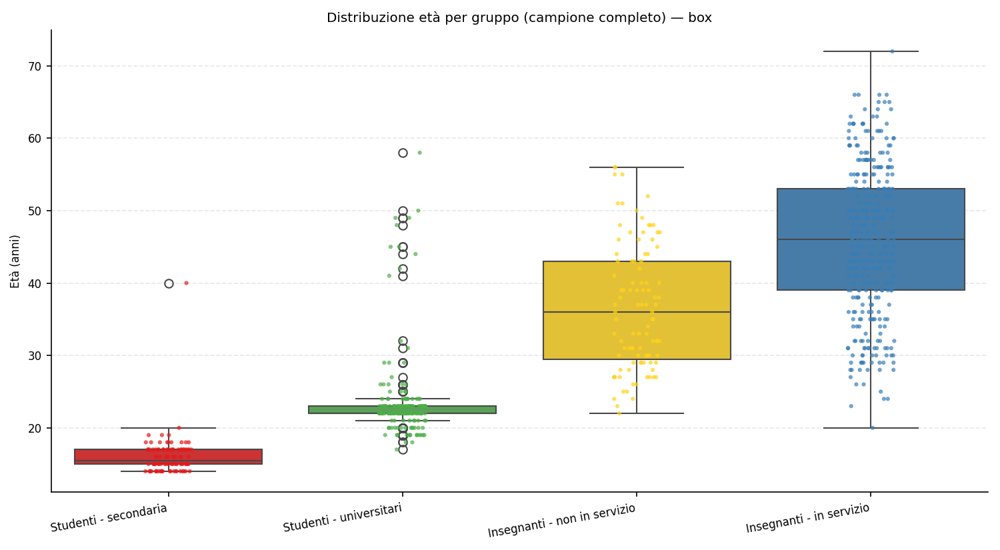{#fig:age-box-it width=100%}

La composizione di genere è fortemente sbilanciata verso le donne (vedi tabella sulle distribuzioni di genere e Figura 3). Le studentesse costituiscono quasi l’85% degli intervistati della secondaria (81 su 96) e l’83% degli universitari (139 su 170), mentre tra i docenti la componente femminile supera il 70% in entrambe le coorti (73 su 98 nei percorsi di formazione iniziale e 279 su 350 tra gli insegnanti in servizio). Questo riflette la femminilizzazione strutturale delle professioni educative italiane e suggerisce che le politiche di alfabetizzazione all’IA devono considerare specifiche traiettorie di sviluppo professionale femminili.

Tabella: Distribuzione per genere e gruppo (frequenze) {#tbl:gender-by-group-it}

| Gruppo                    | Maschi | Femmine | Nessuna risposta |
|:--------------------------|-------:|-------:|-----------------:|
| studenti - secondaria     |     16 |      81|                0 |
| studenti - università     |     29 |     139|                2 |
| docenti - non in servizio |     24 |      73|                1 |
| docenti - in servizio     |     70 |     279|                1 |

{#fig:gender-dist-it width=100%}

La distribuzione per area disciplinare (tabella corrispondente e Figura 4) conferma l’equilibrio tra percorsi STEM e umanistici nei gruppi centrali del campione. Tra gli studenti universitari prevalgono leggermente le discipline umanistiche (94 contro 74 STEM), mentre nei percorsi di formazione docenti i due blocchi risultano quasi equivalenti. Gli insegnanti in servizio mantengono una presenza STEM consistente (143 su 350), ma restano maggioritari i profili umanistici (195). Questa eterogeneità disciplina consente di leggere gli atteggiamenti verso l’IA non solo come questione generazionale, ma anche come confronto tra culture epistemologiche differenti.

Tabella: Distribuzione per area disciplinare e gruppo (frequenze) {#tbl:area-by-group-it}

| Gruppo                    | STEM | Umanistica | Nessuna risposta |
|:--------------------------|----:|----------:|-----------------:|
| studenti - secondaria     |   32|        63 |                2 |
| studenti - università     |   74|        94 |                2 |
| docenti - non in servizio |   46|        50 |                2 |
| docenti - in servizio     |  143|       195 |               12 |

{#fig:area-dist-it width=100%}

### Modelli d'uso dell'IA

#### Usage patterns

L'adozione quotidiana dell'IA presenta una marcata stratificazione tra studenti e insegnanti (Tabella e Figure seguenti). Tra gli studenti della secondaria, l'89,6% (86 su 96) dichiara di utilizzare l'IA quotidianamente, mentre tra gli universitari la percentuale scende al 74,7% (130 su 174). Nei docenti emerge un netto divario: solo il 51% degli insegnanti non ancora in servizio (50 su 98) e il 56% di quelli in servizio (196 su 350) utilizzano strumenti di IA nella vita quotidiana. Questa distribuzione suggerisce che l'integrazione dell'IA è un fenomeno prevalentemente guidato dalle pratiche studentesche, mentre il corpo docente mostra un'adozione più cauta e differenziata.

Tabella: Adozione quotidiana dell'IA per gruppo {#tbl:daily-use-it}

| Gruppo                    | Sì (n) | No (n) | Totale | % Sì  |
|:--------------------------|-------:|-------:|-------:|------:|
| studenti - secondaria     |     86 |     10 |     96 | 89.6% |
| studenti - universitari   |    130 |     44 |    174 | 74.7% |
| docenti - non in servizio |     50 |     48 |     98 | 51.0% |
| docenti - in servizio     |    196 |    154 |    350 | 56.0% |

{#fig:daily-use-it width=100%}

L'intensità d'uso settimanale conferma questa tendenza (Tabella e Figure successive). Gli studenti della secondaria dichiarano una media di 6,41 ore settimanali di utilizzo (mediana = 2, DS = 11,30), seguiti dagli universitari con 2,53 ore (mediana = 2, DS = 2,96). Gli insegnanti mostrano valori nettamente inferiori: 2,06 ore per i docenti non in servizio (mediana = 1, DS = 4,92) e 1,83 ore per quelli in servizio (mediana = 1, DS = 3,87). La forte variabilità osservata negli studenti della secondaria, evidenziata dalla deviazione standard elevata, indica la coesistenza di utenti intensivi e occasionali all'interno dello stesso gruppo, suggerendo percorsi di appropriazione tecnologica fortemente individualizzati.

Tabella: Ore settimanali di utilizzo dell'IA per gruppo {#tbl:weekly-hours-it}

| Gruppo                    | N   | Media | Mediana | Dev. std. | Q1  | Q3  |
|:--------------------------|----:|------:|--------:|----------:|----:|----:|
| studenti - secondaria     |  96 |  6.41 |     2.0 |     11.30 | 1.0 | 5.0 |
| studenti - universitari   | 174 |  2.53 |     2.0 |      2.96 | 0.0 | 4.0 |
| docenti - non in servizio |  98 |  2.06 |     1.0 |      4.92 | 0.0 | 2.0 |
| docenti - in servizio     | 350 |  1.83 |     1.0 |      3.87 | 0.0 | 2.0 |

*Nota.* Q1/Q3 = primo e terzo quartile; Dev. std. = deviazione standard.

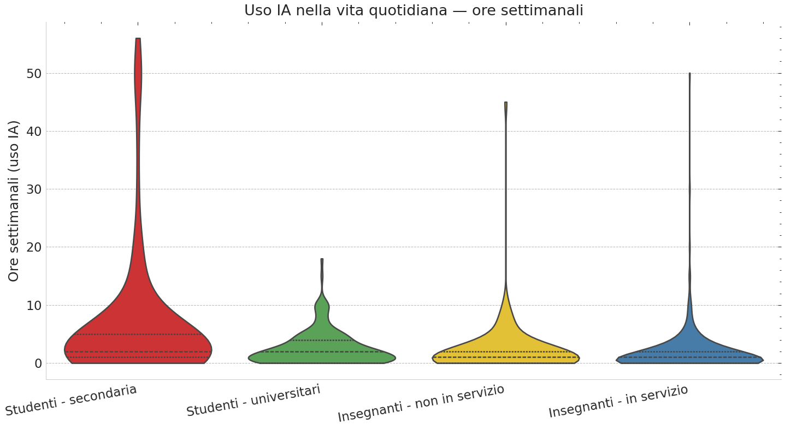{#fig:weekly-hours-violin-it width=100%}

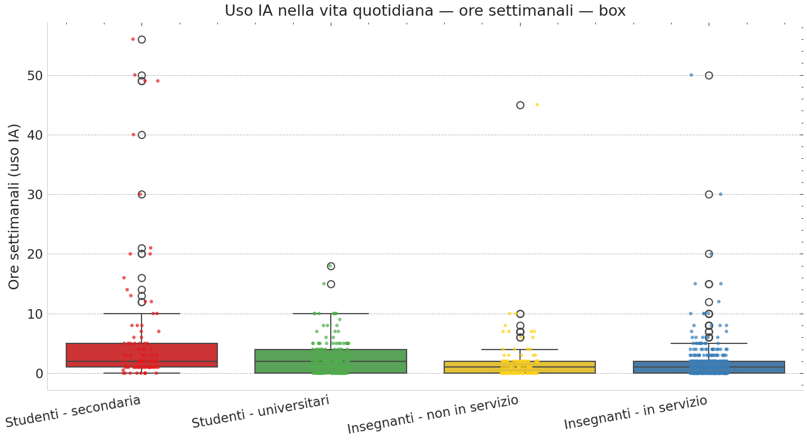{#fig:weekly-hours-box-it width=100%}

Il confronto tra contesti d'uso—studio versus didattica—rivela una polarizzazione significativa (χ² = 76,82, p < 0,001, V di Cramér = 0,325). Il 75,2% degli studenti (203 su 270) utilizza l'IA per attività di studio, mentre solo il 41,4% degli insegnanti (189 su 457) la integra nella didattica. Questa differenza di 33,8 punti percentuali segnala una disconnessione tra le pratiche di apprendimento degli studenti e le strategie didattiche dei docenti. Gli studenti della secondaria mostrano il tasso più alto di adozione per lo studio (76,0%), seguiti dagli universitari (74,7%), mentre tra gli insegnanti in servizio la percentuale scende al 45,0% e crolla al 28,3% tra quelli in formazione. Questo pattern suggerisce che l'IA viene percepita e utilizzata principalmente come strumento di supporto individuale all'apprendimento, mentre la sua integrazione nella pratica didattica strutturata rimane marginale e problematica.

Tabella: Utilizzo dell'IA per studio/didattica per gruppo {#tbl:study-teaching-it}

| Gruppo                    | Sì (n) | No (n) | Totale | % Sì  |
|:--------------------------|-------:|-------:|-------:|------:|
| studenti - secondaria     |     73 |     23 |     96 | 76.0% |
| studenti - universitari   |    130 |     44 |    174 | 74.7% |
| docenti - non in servizio |     28 |     71 |     99 | 28.3% |
| docenti - in servizio     |    161 |    197 |    358 | 45.0% |

{#fig:study-teaching-it width=100%}

#### Test statistici

Le differenze osservate sono state sottoposte a verifica di significatività statistica. L'ANOVA one-way sulle ore settimanali di utilizzo dell'IA evidenzia differenze altamente significative tra i quattro gruppi (*F* = 18,25, *p* < 0,001). Il test post-hoc di Tukey con correzione di Bonferroni rivela che gli studenti della secondaria utilizzano l'IA significativamente più ore rispetto a tutti gli altri gruppi: la differenza media è di 3,88 ore rispetto agli universitari (*p* < 0,01), 4,35 ore rispetto ai docenti non in servizio (*p* < 0,01) e 4,58 ore rispetto ai docenti in servizio (*p* < 0,001). Non emergono differenze significative tra universitari e docenti, né tra le due coorti di insegnanti, indicando che la maggiore intensità d'uso è una caratteristica distintiva degli studenti della secondaria.

Il test chi-quadrato per l'uso quotidiano dell'IA conferma una differenza significativa tra i quattro gruppi (χ² = 76,82, *p* < 0,001), con un effetto di dimensione moderata (V di Cramér = 0,325). Analogamente, il confronto studio versus didattica mostra una polarizzazione altamente significativa (χ² = 76,82, *p* < 0,001, V di Cramér = 0,325), con una differenza di 33,8 punti percentuali tra studenti e docenti. Questi risultati confermano che le differenze osservate non sono dovute al caso, ma riflettono pattern di adozione strutturalmente differenziati tra studenti e insegnanti.

Tabella: Risultati test ANOVA sulle ore settimanali {#tbl:anova-hours-it}

| Test          | F      | p-value  | Significatività |
|:--------------|-------:|---------:|:----------------|
| ANOVA one-way | 18.255 | < 0.001  | ***             |

*Nota.* *** = p < 0.001; test di Levene per omogeneità delle varianze: *F* = 12,94, *p* < 0,001 (varianze non omogenee).

Tabella: Test post-hoc di Tukey (confronti multipli con correzione Bonferroni) {#tbl:tukey-it}

| Confronto                                     | Diff. medie | p-value | Significativo |
|:----------------------------------------------|------------:|--------:|:--------------|
| studenti secondaria vs. universitari          |        3.88 |  < 0.01 | **            |
| studenti secondaria vs. docenti non servizio  |        4.35 |  < 0.01 | **            |
| studenti secondaria vs. docenti in servizio   |        4.58 | < 0.001 | ***           |
| universitari vs. docenti non servizio         |        0.47 |   0.323 | n.s.          |
| universitari vs. docenti in servizio          |        0.70 |   0.036 | n.s.†         |
| docenti non servizio vs. docenti in servizio  |        0.23 |   0.626 | n.s.          |

*Nota.* ** = p < 0.01; *** = p < 0.001; n.s. = non significativo; † = significativo senza correzione Bonferroni (α = 0.008333).

#### Differenze di genere e area disciplinare

L'analisi delle differenze di genere nell'adozione dell'IA non ha rivelato differenze statisticamente significative nella maggior parte dei gruppi. Tra gli studenti della secondaria, l'81,2% dei maschi e il 91,2% delle femmine utilizzano l'IA quotidianamente (test esatto di Fisher, p = 0,363). Analogamente, tra gli universitari non emergono differenze significative (80,0% maschi vs. 73,8% femmine, χ² = 0,234, p = 0,629). Tra gli insegnanti in servizio, il 62,9% dei maschi e il 54,1% delle femmine utilizzano l'IA quotidianamente (χ² = 1,396, p = 0,237). L'unico gruppo che mostra una tendenza verso la significatività è quello degli insegnanti non in servizio, dove i maschi presentano un tasso di adozione più elevato (70,8% vs. 45,2%, χ² = 3,779, p = 0,052), sebbene il valore rimanga al di sopra della soglia convenzionale α = 0,05.

Per quanto riguarda l'intensità d'uso misurata in ore settimanali, le differenze di genere risultano generalmente non significative, con una rilevante eccezione: tra gli insegnanti non in servizio, i maschi dedicano significativamente più ore all'IA rispetto alle femmine (2,42 ore vs. 1,36 ore, differenza = +1,06 ore, p = 0,045). Negli altri gruppi non si osservano differenze statisticamente significative: studenti secondaria (4,88 ore maschi vs. 6,72 ore femmine, p = 0,554), studenti universitari (2,40 ore vs. 2,55 ore, p = 0,804), insegnanti in servizio (2,03 ore vs. 1,78 ore, p = 0,639).

L'analisi per area disciplinare (STEM vs. discipline umanistiche) non ha evidenziato differenze significative né nell'adozione né nell'intensità d'uso dell'IA. Tra gli insegnanti non in servizio, il 53,0% dell'area STEM e il 57,1% dell'area umanistica utilizzano l'IA quotidianamente (χ² = 0,000, p = 1,000). Tra gli insegnanti in servizio, i tassi sono rispettivamente 63,3% (STEM) e 54,5% (umanistica), senza differenze significative (χ² = 1,568, p = 0,211). Anche per le ore settimanali non emergono differenze significative tra le due aree disciplinari: insegnanti non in servizio STEM 2,28 ore vs. umanistica 2,33 ore (p = 0,971); insegnanti in servizio STEM 1,74 ore vs. umanistica 2,34 ore (p = 0,289). I dati per gli studenti non erano disponibili per l'analisi per area disciplinare.

Tabella: Differenze di genere nell'uso quotidiano dell'IA {#tbl:gender-use-it}

| Gruppo                    | Maschi (% sì) | Femmine (% sì) | Test           | p-value | Significativo |
|:--------------------------|:-------------:|:--------------:|:---------------|--------:|:--------------|
| studenti - secondaria     |     81.2%     |     91.2%      | Fisher         |   0.363 | No            |
| studenti - universitari   |     80.0%     |     73.8%      | Chi-quadrato   |   0.629 | No            |
| insegnanti - non servizio |     70.8%     |     45.2%      | Chi-quadrato   |   0.052 | No†           |
| insegnanti - in servizio  |     62.9%     |     54.1%      | Chi-quadrato   |   0.237 | No            |

*Nota.* † = tendenza marginale (0,05 < p < 0,10).

Tabella: Differenze di genere nelle ore settimanali di utilizzo {#tbl:gender-hours-it}

| Gruppo                    | Media Maschi | Media Femmine | Differenza | p-value | Significativo |
|:--------------------------|-------------:|--------------:|-----------:|--------:|:--------------|
| studenti - secondaria     |         4.88 |          6.72 |      -1.84 |   0.554 | No            |
| studenti - universitari   |         2.40 |          2.55 |      -0.15 |   0.804 | No            |
| insegnanti - non servizio |         2.42 |          1.36 |      +1.06 |   0.045 | Sì*           |
| insegnanti - in servizio  |         2.03 |          1.78 |      +0.24 |   0.639 | No            |

*Nota.* * = p < 0.05.

### Readiness Beliefs (R): Competenze Percepite

Le scale di autoefficacia mettono in luce una forte asimmetria tra padronanza operativa e comprensione teorica. Gli studenti si valutano 4,32/7 sulla competenza pratica ma scendono a 3,16/7 quando devono misurare la conoscenza concettuale dei sistemi; i docenti restano sotto il punto medio su entrambe le voci (3,79 e 3,20). Il divario indica pratiche di sperimentazione diffuse ma literacy critica ancora fragile, soprattutto perché i valori mediani coincidono con il punteggio 3 (competenza solo “moderata”).

Tabella: Competenze percepite (scala 1–7) {#tbl:competence-likert-it}

| Dimensione           | Studenti (media; mediana) | Docenti (media; mediana) |
|:---------------------|:--------------------------|:-------------------------|
| Competenza pratica   | 4.32; 4                   | 3.79; 4                  |
| Competenza teorica   | 3.16; 3                   | 3.20; 3                  |

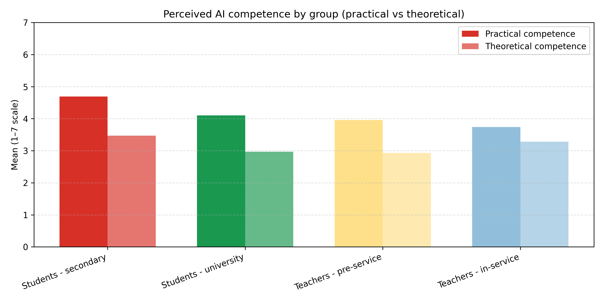{#fig:competence-4groups width=100%}

### Adequacy of Support (A): Adeguatezza della Formazione e Autoapprendimento

La formazione formale è giudicata insufficiente da entrambi i cluster (media studenti = 3,30; docenti = 2,88) e quasi un terzo dei docenti (29%) seleziona il valore minimo “1 – per niente adeguata” insieme al 22% degli studenti. L’autoformazione non compensa il vuoto: la mediana è 0 ore settimanali per gli studenti (IQR 0–1) e appena 1 ora per i docenti (IQR 0–2), nonostante alcuni outlier dichiarino oltre 50 ore e un massimo di 443 ore.

Tabella: Valutazioni della formazione e pratiche di autoapprendimento {#tbl:training-likert-it}

| Indicatore                                       | Studenti            | Docenti             |
|:-------------------------------------------------|:--------------------|:--------------------|
| Adeguatezza percepita (media; mediana)           | 3.30; 3             | 2.88; 3             |
| Risposte “1 – per niente adeguata”               | 22%                 | 29%                 |
| Ore di autoformazione (mediana; IQR)             | 0 h (0–1)           | 1 h (0–2)           |

{#fig:training-adequacy-it width=100%}

{#fig:weekly-training-it width=100%}

### Interpersonal & Institutional Trust (I): Fiducia, responsabilità e preparazione percepita

La fiducia nell’integrazione dell’IA resta moderata (4,47/7 per gli studenti; 4,17/7 per i docenti). La frattura emerge sulle responsabilità: i docenti attribuiscono soltanto 3,27/7 alla capacità degli studenti di usare l’IA in modo maturo, mentre gli studenti valutano la preparazione dei propri insegnanti con un 3,50/7. Le due percezioni si alimentano reciprocamente, segnalando la necessità di percorsi condivisi.

Tabella: Fiducia e responsabilità (scala 1–7) {#tbl:trust-likert-it}

| Indicatore                                           | Studenti (media; mediana) | Docenti (media; mediana) |
|:-----------------------------------------------------|:--------------------------|:-------------------------|
| Fiducia nell’integrazione istituzionale dell’IA      | 4.47; 5                   | 4.17; 4                  |
| Preparazione percepita dei docenti (vista dagli studenti) | 3.50; 3               | —                        |
| Fiducia dei docenti nell’uso responsabile degli studenti | —                      | 3.27; 3                  |

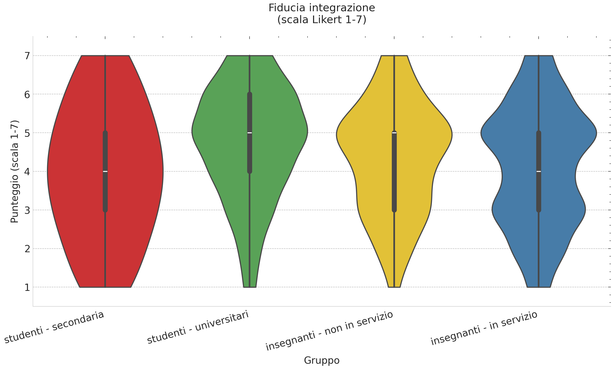{#fig:trust-integration-it width=100%}

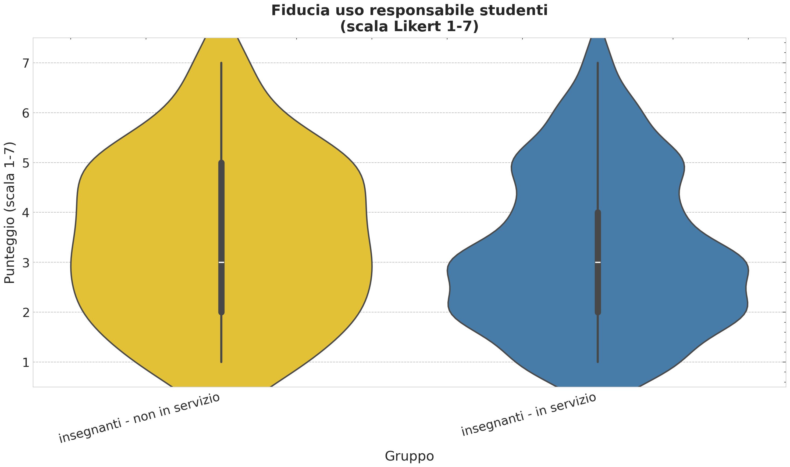{#fig:trust-responsibility-it width=100%}

### Skepticisms (S): Preoccupazioni sull’integrazione dell’IA

Le preoccupazioni restano contenute tra gli studenti (3,31/7), mentre i docenti mostrano un allarme maggiore (4,24/7) e portano il punteggio a 4,69/7 quando valutano il rischio di un uso scorretto da parte degli studenti. Gli studenti temono meno i comportamenti dei pari (3,31/7), confermando una discrepanza percettiva che alimenta il bisogno di regole e accompagnamento espliciti.

Tabella: Preoccupazioni principali (scala 1–7) {#tbl:concern-likert-it}

| Indicatore                                  | Studenti (media; mediana) | Docenti (media; mediana) |
|:--------------------------------------------|:--------------------------|:-------------------------|
| Preoccupazione generale sull’IA a scuola    | 3.31; 3                   | 4.24; 4                  |
| Preoccupazione per l’uso da parte di pari/studenti | 3.31; 3             | 4.69; 5                  |

{#fig:concern-general-it width=100%}

{#fig:concern-students-it width=100%}

### eXpectations (X): Cambiamento Percepito

I docenti prevedono trasformazioni profonde del sistema (media = 5,46) ma mantengono attese più caute sulla propria pratica quotidiana (4,76). Gli studenti si collocano a metà strada con 4,91, segnalando che il cambiamento è percepito come probabile ma ancora da governare. Le figure dedicate mostrano come il gradiente generazionale continui a essere il driver principale dell’aspettativa di cambiamento.

Tabella: Cambiamento percepito (scala 1–7) {#tbl:change-likert-it}

| Indicatore                                             | Studenti (media; mediana) | Docenti (media; mediana) |
|:-------------------------------------------------------|:--------------------------|:-------------------------|
| L’IA cambierà la didattica in generale                 | —                        | 5.46; 6                  |
| L’IA cambierà la mia didattica                         | —                        | 4.76; 5                  |
| L’IA cambierà il mio modo di studiare                  | 4.91; 5                  | —                        |

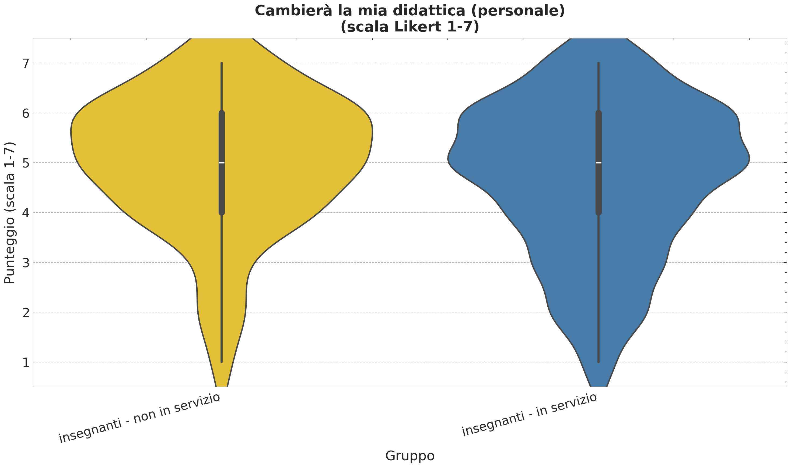{#fig:change-teachers-it width=100%}

{#fig:change-students-it width=100%}

<!-- /lang:it -->

<!-- lang:it -->
## Discussione

### Adozione massiva senza ingaggio istituzionale

Il primo elemento che emerge con forza è la presenza di un’adozione massiccia ma profondamente disomogenea dell’IA. L’80% degli studenti utilizza quotidianamente questi strumenti, segno di un’iniziativa notevole e di una grande adattabilità: gli studenti stanno prendendo in mano le proprie pratiche educative, rispondendo alle opportunità tecnologiche. Tuttavia, questa spinta bottom-up si è sviluppata in assenza di un corrispondente coinvolgimento istituzionale in grado di massimizzarne il potenziale formativo e di mitigarne i rischi.

*Monocultura e concentrazione sugli strumenti*

L’esperienza d’uso si concentra quasi esclusivamente su ChatGPT, con scarsa conoscenza di strumenti più specifici e pedagogicamente orientati. Questa monocultura tecnologica impedisce agli studenti di sviluppare una comprensione articolata delle diverse applicazioni dell’IA e dei loro potenziali educativi: si interagisce con una singola interfaccia conversazionale senza esplorare assistenti alla ricerca, tutor disciplinari, strumenti per il feedback o ambienti multimodali.

*Polarizzazione dell’uso*

Si osserva una forte polarizzazione tra utenti occasionali (uno-due orei settimanali) e “power user” che sperimentano in modo intensivo. La frammentazione riflette la natura informale e guidata dai pari dell’adozione attuale, dove percorsi individuali e reti personali sostituiscono un’azione sistematica guidata dalle istituzioni.

Il quadro complessivo rivela che l’IA è penetrata nelle pratiche educative grazie all’iniziativa studentesca, mentre la scuola e l’università sono rimaste spettatrici, rinunciando ad assumere quel ruolo di partner attivo che permetterebbe di arricchire le pratiche emergenti con quadri critici, ampliare la consapevolezza degli strumenti e accompagnare lo sviluppo da competenza operativa a vera alfabetizzazione.

### Il paradosso della competenza: sapere come senza capire perché

Tra i risultati più significativi figura il divario tra competenza pratica e competenza teorica. Gli studenti hanno sviluppato abilità operative notevoli ma non dispongono degli strumenti concettuali per comprendere limiti, bias e funzionamento dei sistemi. Il fenomeno rispecchia la traiettoria storica delle alfabetizzazioni digitali: l’operatività precede la comprensione critica. Senza un coinvolgimento istituzionale, questa distanza rischia di cristallizzarsi, generando un uso efficiente ma poco consapevole.

Per i docenti la situazione è ugualmente problematica: i livelli di competenza percepita restano sotto la soglia di neutralità, segno di un diffuso senso di inadeguatezza che ostacola l’ingaggio sperimentale e alimenta un circolo vizioso di esitazione e immobilismo.

### Il vuoto nella formazione istituzionale

La valutazione estremamente negativa della formazione formale ricevuta (media 3,3 per gli studenti, 2,93 per i docenti) è forse il segnale più allarmante. Nonostante l’IA sia ormai parte integrante delle pratiche didattiche informali, le istituzioni non hanno ancora costruito percorsi sistematici per affrontarla. Nei commenti qualitativi emerge con chiarezza la richiesta di formazione continua, supporto concreto, linee guida e spazi di confronto professionale.

### Il bias della terza persona e la resistenza al cambiamento

Il “third-person bias” rilevato tra i docenti—riconoscere il potenziale trasformativo dell’IA in generale ma dubitare del proprio impatto personale—rende evidente la necessità di interventi che accompagnino l’integrazione nella pratica quotidiana. Il bias riflette una tensione tipica dei processi di innovazione: la tecnologia è percepita come inevitabile e significativa, ma il modo di incorporarla nella propria routine resta nebuloso.

### Il paradosso della fiducia: guide che non si fidano di chi guidano

Lo squilibrio tra l’elevata fiducia degli studenti e la forte diffidenza dei docenti configura un paradosso: chi dovrebbe guidare l’uso critico degli strumenti si sente impreparato e, di conseguenza, fatica a fidarsi degli studenti. Questa dinamica può generare scenari di proibizionismo difensivo o, al contrario, una delega totale all’autoregolazione studentesca, con evidenti rischi pedagogici.

### Tre dimensioni attitudinali: la struttura delle attitudini verso l’IA

L’analisi correlazionale individua tre cluster principali—competenza, fiducia/ottimismo e preoccupazione—che forniscono una mappa per progettare interventi mirati. La formazione di qualità emerge come leva strategica: migliorare la percezione di supporto istituzionale rafforza la fiducia e alimenta aspettative di cambiamento positivo. Le preoccupazioni, invece, non dipendono dall’ignoranza: sono razionali e informate, e vanno ascoltate con attenzione.

### Il divario di genere: una frattura nella fiducia digitale

Le differenze marcate tra uomini e donne richiedono interventi mirati. Le partecipanti femminili mostrano livelli di fiducia e di percezione di preparazione nettamente inferiori, con effect size molto elevati. Il dato suggerisce di progettare percorsi che offrano modelli di ruolo, comunità di supporto e spazi di sperimentazione sicuri, affrontando stereotipi e barriere culturali.

### La democratizzazione dell’IA: oltre i confini disciplinari

L’assenza di differenze significative tra aree disciplinari indica che l’IA viene percepita come fenomeno trasversale. Questo apre la strada a percorsi formativi interdisciplinari, comunità di pratica che superino i silos dipartimentali e integrazione curricolare diffusa, anziché confinata ai corsi di informatica o alle discipline STEM.


### Il gradiente generazionale nell'adozione e nell'intensità d'uso

L'analisi statistica dei modelli d'uso ha rivelato un marcato **gradiente generazionale** che attraversa l'intero campione. La percentuale di adozione dell'IA decresce in modo sistematico dagli studenti della secondaria (89,6%) agli universitari (74,7%), per poi subire un calo significativo nel passaggio al corpo docente (51,5% per gli insegnanti in formazione, 56,7% per quelli in servizio). Questo pattern suggerisce che l'integrazione dell'IA non è semplicemente una questione di competenza tecnica, ma riflette profonde differenze generazionali nella familiarità con ecosistemi tecnologici, nelle aspettative di utilizzo e nei processi di socializzazione digitale.

L'intensità d'uso, misurata in ore settimanali, amplifica ulteriormente questa stratificazione. Gli studenti della secondaria dedicano all'IA una media di 6,41 ore settimanali, più del doppio rispetto a universitari (2,53 ore) e insegnanti (circa 2 ore per entrambe le categorie). Questa differenza rimane statisticamente significativa anche dopo i test post-hoc con correzione di Bonferroni, confermando che non si tratta di una variazione casuale ma di un fenomeno robusto e replicabile. L'elevata deviazione standard osservata negli studenti della secondaria (SD = 11,30) e i valori estremi registrati (fino a 56 ore settimanali) indicano inoltre una forte **eterogeneità interna** al gruppo, con la presenza di "power user" che sperimentano l'IA in modo intensivo accanto a utenti occasionali.

Questa polarizzazione può essere interpretata alla luce di molteplici fattori. Da un lato, gli studenti più giovani cresciuti in un'era di pervasiva digitalizzazione potrebbero percepire l'IA come una naturale estensione del loro ambiente tecnologico quotidiano, integrandola in attività didattiche, creative e ludiche senza soluzione di continuità. Dall'altro, l'assenza di vincoli istituzionali o etici stringenti consente loro una maggiore libertà esplorativa rispetto agli universitari, che potrebbero autocensurarsi per timori legati all'integrità accademica, o agli insegnanti, vincolati da responsabilità professionali e pedagogiche.

Il fatto che **non emergano differenze significative** tra studenti universitari e insegnanti (circa 2 ore settimanali per entrambi) è particolarmente rilevante. Questo pattern suggerisce che, oltre la soglia dell'adolescenza, l'uso dell'IA si stabilizza su livelli più contenuti e probabilmente più **strumentali e focalizzati**, limitati a compiti specifici come ricerca di informazioni, preparazione di materiali didattici o sintesi di documenti, piuttosto che a un'esplorazione ampia e differenziata. L'uniformità tra questi due gruppi così diversi per ruolo e contesto professionale indica che l'intensità d'uso potrebbe essere più influenzata da fattori situazionali e generazionali che da caratteristiche individuali o professionali.

### Equità di genere e democratizzazione disciplinare: segnali positivi in un contesto frammentato

Un risultato particolarmente significativo, in controtendenza rispetto a studi precedenti sul gender gap digitale, è l'**assenza di differenze sistematiche** tra maschi e femmine nell'adozione e nell'intensità d'uso dell'IA. Tra gli studenti—sia della secondaria che universitari—non emergono disparità statisticamente significative, suggerendo che le attuali coorti studentesche accedono all'IA in modo equo, indipendentemente dal genere. Questo è un risultato incoraggiante, che potrebbe riflettere un progressivo superamento degli stereotipi di genere legati alle competenze tecnologiche e una maggiore accessibilità e usabilità degli strumenti di IA generativa rispetto a tecnologie precedenti.

Tuttavia, emerge un'**eccezione rilevante** nel gruppo degli insegnanti non in servizio, dove i maschi dedicano significativamente più ore all'IA rispetto alle femmine (2,42 vs. 1,36 ore, p = 0,045) e mostrano una tendenza marginale verso un tasso di adozione più elevato (70,8% vs. 45,2%, p = 0,052). Questo pattern potrebbe riflettere differenze nelle motivazioni professionali, con i maschi più orientati verso l'esplorazione tecnologica e le femmine più focalizzate su altre priorità formative nel periodo pre-servizio. Alternativamente, potrebbero persistere influenze di stereotipi di genere e auto-efficacia tecnologica percepita in questa fascia di età e contesto professionale, elementi che meritano approfondimenti qualitativi per essere compresi appieno.

Analogamente, l'**assenza di differenze tra aree disciplinari** (STEM vs. discipline umanistiche) nell'adozione e nell'intensità d'uso dell'IA è un risultato contro-intuitivo ma estremamente promettente. Ci si potrebbe aspettare una maggiore familiarità e propensione all'uso dell'IA nei settori scientifici e tecnici, storicamente più orientati alla tecnologia. Invece, i dati mostrano tassi di utilizzo sostanzialmente equivalenti tra STEM e discipline umanistiche, sia per l'adozione quotidiana che per le ore settimanali dedicate. Questo risultato testimonia l'**applicabilità trasversale** degli strumenti di IA generativa: se ChatGPT e strumenti simili sono utili tanto per scrivere codice, analizzare dati e risolvere problemi matematici quanto per redigere testi, tradurre, sintetizzare letteratura e supportare il pensiero critico, allora l'IA può effettivamente configurarsi come una tecnologia **democratizzante** che attraversa i confini disciplinari tradizionali.

Questa democratizzazione disciplinare apre prospettive positive per la formazione: percorsi formativi interdisciplinari, comunità di pratica che superino i silos dipartimentali, e integrazione curricolare diffusa dell'IA in tutto il tessuto accademico, piuttosto che confinarla ai corsi di informatica o alle sole discipline STEM. Tuttavia, rimane cruciale garantire che questa accessibilità trasversale si traduca in un uso **critico e consapevole**, capace di riconoscere i limiti, i bias e le implicazioni etiche degli strumenti, indipendentemente dal dominio disciplinare di applicazione.

### Limitazioni metodologiche e direzioni future

È importante riconoscere le limitazioni metodologiche dell'analisi condotta. I test statistici hanno rilevato violazioni dei presupposti di normalità (test di Shapiro-Wilk, tutti p < 0,001) e omogeneità delle varianze (test di Levene, p < 0,001) nelle distribuzioni delle ore settimanali, suggerendo che le distribuzioni presentano asimmetria positiva e code pesanti. Sebbene l'ANOVA parametrica sia considerata robusta a violazioni moderate con campioni sufficientemente ampi, sarebbe auspicabile confermare i risultati mediante test non parametrici (es. Kruskal-Wallis) e modelli robusti (es. bootstrap, permutation tests) in analisi successive.

Inoltre, le stime delle ore settimanali sono basate su **autovalutazione**, soggette a bias di recall e desiderabilità sociale. L'ampia variabilità e i valori estremi osservati (es. 56 ore/settimana tra gli studenti della secondaria) suggeriscono possibili sovrastime o interpretazioni eterogenee della domanda. Future ricerche potrebbero beneficiare di metodi di raccolta dati più oggettivi, come log automatici di utilizzo, diari strutturati o tecniche di campionamento esperienziale, per triangolare le misure e ridurre i bias.

Infine, lo studio adotta un **disegno trasversale**, che consente di rilevare associazioni ma non di inferire causalità. Non è possibile determinare se le differenze osservate siano dovute a effetti generazionali (coorti cresciute in epoche tecnologiche diverse), effetti di età (stadi di sviluppo cognitivo e sociale), o effetti di contesto (pressioni accademiche, vincoli professionali). Studi longitudinali che seguano le stesse coorti nel tempo, o disegni quasi-sperimentali che introducano interventi formativi controllati, sarebbero essenziali per chiarire le relazioni causali e valutare l'impatto di politiche educative mirate.

Nonostante queste limitazioni, i risultati forniscono una **base empirica solida** per orientare le politiche educative e le pratiche formative, evidenziando la necessità di interventi differenziati per gruppi generazionali, attenzione alle specificità di genere in contesti professionali pre-servizio, e promozione di una visione trasversale e inclusiva dell'alfabetizzazione all'IA che attraversi i confini disciplinari tradizionali.
### Implicazioni più ampie per teoria e pratica educativa

I risultati dialogano con diversi framework teorici. Il gap tra competenza e fiducia richiama il concetto di autoefficacia di Bandura: senza mastery experience e modelli di riferimento è difficile maturare sicurezza critica. I modelli di accettazione tecnologica spiegano l’adozione studentesca (utilità immediata, facilità d’uso), ma non quella dei docenti, per i quali entrano in gioco responsabilità professionali e complessità pedagogiche. La prospettiva socioculturale sottolinea l’assenza di scaffolding esperto: gli studenti operano nella zona di sviluppo prossimale senza mentori capaci di guidarli. I framework di digital literacy invitano ad andare oltre le abilità operative, includendo comprensione dei sistemi sociotecnici, riconoscimento dei bias, valutazione critica e consapevolezza metacognitiva.

### L’urgenza di un intervento sistematico

Nel loro insieme, i dati delineano un’urgenza educativa che non può essere rimandata. L’integrazione dell’IA sta avvenendo de facto, ma in modo caotico, non guidato e pedagogicamente fragile. Servono interventi strutturati su più livelli:

1. **Formazione professionale dei docenti**: percorsi continui e solidi che sviluppino comprensione concettuale, strategie pedagogiche, quadri etici, esperienza pratica con strumenti diversificati e comunità di pratica.
2. **Curricoli strutturati per gli studenti**: integrare e arricchire l’apprendimento informale con percorsi che combinino competenze operative, comprensione teorica, valutazione critica, ragionamento etico e consapevolezza metacognitiva.
3. **Diversificazione degli strumenti**: far conoscere soluzioni progettate per la didattica, superando la dipendenza da piattaforme generaliste.
4. **Sostegno istituzionale e politiche chiare**: linee guida, infrastrutture e processi di monitoraggio continuo che accompagnino l’evoluzione tecnologica.
5. **Ricerca empirica**: indagare in modo rigoroso gli effetti dell’IA sull’apprendimento, le strategie di integrazione efficaci, le ricadute a lungo termine su competenze e disposizioni cognitive.
6. **Ripensamento delle pratiche didattiche**: supportare i docenti nella rielaborazione di attività, valutazioni e modelli organizzativi in chiave “AI-aware”, favorendo sperimentazione entro confini etici condivisi.

<!-- /lang:it -->

<!-- lang:it -->
## Conclusioni

Siamo a un bivio cruciale nell’integrazione tecnologica dell’educazione. I risultati dello studio evidenziano un divario significativo tra la rapida e diffusa adozione dell’IA generativa da parte degli studenti e la capacità delle istituzioni educative di fornire guida, quadri critici e supporto pedagogico adeguati.

*Lo stato attuale: una tempesta perfetta di sfide*

I dati delineano:
- **Adozione massiva senza ingaggio istituzionale**: circa l’80% degli studenti (90% nella secondaria, 75% all’università) utilizza quotidianamente l’IA attraverso preziose reti informali, ma senza un supporto formale complementare.
- **Squilibrio di competenza**: elevate abilità operative ma scarsa comprensione teorica e alfabetizzazione critica.
- **Ritrazione istituzionale**: diffusa insoddisfazione per la formazione sull’IA tra studenti e docenti, sintomo di mancato ingaggio delle pratiche emergenti.
- **Impreparazione docente**: molti insegnanti si sentono inadeguati a guidare strumenti che dovrebbero insegnare a usare in modo critico.
- **Asimmetria di fiducia**: gli studenti sono più fiduciosi dei docenti, mentre questi ultimi dubitano della capacità critica degli studenti.
- **Consapevolezza limitata degli strumenti**: uso concentrato su una piattaforma generalista, con scarsa esplorazione di applicazioni educative specializzate.
- **Resistenza e incertezza**: i docenti riconoscono il potenziale trasformativo dell’IA in generale ma sono incerti su come integrarla personalmente.

Questa configurazione presenta insieme rischi urgenti e opportunità significative.

*Rischi dell’inazione*

Lasciare che l’IA si integri spontaneamente e senza guida significa esporsi a:
1. **Erosione del pensiero critico**: affidarsi senza verifica agli output dell’IA.
2. **Atrofia delle abilità cognitive**: delegare all’IA processi essenziali per l’apprendimento profondo.
3. **Perpetuazione dei bias**: incorporare pregiudizi e disuguaglianze presenti nei dati di addestramento.
4. **Crisi di integrità accademica**: difficoltà a distinguere il lavoro autentico da quello generato dall’IA.
5. **Divari crescenti**: differenze tra chi dispone di guida e chi ne è privo.
6. **Demoralizzazione professionale**: aumento dello stress docente e senso di inadeguatezza.

*Opportunità per un’integrazione consapevole*

Con interventi sistematici è possibile valorizzare il potenziale educativo dell’IA:
1. **Personalizzazione**: tutoraggio su misura con spiegazioni, esercizi e feedback scalabili.
2. **Accessibilità**: sostegno a studenti con disabilità, apprendenti di lingua e contesti a risorse limitate.
3. **Empowerment docente**: automazione dei compiti routinari per dedicare più tempo a relazione e supporto individuale.
4. **Creatività ed esplorazione**: l’IA come partner nei progetti creativi e nell’apprendimento esplorativo.
5. **Nuove alfabetizzazioni**: sviluppo dell’AI literacy come competenza fondamentale del XXI secolo.
6. **Ricerca e innovazione**: uso dell’IA per accelerare la ricerca educativa e le innovazioni pedagogiche.

*Il percorso: costruire una pedagogia dell’IA*

Passare dalle sfide attuali alle opportunità richiede di costruire una “pedagogia dell’IA” che includa:

**Principi fondanti**
- L’IA come strumento da ingaggiare criticamente, non come autorità autonoma
- Trasparenza su uso, capacità e limiti degli strumenti
- Centralità del giudizio umano, della creatività e del ragionamento etico
- Attenzione ai processi di apprendimento più che ai soli prodotti
- Impegno per equità e inclusione nell’accesso e nella literacy digitale

**Componenti operative**
- Formazione professionale estesa per i docenti
- Curricoli integrati per studenti che sviluppino AI literacy critica
- Politiche istituzionali chiare ed etiche
- Ricerca continua a supporto di pratiche evidence-based
- Coinvolgimento della comunità educante

**Trasformazione culturale**
- Passare dal divieto basato sulla paura all’ingaggio critico
- Valorizzare la sperimentazione entro confini etici condivisi
- Sviluppare norme e pratiche comuni tra le istituzioni
- Coltivare culture di trasparenza e apprendimento continuo
- Riconoscere che l’integrazione dell’IA è un processo dinamico e permanente

*Il momento decisivo*

I dati indicano che ci troviamo a un punto di biforcazione. Da un lato, proseguire con l’assenza istituzionale lasciando che l’apprendimento informale continui senza alfabetizzazione critica; dall’altro, impegnarsi con decisione per accompagnare le pratiche emergenti con strutture pedagogiche, capacità professionali e literacy critiche adeguate.

La scelta non è se l’IA farà parte dell’educazione—gli studenti hanno già deciso integrandola nelle proprie routine—ma se educatori, ricercatori e istituzioni vorranno esserne partner attivi, orientando l’integrazione verso finalità educative e un ingaggio critico.

*Un invito all’azione*

Lo studio rivolge un appello urgente a tutti gli attori educativi:

- **Ai decisori politici**: investire in iniziative di AI literacy, sostenere la formazione dei docenti e sviluppare cornici regolative equilibrate.
- **Alle istituzioni educative**: superare i divieti reattivi e costruire politiche, supporti e innovazioni curricolari che abbraccino l’IA in modo critico.
- **Ai formatori di docenti**: integrare l’AI literacy nella formazione iniziale e in servizio, modellando un ingaggio riflessivo.
- **Ai ricercatori**: produrre studi empirici rigorosi sugli impatti educativi, sulle strategie di integrazione e sulle conseguenze a lungo termine.
- **Ai docenti**: sperimentare con coraggio, entro confini etici, cercando supporto e partecipando a comunità di pratica emergenti.
- **Agli studenti**: chiedere la guida che meritano, usare gli strumenti con spirito critico e distinguere tra competenza superficiale e literacy profonda.

Costruire una autentica pedagogia dell'intelligenza artificiale non è più opzionale ma un imperativo educativo. Solo con interventi sistematici, riflessivi e basati su evidenze potremo trasformare l'IA in uno strumento capace di arricchire l'esperienza educativa, anziché impoverire il pensiero critico e l'autonomia intellettuale degli studenti. Il momento di decidere è adesso; i dati parlano chiaro. Servono coraggio, impegno e azione collettiva. Gli studenti—e il futuro dell'educazione—non meritano nulla di meno.

## Bibliografia {.unnumbered}
::: {#refs}
:::


## Appendice: Domande del Questionario {.unnumbered}

### Questionario Studenti

#### Domande Demografiche

**#3**: Quanti anni hai? (Numerico)

**#4**: Il tuo genere è (Scelta singola)

**#5**: Che scuola frequenti (Scelta singola)

**#6**: Titolo di studio (Scelta singola)

**#7**: Il tuo percorso attuale di studio è di tipo (Scelta singola: STEM o Umanistico)

#### Domande sui Modelli d'Uso (Sì/No)

**#16**: Nella tua vita quotidiana utilizzi l'intelligenza artificiale?

**#19**: Utilizzi l'intelligenza artificiale nello studio?

#### Domande sui Modelli d'Uso (Numeriche)

**#17**: Se sì, quante ore alla settimana, in media, utilizzi strumenti di intelligenza artificiale per le tue attività quotidiane?

**#20**: Quante ore alla settimana mediamente utilizzi l'intelligenza artificiale per le tue attività quotidiane?

**#21**: Quante ore alla settimana mediamente utilizzi l'intelligenza artificiale per le attività riguardanti lo studio?

**#22**: Quante ore alla settimana mediamente dedichi ad informarti sui nuovi strumenti di intelligenza artificiale per lo studio?

**#23**: Sapresti quante ore ti fa risparmiare l'uso dell'intelligenza artificiale nel tuo studio in una settimana?

#### Competenza e Formazione (Scala Likert a 7 punti)

**#8**: Su una scala da 1 a 7, quanto ti consideri competente nell'uso pratico di strumenti o tecnologie legati all'intelligenza artificiale?

**#9**: Su una scala da 1 a 7, quanto ritieni adeguata la tua competenza teorica riguardo l'intelligenza artificiale?

**#11**: Su una scala da 1 a 7, quanto ritieni adeguata la formazione ricevuta in merito all'intelligenza artificiale?

**#13**: Su una scala da 1 a 7, quanto ritieni che i tuoi attuali insegnanti siano preparati e competenti nell'insegnare l'uso dell'intelligenza artificiale?

#### Fiducia, Confidenza e Preoccupazioni (Scala Likert a 7 punti)

**#10**: Da una scala da 1 a 7, quanto pensi che l'intelligenza artificiale cambierà il tuo modo di studiare?

**#12**: Da una scala da 1 a 7, quanto sei fiducioso nell'integrazione dell'intelligenza artificiale nella scuola o università?

**#14**: Da una scala da 1 a 7, ti preoccupa l'inserimento dell'intelligenza artificiale nella scuola o nell'università?

**#15**: Da una scala da 1 a 7, quanto sei preoccupato riguardo all'utilizzo dell'intelligenza artificiale da parte dei tuoi compagni di scuola o universitari?

#### Domande a Scelta Multipla

**#24**: Quali sono gli strumenti di intelligenza artificiale che utilizzi?

**#25**: Per quali scopi usi l'intelligenza artificiale nei tuoi studi?

**#26**: Per quali tipi di attività NON deve essere utilizzata l'intelligenza artificiale per apprendere?

**#27**: Quali strumenti di intelligenza artificiale utilizzi regolarmente nel tuo studio?

**#33**: Quali difficoltà hai incontrato nell'implementazione di strumenti di IA nella tua pratica di studio?

**#35**: In base alla tua esperienza, quali sono i pro e i contro dell'uso dell'intelligenza artificiale nello studio?

---

### Questionario Docenti

#### Domande Demografiche

**#3**: Attualmente insegni o hai intenzione di intraprendere la professione docente? (Scelta singola)

**#4**: Quanti anni hai? (Numerico)

**#5**: Il tuo genere è (Scelta singola)

**#6**: Titolo di studio (Scelta singola)

**#7**: In quale ordine di scuola insegni? O vorresti insegnare? (Scelta singola)

**#8**: Insegna (o insegnerà) una materia (Scelta singola: STEM o Umanistica)

**#9**: Qual è il tuo settore scientifico-disciplinare attuale? (Scelta multipla)

#### Domande sui Modelli d'Uso (Sì/No)

**#20**: Nella tua vita quotidiana utilizzi l'intelligenza artificiale?

**#23**: Utilizzi l'intelligenza artificiale nella didattica?

#### Domande sui Modelli d'Uso (Numeriche)

**#21**: Se sì, quante ore alla settimana, in media, utilizzi strumenti di intelligenza artificiale per le tue attività quotidiane?

**#24**: Quante ore alla settimana mediamente dedichi alla formazione e all'aggiornamento sulle tecnologie di intelligenza artificiale per l'insegnamento?

**#25**: Quante ore alla settimana dedichi mediamente per integrare strumenti di intelligenza artificiale nei tuoi piani di lezione settimanali?

#### Competenza e Formazione (Scala Likert a 7 punti)

**#10**: Su una scala da 1 a 7, quanto ti consideri competente nell'uso pratico di strumenti o tecnologie legati all'intelligenza artificiale?

**#11**: Su una scala da 1 a 7, quanto ritieni adeguata la tua competenza teorica riguardo l'intelligenza artificiale?

**#14**: Su una scala da 1 a 7, quanto ritieni adeguata la formazione ricevuta in merito all'intelligenza artificiale?

#### Fiducia, Confidenza e Preoccupazioni (Scala Likert a 7 punti)

**#12**: Da una scala da 1 a 7 quanto pensi che l'intelligenza artificiale cambierà la didattica?

**#13**: Da una scala da 1 a 7, quanto pensi che l'intelligenza artificiale cambierà la tua didattica?

**#15**: Da una scala da 1 a 7, quanto sei fiducioso nell'integrazione dell'intelligenza artificiale nella pratica educativa?

**#16**: Da una scala da 1 a 7, quanto sei fiducioso nell'utilizzo da parte degli studenti di un uso responsabile e maturo dell'intelligenza artificiale?

**#17**: Da una scala da 1 a 7, quanto sei preoccupato riguardo all'utilizzo dell'intelligenza artificiale nel mondo dell'educazione?

**#18**: Da una scala da 1 a 7, quanto sei preoccupato riguardo all'utilizzo dell'intelligenza artificiale da parte degli studenti?

#### Domande a Scelta Multipla

**#19**: Per quali tipi di attività NON deve essere utilizzata l'intelligenza artificiale nell'insegnamento?

**#26**: Quali sono gli strumenti di intelligenza artificiale che utilizzi?

**#27**: Per quali tipi di attività usi l'intelligenza artificiale?

**#34**: Quali difficoltà hai incontrato nell'implementazione di strumenti di IA nella tua didattica?

<!-- /lang:it -->

<!-- lang:en -->
## Introduction: GenAI as Cultural Mediator in Education
Generative artificial intelligence (GenAI) is entering Italian schools and universities spontaneously, without structured pedagogical planning. Unlike previous digital tools that merely retrieve or display existing content (search engines, databases, websites, e-books, etc.), GenAI actively reconstructs knowledge at each interaction. When, for example, a student queries ChatGPT about the French Revolution, they receive not a document or source, but a newly synthesized narrative of the most relevant information, retrieved from its knowledge network, presented with an authoritative voice.

This process is genuinely creative, in the sense expressed by Bruno Munari. Indeed, in his work "Fantasia" [@Munari1977Fantasia], he defines creativity as a recombination of existing elements into new configurations, where the creative essence consists in combining very different things in original and novel ways—for example, an elastic mirror rather than an *ex nihilo* invention. GenAI operates precisely through such recombinatory processes.

This creative capacity—which in models is more properly associated with the term "generative"—enables these tools to perform many high-level cognitive tasks that until yesterday were the exclusive prerogative of human beings: writing essays, synthesizing complex documents, translating texts, producing software code, selecting and hierarchizing news, elaborating argumentative strategies, etc. When a student asks ChatGPT to summarize a philosophy chapter or propose a structure for an essay, the system instantly executes operations of selecting relevant sources, extracting and hierarchizing the most important concepts, and constructing logical connections, producing a structured and coherent text.

However, it is precisely GenAI's generative capacity that raises the main concerns. Some scholars argue that such systems may operate as a "stochastic parrot" [@Bender2021DangersS]—that is, as a pattern-matcher without genuine understanding. Moreover, GenAI tends to incorporate and amplify systematic biases present in training data, reflecting and sometimes reinforcing the inequalities of the society that produced them. These include gender biases that associate certain professions with specific sexes, racial biases that perpetuate stereotypes about cultures and ethnic groups, socioeconomic biases that privilege dominant perspectives while marginalizing alternative visions [@Navigli2023BiasesLLM; @Bender2021DangersS]. When a student asks an AI to describe "an engineer" or "a nurse," the responses systematically reflect these prejudices, naturalizing them as neutral truths and rendering them invisible precisely through the apparent objectivity of algorithmic output.

Alongside this problem of biases, the question of transparency and accountability arises. In traditional media—books, films, television, newspapers—the work of knowledge curation is performed by authors, editors, curators, and journalistic gatekeepers who make deliberate choices and bear responsibility for them. Gatekeepers, in particular, play a crucial role in filtering and validation: deciding which news deserves attention, what relevance to attribute to events, which sources are reliable. This process, though not immune to bias, is transparent in its responsibilities—one can identify who made the editorial decisions and hold them accountable for their choices. With GenAI tools, this task is delegated to computational mechanisms that operate without authorial intent, accountability, or transparent selection criteria.

Added to these concerns is the perspective of teacher replacement. Some technological visionaries imagine that AI can not only automate intellectual tasks but completely replace the teacher figure. Bill Gates, at the ASU+GSV event in San Diego, envisioned that within eighteen months chatbots like ChatGPT will be able to teach children to read and write with the effectiveness of a human tutor [@Clifford2023BillGates]. This vision finds echo even in fiction, as in the series *Star Wars: Skeleton Crew*, where children interact with droid educators in completely automated learning contexts [@Watts2024StarWars]. Beyond technical questions—whether these systems can adequately perform tasks that were once human competence—a fundamental pedagogical question emerges: when a machine replaces the educational relationship, what effects does this process have on intellectual and human formation?

Another issue concerns the epistemological dimension, related to how we know the world. These systems do not merely package information and deliver it in a seemingly neutral manner: like many media before them but in a more refined way, they actively modify our way of perceiving reality, make us see things differently, push us toward reasoning we would not have developed autonomously. When a student asks ChatGPT to explain a complex concept, they receive not just data but a particular interpretation, a specific cognitive frame, a way of thinking that invisibly becomes part of their learning process. The risk, on one hand, is being influenced in a veiled manner in our way of thinking; on the other, that systematic delegation of cognitive processes may atrophy our capacities for critical thinking, autonomous analysis, and original synthesis—transforming us from active thinkers into passive consumers of algorithmic elaborations.

Closely connected to the epistemological question is the problem of speed and efficiency, increasingly dominant values in our society. If the aspects we have mentioned modify *what* we think, radical acceleration eliminates the *time* necessary to think. Indeed, GenAI contributes to amplifying the push toward ever-shorter response times. A student who once would have spent hours or days elaborating a paper—reading sources, taking notes, reorganizing ideas, writing successive drafts—can now obtain a complete text in seconds. This radical acceleration eliminates what educators call "incubation time" [@Wallas1926TheArt]: that apparently unproductive but cognitively crucial period in which ideas settle, connect, mature. Deep reflection requires slowness; it requires moments of suspension, doubt, critical return to one's reasoning—pauses, a right to silence [@Caligiore2024Curarsicon] that in the contemporary context are increasingly perceived as unjustifiable luxuries. GenAI, offering instant solutions, risks making this reflective slowness be perceived not as an essential cognitive resource but as an inefficiency to eliminate. The implicit message is clear: why spend three days when you can obtain the same result in three minutes? *But is the result truly the same?* The process matters, not just the product—and a process that skips the phase of personal re-elaboration produces superficial learning, lacking that sedimentation which transforms information into authentic knowledge. Moreover, speed also pushes us to accept "good enough" [@Simon1956Rationalch] texts or solutions that are not perfect, increasing passive acceptance of errors or even leading us to not check outputs at all. This combination of acceleration and lowering quality standards risks normalizing a superficiality that, over time, erodes the critical capacities necessary to discern when a result is genuinely valid and when it is only apparently plausible.

Yet it would be reductive to consider GenAI only through the lens of risks. These same tools, used with critical awareness, can function as *cognitive amplifiers* [@Rizzo2025Pensarecon]: supporting thought structuring, offering alternative perspectives, accelerating bibliographic research, facilitating revision of complex texts. AI can become a *dialogic partner* in the process of reflection and writing, helping not to replace critical thinking but to exercise it more effectively. Students and teachers can use these tools to explore different methodological approaches, verify argumentative coherence, generate hypotheses to critically evaluate.

For GenAI to function as a cognitive amplifier rather than a substitute for thought, a specific competence is necessary—what we might call *critical AI literacy* [@Agrusti2023LAIlitera]. It is not enough to know how to operate these tools technically; one must develop capacities for critical evaluation of outputs, recognition of limitations, identification of hallucinations and biases, understanding of appropriate use contexts. A student using ChatGPT to write an essay must be able to distinguish between solid argumentation and plausible but superficial formulation; must know how to verify sources, critically integrate AI suggestions with their own reflection, recognize when output reproduces stereotypes or excessive simplifications. Similarly, a teacher using AI to generate educational materials—personalized quizzes, self-assessment tests, interactive simulations, multimedia content—must possess pedagogical evaluation criteria to discern what actually works in terms of learning and what is merely technically impressive. Competence in AI use, therefore, is not merely instrumental: it is a meta-competence requiring critical thinking, judgment capacity, and epistemological awareness. This critical literacy does not develop spontaneously through use; it requires explicit training, guided practice, and structured opportunities for reflection on one's own processes of interaction with AI. The educational challenge thus becomes double: training students competent in critical AI use, and training teachers capable of teaching this competence while exercising it themselves.

Given the complexity of the phenomenon—which Morin [@Morin2008PenserCompl] would define as irreducible to simplifications—it is understandable that positions regarding AI adoption in the educational context oscillate between "integrated" and "apocalyptic" [@Eco1964Apocalittici], often within the same person: those who see in AI a democratizing pedagogical revolution may simultaneously fear the erosion of critical thinking; those who recognize risks for the human educational relationship may contemporaneously appreciate its potential. Hence the prudent and waiting position of many teachers.

The central question thus becomes: is the world of education ready to face this transformation? To answer requires interrogating multiple dimensions: how and how much are these tools actually being used in daily practices? Do students and teachers feel competent in using them and understanding their mechanisms? Is there trust in the technology and in the capacity of educational actors to use it responsibly? What concerns and barriers slow adoption? Do institutions offer adequate training support? How is change perceived in teaching practices?
<!-- /lang:en -->

<!-- lang:en -->
## Research objectives

The objective of this research is to analyze the degree of Artificial Intelligence integration in the teaching practices of Italian schools and universities. Specifically, the investigation aims to measure six fundamental dimensions, which together provide a picture of the current state of this transformation.

1. **Practice patterns (P)** (usage): use of AI tools in the context of one's daily life and educational settings.

2. **Readiness beliefs (R)** (perceived competence): perception of one's own practical and theoretical competence with AI tools.

3. **Adequacy of support (A)** (training adequacy): evaluation of formal institutional preparation and support.

4. **eXpectations (X)** (perceived change): expectations about AI's transformative impact on teaching and learning practices.

5. **Interpersonal & Institutional trust (I)** (trust and confidence): belief in AI's reliability and in human actors' capacity to use it responsibly.

6. **Skepticisms (S)** (concerns): anxieties about risks and barriers to adoption.

Each dimension addresses a critical aspect of integration: behavior, knowledge, institutional support, change anticipation, psychological facilitators, and psychological barriers. The theoretical grounding for each dimension, and the frameworks explaining their interrelationships, are elaborated in the following section.
<!-- /lang:en -->

<!-- lang:en -->
## Theoretical Framework: The PRAXIS Framework for AI Integration

Understanding AI integration in education requires theoretical lenses that illuminate both individual psychological processes and socio-cognitive dynamics. Rather than organizing our framework by theoretical traditions, we structure it around the six empirical dimensions we measure—usage patterns, perceived competence, training adequacy, trust and confidence, concerns, and perceived change—showing how established theories from cognitive psychology, technology adoption research, and innovation diffusion studies ground each dimension. This organization makes explicit the theory-to-measurement pathways that justify our methodological choices and guide our interpretation of findings.

**Why these six dimensions?** The selection is not arbitrary but emerges from three converging considerations. First, **empirically**: research on educational technology adoption consistently shows these six factors predict integration success or failure. Second, **theoretically**: each dimension corresponds to established constructs in cognitive and social sciences—the Technology Acceptance Model (TAM) for usage and trust, Bandura's self-efficacy theory for perceived competence, Castelfranchi and Falcone's socio-cognitive trust model, the Concerns-Based Adoption Model (CBAM) for developmental concerns, Rogers' diffusion theory for perceived change. Third, **pragmatically**: these dimensions are *actionable*—they can be modified through institutional interventions (training, support, policy), unlike purely demographic variables. Together, they span the entire integration spectrum: **what they do** (usage), **what they know** (competence), **what they receive** (training), **what they believe** (trust), **what they fear** (concerns), **what they anticipate** (change). This multidimensional framework enables us to move beyond simplistic binary classifications (adopters vs. non-adopters) toward a nuanced understanding of AI integration as a complex interplay of behavior, knowledge, institutional support, cognitive beliefs, emotional states, and developmental progression.

**The PRAXIS Framework.** To render this model more memorable and readily referenceable, we designate these six dimensions as the **PRAXIS Framework**—an acronym reflecting the fundamental pedagogical concept of praxis, where theory and practice integrate in educational action. Each letter corresponds to a key dimension:

- **P**ractice patterns — usage patterns (modelli d'uso)
- **R**eadiness beliefs — perceived competence (competenza percepita)
- **A**dequacy of support — training adequacy (adeguatezza della formazione)
- e**X**pectations — perceived change (cambiamento percepito)
- **I**nterpersonal & Institutional trust — trust and confidence in both technology and human actors (fiducia e confidenza)
- **S**kepticisms — concerns (preoccupazioni)

This designation underscores that AI integration in education is not a purely technical phenomenon but a transformation of educational praxis requiring alignment among cognitive beliefs, institutional support, operational competencies, and critical awareness. The PRAXIS framework functions effectively in both Italian and English, facilitating international scientific communication and model citability.

### Practice Patterns (P): Behavioral Foundations of AI Integration

Establishing *practice patterns* provides the empirical foundation for the entire investigation. Without grounding the study in behavioral reality—understanding how frequently, intensively, and diversely AI tools are actually being employed—assessments of competence, trust, or concerns risk floating in abstraction. This dimension reveals the extent of AI diffusion in educational practice, creating the baseline against which to evaluate whether students' and teachers' psychological readiness aligns with their actual engagement. Measuring usage also allows us to identify disparities between different groups, which is essential for understanding whether AI integration is proceeding uniformly or creating new divides.

From a theoretical perspective, usage patterns represent the behavioral outcome of all psychological dimensions examined in this study. The Technology Acceptance Model (TAM) [@Davis1989PerceivedU] positions actual system use as the culminating behavioral manifestation of cognitive beliefs (perceived usefulness and ease of use) and behavioral intentions. In our framework, usage patterns function as TAM's dependent variable—the observable behavior that results when competence beliefs, trust, institutional support, and manageable concern levels align to facilitate adoption. By measuring usage alongside its psychological antecedents, we can test whether the TAM pathway—external variables → beliefs → intentions → behavior—manifests in educational AI contexts.

However, usage alone reveals little about the quality of engagement or the pathways through which competencies develop. Research on participatory culture and informal digital learning [@Jenkins2009Confrontin; @Jenkins2015Participat] demonstrates that users often acquire practical skills through peer-driven, community-based learning rather than formal instruction. Jenkins and collaborators document how young people develop sophisticated media literacies through participatory practices—remix culture, fan communities, collaborative knowledge construction—without explicit pedagogical scaffolding. This perspective suggests that technological adoption can proceed through informal channels even in the absence of structured institutional training, with potential implications for the development of critical competencies alongside operational ones.

### Readiness Beliefs (R): Self-Efficacy and Critical Understanding

Practice alone cannot reveal whether engagement is superficial or informed. *Readiness beliefs* address this gap by distinguishing between practical ability (operational use of tools) and theoretical understanding (comprehension of mechanisms, capabilities, and limitations). This distinction is critical: high usage coupled with low theoretical competence suggests potentially uncritical adoption, while high theoretical knowledge with low practical skills indicates unrealized potential. By measuring both dimensions across students and teachers, we can identify whether they possess the depth of understanding necessary for critical, responsible use rather than merely instrumental familiarity.

Bandura's self-efficacy theory [@Bandura1977Selfeffic; @Bandura1986SocialFoun] provides the foundational framework for understanding perceived competence. Self-efficacy—individuals' beliefs about their capabilities to perform specific tasks—fundamentally shapes motivation, behavior, and resilience when facing challenges. Self-efficacy derives from four primary sources: mastery experiences (successful task completion), vicarious experiences (observing others), social persuasion (encouragement from others), and physiological states (stress or confidence). In technology contexts, technology self-efficacy—the belief in one's ability to successfully use technological tools—has been consistently shown to predict adoption, sustained engagement, and willingness to explore advanced features [@Compeau1995ComputerSelfEfficacy].

In our framework, self-efficacy explains the distinction between practical competence (operational ability) and theoretical competence (conceptual understanding). Individuals with high practical self-efficacy believe they can successfully operate AI tools, while those with high theoretical self-efficacy believe they understand underlying mechanisms and can critically evaluate outputs. Importantly, self-efficacy is domain-specific: one can feel confident in practical use while lacking confidence in theoretical knowledge, or vice versa. Individuals with high self-efficacy in both domains are more likely to move beyond surface-level use toward deeper, critical engagement with AI tools—asking questions about how outputs are generated, recognizing when AI produces unreliable results, and understanding appropriate use boundaries.

The Technology Acceptance Model (TAM) [@Davis1989PerceivedU] connects self-efficacy to adoption behavior through the construct of perceived ease of use (PEOU). TAM posits that individuals who perceive a technology as easy to use—requiring minimal effort—are more likely to adopt it. Self-efficacy functions as a psychological antecedent to PEOU: those who feel competent perceive tools as more accessible and less effortful. In our study, *perceived practical competence* operationalizes this TAM-self-efficacy pathway, measuring whether students and teachers believe they can use AI tools effectively. This belief, in turn, predicts whether initial experimentation translates into sustained adoption or whether low confidence creates barriers that inhibit engagement even when tools are available.

Critically, self-efficacy interacts with trust: while trust (discussed below) addresses *what the technology can do reliably*, self-efficacy addresses *what I can do with the technology competently*. Both beliefs are necessary for adoption: even perfect trust in AI's capabilities cannot overcome low self-efficacy, and high self-efficacy cannot compensate for fundamental distrust of the technology's reliability or appropriateness.

### Adequacy of Support (A): Institutional Support as Moderator

The gap between current competence and needed competence points directly to institutional responsibility, making *adequacy of support* a crucial dimension. Evaluating whether formal preparation efforts meet students' and teachers' needs reveals the effectiveness of educational systems' responses to AI transformation. Are institutions proactively equipping their communities, or are students and teachers navigating this landscape without adequate support? This dimension identifies where policy interventions and resource allocation are most urgently needed, distinguishing between contexts where infrastructure exists but is insufficient versus contexts where institutional support is largely absent.

From a theoretical perspective, training adequacy functions as TAM's external variable—factors outside the technology itself that influence perceived usefulness and ease of use [@Davis1989PerceivedU; @Scherer2019TechnologyAcceptance]. TAM research consistently demonstrates that institutional support, including training programs, technical assistance, and organizational encouragement, shapes users' beliefs about technology. Adequate training increases perceived ease of use by building actual skills, and increases perceived usefulness by demonstrating how tools support valued goals. Conversely, inadequate training leaves users uncertain about how to operate tools effectively (low PEOU) and skeptical about whether the effort required justifies the benefits (low PU). In our framework, *training adequacy* operates as this external variable, potentially creating pathways through which institutional interventions can facilitate adoption.

Training also functions as a moderator of self-efficacy development. Recall that Bandura identifies four sources of self-efficacy: mastery experiences, vicarious experiences, social persuasion, and physiological states [@Bandura1986SocialFoun]. Effective training programs provide all four: structured opportunities for successful task completion (mastery), demonstrations of effective use by instructors or peers (vicarious learning), encouragement and constructive feedback (social persuasion), and anxiety reduction through supportive environments (physiological management). Poor training, conversely, risks undermining self-efficacy by creating frustrating experiences, providing inadequate models, offering critical rather than constructive feedback, and generating anxiety about competence. Our measure of training adequacy captures whether institutions are successfully building self-efficacy or inadvertently undermining it.

Importantly, the relationship between training and competence is not deterministic. As Jenkins's work on participatory culture demonstrates [@Jenkins2009Confrontin; @Jenkins2015Participat], individuals can develop substantial practical competencies through informal, peer-driven learning even in the absence of formal instruction. This theoretical framework suggests that technological adoption can proceed through informal participatory learning channels even when formal institutional support is lacking. However, informal learning typically excels at transmitting operational know-how while lacking the structured critical frameworks that formal education should provide. The institutional challenge is not to replace informal learning but to complement it—building upon the enthusiasm and practical skills users are developing while adding theoretical depth, critical evaluation frameworks, and ethical considerations that informal peer learning rarely addresses systematically.

### eXpectations (X): Meta-Cognitive Awareness and Readiness

*Expectations* capture whether educational actors anticipate transformation and how they conceptualize it. Expectations about AI's impact on teaching practices and learning methods reveal readiness for adaptation: realistic anticipation of change suggests psychological preparation, while denial of impact or unrealistic expectations (whether utopian or dystopian) indicate potential resistance or disappointment. For teachers, we measure both self-directed expectations (impact on my own teaching) and other-directed perceptions (impact on teaching generally), as discrepancies between these perspectives can signal defensive attitudes toward change. Understanding these expectations helps institutions manage the transformation process, aligning educational actors' anticipations with realistic trajectories.

Perceived change operationalizes meta-cognitive awareness of transformation—the capacity to recognize and anticipate how AI integration will alter established practices, roles, and relationships. This dimension connects to CBAM's highest stage: consequence concern, where individuals shift from self-focused or task-focused worries to considering broader impacts [@Hall1987CBAM]. Teachers who anticipate significant change demonstrate awareness that AI represents more than a new tool requiring operational skill; it constitutes a transformative force reshaping pedagogy, assessment, and the teacher-student relationship. Conversely, denial of change—either through dismissal ("AI won't really affect my teaching") or through failure to recognize its scope—suggests psychological resistance or lack of engagement with the innovation.

Perceived change also relates to theories of resistance to change and innovation diffusion. Rogers's diffusion of innovations theory identifies perceived relative advantage—the degree to which an innovation is seen as better than existing practices—as a key predictor of adoption [@Rogers2003DiffusionI]. Individuals who anticipate positive change (improved efficiency, enhanced learning outcomes, new pedagogical possibilities) perceive high relative advantage and are psychologically prepared for adoption. Those who anticipate negative change (skill atrophy, job displacement, loss of pedagogical authenticity) perceive disadvantages that create resistance. By measuring change expectations, we assess whether educational actors view AI integration as opportunity or threat—a fundamental psychological orientation that shapes all other dimensions of readiness.

Importantly, we distinguish between *self-directed* expectations (impact on *my* teaching) and *other-directed* perceptions (impact on teaching *generally*). This distinction reveals potential defensive distancing: teachers might acknowledge that AI will transform education broadly while maintaining that *their own* practice will remain unchanged. Such discrepancies can signal psychological defense mechanisms—recognizing external inevitability while maintaining personal exceptionalism—that may inhibit genuine engagement and adaptation.

### Interpersonal & Institutional Trust (I): Cognitive Foundations of Adoption

Yet even adequate training cannot guarantee effective integration if psychological barriers persist. *Interpersonal & institutional trust* operate as gatekeepers to adoption: educational actors who lack confidence in AI's reliability or appropriateness in educational contexts—or, for teachers, who distrust students' capacity for responsible use—will resist integration regardless of competence or training. We measure trust as both a facilitator and obstacle, recognizing that rational adoption depends not only on capability but on belief in the technology's value and in human actors' ability to use it appropriately. This dimension reveals whether resistance stems from knowledge gaps (addressable through training) or fundamental skepticism about AI's role in education (requiring deeper pedagogical dialogue).

The theoretical foundation for understanding trust comes from the socio-cognitive model developed by Castelfranchi and Falcone [@Castelfranchi2017RischioFidarsi; @Falcone2008Fiducia], which is itself grounded in the broader cognitive and social framework elaborated by Castelfranchi and colleagues [@Castelfranchi1980Linguaggio; @Conte1995CognitiveAction; @Miceli1989CognitiveValues; @Miceli1995DifeseMente; @Miceli2002MindFuture; @Castelfranchi1998Bugie; @Castelfranchi2002Fondamenti; @Poggi2006ParoleCorpo; @Poggi2008MenteCuore; @Poggi2022PsicologiaComunicazione]. This comprehensive model provides analytical tools for interpreting mental attitudes, social cognition, and behavioral dynamics in complex social contexts—precisely the interpretive framework needed to understand participants' cognitive and emotional responses to AI integration.

According to Castelfranchi and Falcone, trust is a complex mental attitude based on the beliefs and goals of the trusting subject. Trust is placed in another when one believes that the other has both the *capacity* (ability to perform the task) and the *willingness* (motivation to perform it in ways that serve the truster's goals). This two-component structure—capacity and willingness—proves particularly useful in educational AI contexts, where trust operates on multiple levels. Teachers must trust that AI systems have the *capacity* to generate reliable, educationally appropriate content, and the *willingness* (in anthropomorphized terms, the design intention and training data quality) to serve educational rather than commercial or manipulative purposes. Additionally, teachers must trust that *students* have both the capacity (competence) and willingness (responsibility, ethical awareness) to use AI appropriately rather than for academically dishonest purposes.

This dual-object trust structure—trust in technology and trust in human actors—distinguishes our framework from studies that examine only technology trust. Research demonstrates that trust influences acceptance of AI technologies: only when perceived as reliable and aligned with educational goals will teachers and students integrate AI into daily practices [@Allison2025CommitmentTrust]. However, in educational contexts, technology trust is insufficient; educators also need confidence in students' judgment and ethical decision-making. Our study captures both dimensions: confidence in AI integration (technology trust) and trust in students' responsible use (human actor trust).

The Technology Acceptance Model (TAM) connects trust to adoption through the construct of perceived usefulness (PU) [@Davis1989PerceivedU]. TAM posits that users adopt technologies they believe will enhance performance and achieve valued goals. Perceived usefulness aligns conceptually with Castelfranchi-Falcone's trust: believing that AI *can reliably* support educational goals is functionally equivalent to trusting AI's capacity and alignment with one's purposes. In our framework, *trust and confidence* operationalizes this TAM construct, measuring whether educational actors believe AI reliably supports educational objectives. This belief, combined with perceived ease of use (competence), predicts adoption intentions and actual usage patterns.

Critically, trust interacts with competence: high trust but low competence creates unrealized potential (individuals believe the technology is valuable but lack skills to use it), while high competence but low trust creates resistant expertise (individuals possess skills but refuse to deploy them due to skepticism). Both beliefs must align for effective, sustained adoption.

### Skepticisms (S): Psychological Barriers to Integration

Trust's counterpart is *skepticism*: while trust measures confidence in positive outcomes, skepticisms capture anxieties about risks. Understanding the nature and intensity of these worries—whether focused on academic integrity, skill atrophy, bias, privacy, or pedagogical disruption—helps identify the psychological barriers that inhibit adoption. Concerns also indicate perceived urgency: high levels of worry signal that educational actors recognize AI integration as a pressing issue requiring immediate attention, while low concern might suggest either complacency or lack of awareness. By mapping the landscape of anxieties, we can address specific fears through targeted interventions rather than generic reassurances.

Concerns represent the inverse of trust in Castelfranchi-Falcone's framework: anxieties about whether AI can be relied upon (technology concerns) or whether human actors possess the willingness to use it responsibly (human actor concerns). Recent research on AI anxiety reveals a nuanced relationship between use and apprehension: a U-shaped pattern emerges where minimal AI use triggers anticipatory anxiety (fear of unknown consequences), moderate use reduces anxiety by building familiarity and control, but excessive use can generate dependency anxiety (fear of over-reliance and loss of autonomy) [@Frenkenberg2025PsychologicalDimensions]. This framework helps interpret the nature and intensity of concerns we measure: are worries driven by unfamiliarity (addressable through exposure and training) or by deeper ethical and existential fears (requiring substantive dialogue about values, agency, and appropriate AI roles in education)?

The Concerns-Based Adoption Model (CBAM) [@Hall1987CBAM], developed specifically for educational innovations, provides a developmental framework for understanding how concerns evolve. CBAM identifies a progression through stages of concern: initially, individuals exhibit *self-focused concerns* (Will I be able to learn this? How will it affect my workload?), which gradually shift to *task-focused concerns* (How do I manage implementation effectively?) and ultimately to *impact-focused concerns* (How does this benefit students? What are the ethical implications? How can I refine my practice?). This progression model suggests that concerns are not static obstacles but evolving psychological states that change with experience and support.

CBAM's developmental lens is crucial for interpreting our findings. Self-focused concerns ("Can I use this?") signal early-stage adoption anxieties that training and hands-on experience can address. Task-focused concerns ("How do I implement this well?") indicate that individuals have moved past personal competence worries and are now grappling with practical integration challenges—a sign of progress. Impact-focused concerns ("What are the consequences for students?") represent the most sophisticated engagement, where individuals consider broader ethical, pedagogical, and social implications. By measuring concerns across teachers and students at different adoption stages, we can diagnose where educational actors are positioned along this developmental trajectory and what interventions might facilitate progression toward impact-focused engagement rather than remaining stalled in self-focused apprehension.

The U-shaped anxiety pattern [@Frenkenberg2025PsychologicalDimensions] suggests that moderate *practice patterns* should correlate with lower concern levels, while very low or very high usage may elevate anxieties—a hypothesis our data can test. This pattern aligns with CBAM's stages: non-users experience anticipatory self-focused concerns, moderate users have reduced anxieties through familiarity (though task-focused concerns may emerge), and intensive users may develop impact-focused concerns about over-reliance and ethical implications.

### Integrating the Framework: Interconnections and Theoretical Coherence

These six dimensions form an interconnected theoretical model grounded in established frameworks from cognitive psychology (Bandura's self-efficacy, Castelfranchi-Falcone's trust theory), technology adoption research (TAM's usefulness and ease of use), innovation diffusion studies (CBAM's developmental stages, Rogers's diffusion theory), and digital culture research (Jenkins's participatory learning). Rather than viewing these frameworks as competing explanations, our model synthesizes them to capture the multi-faceted nature of AI readiness:

- **Practice patterns (P)** represent the behavioral manifestation—the observable outcome when psychological, cognitive, and institutional factors align to enable adoption. TAM positions usage as the dependent variable; our study examines what predicts it.

- **Readiness beliefs (R)** capture self-efficacy beliefs (practical and theoretical), which function as psychological antecedents to TAM's perceived ease of use and predict sustained engagement versus abandonment.

- **Adequacy of support (A)** operates as TAM's external variable and self-efficacy's developmental context, potentially strengthening competence beliefs and reducing anxiety through mastery experiences and social support.

- **eXpectations (X)** operationalize meta-cognitive awareness and readiness for transformation, revealing whether educational actors anticipate impact (preparing psychologically for adaptation) or resist recognizing AI's transformative scope.

- **Interpersonal & Institutional trust (I)** translate perceived usefulness and Castelfranchi-Falcone's trust constructs into educational AI contexts, measuring belief in technology's capacity and alignment with educational goals, plus trust in human actors' responsible use.

- **Skepticisms (S)** reflect CBAM's stages and AI anxiety research, capturing psychological barriers that inhibit adoption. Concerns evolve developmentally from self-focused (competence worries) to task-focused (implementation challenges) to impact-focused (ethical implications).

Together, these dimensions enable us to move beyond simplistic binary classifications (adopters vs. non-adopters) toward a nuanced understanding of AI integration as a complex interplay of behavior, knowledge, institutional support, cognitive beliefs, emotional states, and developmental progression. The empirical findings that follow are interpreted through these theoretical lenses, revealing not merely *what is happening* in Italian educational contexts, but *why*—and what interventions might effectively support readiness across diverse educational actors groups.

<!-- /lang:en -->

<!-- lang:en -->
## Materials and Methods

A quantitative survey design with action-research components was implemented to capture numerical trends and measurable patterns in AI adoption in education. The study employed traditional survey techniques enhanced by an experimental "vibe-research" approach, whereby an interactive dashboard facilitated a dynamic interplay between GenAI and researcher decisions, allowing real-time adjustments to question presentation and analytic focus.

### Questionnaire Design

The online questionnaire was engineered to mirror the six theoretical dimensions of AI readiness, with parallel items for students and teachers whenever possible. Below, each dimension is mapped to the exact question numbers and response formats used in both instruments:

1. **Usage patterns** — Binary and numeric items captured whether and how intensively AI is used, complemented by multiple-choice grids on practices and obstacles.  
   - *Student items*: daily use (#16), study-specific use (#19), weekly hours for daily/educational use and upskilling (#17, #20–#22), estimated time saved (#23), tools and purposes (#24–#27), difficulties and perceived pros/cons (#33, #35).  
   - *Teacher items*: daily use (#20), instructional use (#23), weekly hours for personal use, training, and lesson integration (#21, #24–#25), activities to avoid (#19), tools and purposes (#26–#27), difficulties encountered (#34).

2. **Perceived competence** — Seven-point Likert items assessed self-reported mastery.  
   - *Students*: practical competence (#8), theoretical competence (#9).  
   - *Teachers*: practical competence (#10), theoretical competence (#11).

3. **Training adequacy** — Likert evaluations and time-allocation questions measured institutional support.  
   - *Students*: adequacy of formal training (#11), perceived preparedness of current teachers (#13).  
   - *Teachers*: adequacy of training received (#14), weekly hours invested in AI-focused professional development (#24).

4. **Trust and confidence** — Likert items captured confidence in AI integration and in educational actors’ behaviour.  
   - *Students*: confidence in AI integration (#12).  
   - *Teachers*: confidence in institutional AI integration (#15), trust in students’ responsible use (#16).

5. **Concerns** — Parallel Likert items gauged apprehension about AI in education and about students’ usage.  
   - *Students*: concern about institutional AI integration (#14), concern about peers’ AI use (#15).  
   - *Teachers*: concern about AI in education (#17), concern about students’ AI use (#18).

6. **Perceived change** — Dedicated Likert items measured expectations of transformation.  
   - *Students*: anticipated change in personal study practices (#10).  
   - *Teachers*: anticipated change in teaching generally (#12) and in personal practice (#13).

Item wording was mirrored across cohorts to enable direct comparisons, even when numbering differed. The instrument was piloted with a convenience sample to refine phrasing, check response distributions, and estimate completion time before large-scale deployment.

### Participants
The study involved four primary participant groups, with teachers constituting the majority of the sample. Most teacher participants were actively engaged in professional development at the time of data collection, including mandatory qualification pathways introduced by recent Italian educational reforms (for example, PEF30 and PEF60), the TFA program (Active Training Internship for teaching certification), and specialized special-education support training courses. Additionally, a substantial portion of teachers attended continuing education and update courses specifically focused on AI integration and digital competencies in education. This cohort is strategically important for understanding faculty development needs, as these educators were actively updating their professional knowledge and pedagogical practices to incorporate emerging technologies.

The second teacher subgroup consisted of pre-service teachers: university students enrolled in teacher education programs preparing for future teaching careers. This group complements the in-service professional development participants by representing another dimension of teacher formation—initial preparation rather than ongoing professional updating.

Student participants were drawn from two educational contexts. Secondary school students were recruited through the in-service teachers who participated in the study, creating a direct connection between educator professional development contexts and student learning environments. University students, primarily enrolled in psychology programs, served as a counterpart to the teacher training populations (PEF and TFA participants), representing another domain of higher education formation. Together, these student groups enabled examination of AI adoption patterns across different educational levels and institutional contexts.

Recruitment occurred primarily through faculty development courses, teacher training programs, educational networks, and university courses, with additional online invitations extending participation opportunities. The sampling strategy deliberately prioritized educators engaged in professional learning contexts, as this population is strategically positioned at the intersection of current practice and institutional transformation efforts—actively navigating the challenges of integrating AI into their teaching while simultaneously developing the competencies necessary to do so effectively. This focus aligns directly with the study's emphasis on understanding readiness, competence gaps, and capacity-building needs during AI integration in education.

<!-- lang:en -->
### Data Collection Procedures

Data collection extended over several weeks during the academic term, employing a dual-modality approach designed to balance accessibility with pedagogical value. While a portion of participants completed the questionnaire independently through a web-based platform, the majority engaged with the survey during university lectures and professional development courses. This in-class administration proved particularly valuable: after completing the questionnaire, participants engaged in facilitated group reflections on AI use in educational contexts. These discussions transformed data collection from a purely extractive research activity into a generative pedagogical opportunity, enabling participants to critically examine their own practices and assumptions about AI integration while simultaneously contributing to the research. This approach not only ensured substantially higher response rates but also created immediate value for participants, who reported that the reflection process itself heightened their awareness of AI-related challenges and opportunities.

All responses were gathered under strict adherence to GDPR regulations, with complete anonymization protocols ensuring that no individual participant could be identified from the data. Participation was entirely voluntary, with no financial incentives or course credit offered, thereby mitigating potential response biases related to coercion or external reward. Participants were free to skip any questions they preferred not to answer and could withdraw from the study at any point without consequence.

### Ethical Considerations

The study design incorporated comprehensive ethical safeguards throughout all phases of the research. Before beginning the questionnaire, all participants received detailed information about the study's purposes, the nature of questions they would encounter, how their data would be used, and the protections in place to ensure confidentiality. This informed consent process emphasized that participation was voluntary and that they could withdraw at any time without providing justification.

Data protection measures extended beyond basic anonymization. All collected data were stored on secure servers with access restricted to the research team, and storage protocols complied fully with European data protection regulations. No personally identifying information was collected as part of the questionnaire responses, and demographic data (age, gender, educational role) were gathered only in aggregate form sufficient for analytical purposes but insufficient for individual identification. These ethical protections were particularly important given that some questions addressed potentially sensitive topics, such as self-assessed competence levels and concerns about professional adequacy, where participants needed assurance that their candid responses would not expose them to professional or academic consequences.

### Statistical Analysis

The quantitative analysis employed standard statistical procedures to identify patterns and test hypotheses across participant groups. Descriptive statistics (means, medians, standard deviations, and frequency distributions) provided the foundational characterization of response patterns, revealing central tendencies and variability within each measured dimension. To detect statistically significant differences between students and teachers, we conducted independent-samples t-tests on key variables including perceived competence, trust levels, and training adequacy ratings. For comparisons involving three groups (current teachers, future teachers, and students), one-way ANOVAs enabled simultaneous examination of between-group variations. Finally, correlation matrices illuminated the relationships among variables, revealing whether perceived competence, concerns, trust, and actual usage patterns showed meaningful associations that might suggest causal or predictive relationships warranting further investigation.

For analyzing AI usage patterns, we employed differentiated statistical techniques based on data type and research questions. For binary categorical variables (daily use yes/no, use for study/teaching), we applied the chi-square test (χ²) to verify whether observed differences among the four groups were statistically significant or attributable to chance. The χ² test is appropriate when comparing observed frequencies with expected frequencies in contingency tables, allowing quantification of the association between group membership and usage behavior. When expected values in some cells were below 5, we used Fisher's exact test, which is more robust with small samples. The effect size of the association was measured through Cramér's V, which quantifies the strength of the relationship independently of sample size (0 = no association, 1 = perfect association).

For continuous variables (weekly usage hours), we conducted one-way analysis of variance (ANOVA), which enables simultaneous comparison of means across multiple groups to verify whether at least one mean difference is statistically significant. Before applying ANOVA, we verified the assumptions of normality (Shapiro-Wilk test) and homoscedasticity (Levene's test). Since the distribution of weekly hours showed positive skewness and variance was not homogeneous across groups, we complemented parametric ANOVA with robust descriptive statistics (median, quartiles) that are less sensitive to outliers. Post-hoc pairwise comparisons between groups were performed using Tukey's test with Bonferroni correction (α = 0.0083 for 6 comparisons) to reduce the risk of Type I errors (false positives) when conducting multiple tests on the same data. For analyzing gender and disciplinary area differences within each group, we employed independent-samples t-tests and comparisons between STEM and humanities disciplines respectively, maintaining the conventional significance level α = 0.05.


### AI-Assisted Research Methodology

This study adopted an innovative methodological approach that aligned research practice with research subject matter: investigating AI integration in education while simultaneously employing AI tools throughout the research process itself. This reflexive methodology transformed the research team into participant-observers, experiencing firsthand the affordances and challenges that survey respondents reported.

The research workflow integrated human intellectual work with AI assistance at multiple stages, following a consistent pattern: independent human-generated initial work, followed by AI-assisted refinement and verification. Writing proceeded iteratively, with researchers drafting content autonomously and then employing advanced AI coding assistants—specifically Anthropic's Claude Code, OpenAI's Codex, GitHub Copilot, and integrated AI capabilities within Visual Studio Code—to refine argumentation, enhance clarity, identify conceptual gaps, and suggest relevant literature. Importantly, these tools represent sophisticated programming environments that extend far beyond simple conversational AI interfaces, providing context-aware code generation, automated script creation, and intelligent debugging capabilities. Critically, every AI-generated suggestion—whether textual, analytical, or bibliographic—underwent rigorous human verification to ensure accuracy, appropriateness, and scholarly integrity. No AI output entered the final manuscript without critical evaluation and confirmation of its validity.

For data analysis and visualization, the research employed a custom interactive dashboard developed using a modern web technology stack: Vite for the frontend framework, Python for backend data processing, and PostgreSQL for data storage. The development process exemplified AI-human collaboration: researchers articulated analytical goals and visualization requirements in natural language, AI coding assistants generated implementation code, and researchers reviewed, debugged, and refined the outputs to ensure statistical validity and interpretive accuracy. This "vibecoding" approach—where high-level intentions are translated into functional code through AI mediation—dramatically accelerated development while maintaining analytical rigor through human oversight. Scripts for automated data processing, statistical analysis, and visualization generation were developed collaboratively between human researchers and AI assistants, with version control tracking the iterative refinement process.

The project embraces full methodological transparency through open-source practices. Both the data analysis platform and this manuscript are maintained in public GitHub repositories, enabling full reproducibility and scholarly scrutiny of research methods, code implementations, and analytical decisions. This transparency reflects our commitment to accountable AI-assisted research: all workflows, prompts, AI-generated code, and human modifications are documented and accessible, allowing the scholarly community to examine exactly how AI tools contributed to the research process and how human oversight ensured validity.

The project repository structure itself reflects this hybrid methodology, organized to support both human comprehension and AI-assisted workflows. Documentation files explain research objectives and methodological decisions; data processing scripts contain human-readable comments alongside AI-generated code; and version control practices track the evolution of both human and AI contributions. This transparent workflow enabled the research team to maintain full accountability for all analytical decisions while leveraging AI capabilities for efficiency and exploratory analysis.

This methodological transparency serves dual purposes. First, it models responsible AI integration in research practice, demonstrating how these tools can enhance rather than replace human scholarly judgment. Second, it provides the research team with experiential knowledge of AI adoption challenges—the same uncertainties, learning curves, trust negotiations, and competence development that our participants reported. This first-person engagement with AI tools informed our interpretation of survey findings, grounding theoretical analysis in lived methodological experience.
<!-- /lang:en -->

<!-- lang:en -->
## Results

### Participant profile

The analytical sample comprises 717 respondents split across four cohorts that mirror Italy’s current educational landscape (Table 1). Secondary-school students (n = 96) and university students (n = 173) account for 37% of the sample, while pre-service (n = 98) and in-service teachers (n = 350) make up the remaining 63%. This configuration makes it possible to track AI adoption simultaneously from the learner’s and the educator’s perspective, capturing how bottom-up experimentation intersects with institutional responsibility for curricular integration.

Age distributions (Figures 1–2) reveal the expected generational gradient. Secondary students cluster between 15 and 17 years of age (median = 15.5), university students concentrate in their early twenties (median = 22), pre-service teachers form a bridge cohort around age 36, and in-service teachers peak in their mid-forties (median = 46). The spread across life stages underlines that the dataset captures AI practices as an intergenerational phenomenon rather than a youth-only trend.

Table: Age distribution summary by group {#tbl:age-by-group-en}

| Group                      | Count | Mean | Median | SD  | Q1   | Q3   |
|:---------------------------|------:|-----:|-------:|----:|:----:|:----:|
| students - secondary       |    96 | 16.07|   15.50| 2.89| 15.0 | 17.0 |
| students - university      |   173 | 23.76|   22.00| 6.28| 22.0 | 23.0 |
| teachers - pre-service     |    98 | 36.69|   36.00| 8.62| 30.0 | 43.0 |
| teachers - in-service      |   350 | 45.58|   46.00|10.07| 39.0 | 53.0 |

*Note.* Q1/Q3 = first and third quartile; SD = standard deviation.

{#fig:age-violin-en width=100%}

{#fig:age-box-en width=100%}

Gender composition is overwhelmingly female (see the gender-by-group table and Figure 3). Women represent 84% of secondary students (81 of 96), 82% of university students (139 of 170), 74% of pre-service teachers (73 of 98), and 80% of in-service teachers (279 of 350). This mirrors the feminization of the Italian teaching workforce and indicates that capacity-building initiatives must speak to the professional pathways most frequently undertaken by women educators.

Table: Gender distribution by group (counts) {#tbl:gender-by-group-en}

| Group                      | Male | Female | No response |
|:---------------------------|-----:|------:|------------:|
| students - secondary       |   16 |     81 |           0 |
| students - university      |   29 |    139 |           2 |
| teachers - pre-service     |   24 |     73 |           1 |
| teachers - in-service      |   70 |    279 |           1 |

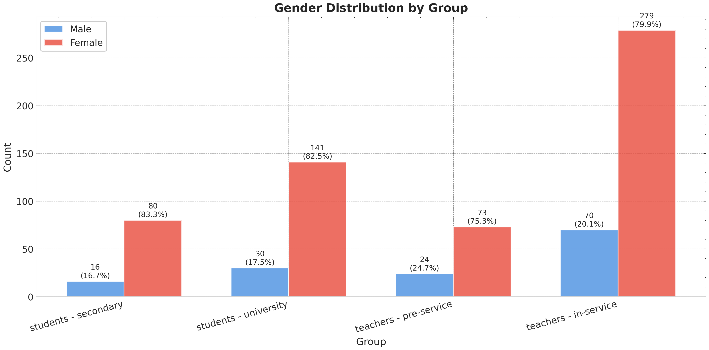{#fig:gender-dist-en width=100%}

The disciplinary mix (table on STEM/Humanities splits and Figure 4) shows a balanced representation of STEM and Humanities backgrounds. Among university students, humanities majors slightly outnumber STEM peers (94 vs. 74), while the two tracks are nearly even within teacher education programs. In-service teachers display a robust STEM presence (143 respondents) alongside a larger humanities share (198). This diversity highlights that the debate on AI integration is not confined to scientific curricula but cuts across epistemic cultures, from computational subjects to language and social sciences.

Table: Disciplinary area (STEM/Humanities) distribution by group {#tbl:area-by-group-en}

| Group                      | STEM | Humanities | No response |
|:---------------------------|----:|----------:|------------:|
| students - secondary       |   32 |        63 |           2 |
| students - university      |   74 |        94 |           2 |
| teachers - pre-service     |   46 |        50 |           2 |
| teachers - in-service      |  143 |       195 |          12 |

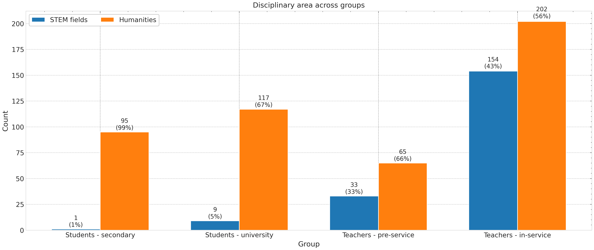{#fig:area-dist-en width=100%}

### AI Usage Patterns

Daily AI adoption shows marked stratification between students and teachers (Table and Figures below). Among secondary students, 89.6% (86 out of 96) report using AI daily, while the percentage drops to 74.7% among university students (130 out of 174). Teachers exhibit a sharp divide: only 51% of pre-service teachers (50 out of 98) and 56% of in-service teachers (196 out of 350) use AI tools in their daily lives. This distribution suggests that AI integration is primarily a student-driven phenomenon, while the teaching workforce shows more cautious and differentiated adoption.

Table: Daily AI adoption by group {#tbl:daily-use-en}

| Group                      | Yes (n) | No (n) | Total | % Yes |
|:---------------------------|--------:|-------:|------:|------:|
| students - secondary       |      86 |     10 |    96 | 89.6% |
| students - university      |     130 |     44 |   174 | 74.7% |
| teachers - pre-service     |      50 |     48 |    98 | 51.0% |
| teachers - in-service      |     196 |    154 |   350 | 56.0% |

{#fig:daily-use-en width=100%}

Weekly usage intensity confirms this trend (Table and Figures below). Secondary students report an average of 6.41 weekly hours of use (median = 2, SD = 11.30), followed by university students with 2.53 hours (median = 2, SD = 2.96). Teachers show substantially lower values: 2.06 hours for pre-service teachers (median = 1, SD = 4.92) and 1.83 hours for in-service teachers (median = 1, SD = 3.87). The high variability observed among secondary students, evidenced by the elevated standard deviation, indicates the coexistence of intensive and occasional users within the same group, suggesting highly individualized paths of technological appropriation.

Table: Weekly hours of AI use by group {#tbl:weekly-hours-en}

| Group                      | N   | Mean | Median | SD    | Q1  | Q3  |
|:---------------------------|----:|-----:|-------:|------:|----:|----:|
| students - secondary       |  96 | 6.41 |    2.0 | 11.30 | 1.0 | 5.0 |
| students - university      | 174 | 2.53 |    2.0 |  2.96 | 0.0 | 4.0 |
| teachers - pre-service     |  98 | 2.06 |    1.0 |  4.92 | 0.0 | 2.0 |
| teachers - in-service      | 350 | 1.83 |    1.0 |  3.87 | 0.0 | 2.0 |

*Note.* Q1/Q3 = first and third quartile; SD = standard deviation.

{#fig:weekly-hours-violin-en width=100%}

{#fig:weekly-hours-box-en width=100%}

The comparison between contexts of use—study versus teaching—reveals significant polarization (χ² = 76.82, p < 0.001, Cramér's V = 0.325). Among students, 75.2% (203 out of 270) use AI for study activities, while only 41.4% of teachers (189 out of 457) integrate it into teaching. This 33.8-percentage-point difference signals a disconnect between student learning practices and teacher pedagogical strategies. Secondary students show the highest adoption rate for study purposes (76.0%), followed by university students (74.7%), while among in-service teachers the percentage drops to 45.0% and plummets to 28.3% among those in training. This pattern suggests that AI is perceived and used primarily as a tool for individual learning support, while its integration into structured pedagogical practice remains marginal and problematic.

Table: AI use for study/teaching by group {#tbl:study-teaching-en}

| Group                      | Yes (n) | No (n) | Total | % Yes |
|:---------------------------|--------:|-------:|------:|------:|
| students - secondary       |      73 |     23 |    96 | 76.0% |
| students - university      |     130 |     44 |   174 | 74.7% |
| teachers - pre-service     |      28 |     71 |    99 | 28.3% |
| teachers - in-service      |     161 |    197 |   358 | 45.0% |

{#fig:study-teaching-en width=100%}

#### Statistical significance tests

The observed differences were subjected to statistical significance testing. One-way ANOVA on weekly AI usage hours reveals highly significant differences among the four groups (*F* = 18.25, *p* < 0.001). Tukey's post-hoc test with Bonferroni correction shows that secondary students use AI significantly more hours than all other groups: the mean difference is 3.88 hours compared to university students (*p* < 0.01), 4.35 hours compared to pre-service teachers (*p* < 0.01), and 4.58 hours compared to in-service teachers (*p* < 0.001). No significant differences emerge between university students and teachers, nor between the two teacher cohorts, indicating that higher usage intensity is a distinctive characteristic of secondary students.

The chi-square test for daily AI use confirms a significant difference among the four groups (χ² = 76.82, *p* < 0.001), with a moderate effect size (Cramér's V = 0.325). Similarly, the study versus teaching comparison shows highly significant polarization (χ² = 76.82, *p* < 0.001, Cramér's V = 0.325), with a 33.8-percentage-point difference between students and teachers. These results confirm that the observed differences are not due to chance but reflect structurally differentiated adoption patterns between students and teachers.

Table: ANOVA results for weekly hours {#tbl:anova-hours-en}

| Test          | F      | p-value | Significance |
|:--------------|-------:|--------:|:-------------|
| One-way ANOVA | 18.255 | < 0.001 | ***          |

*Note.* *** = p < 0.001; Levene's test for homogeneity of variances: *F* = 12.94, *p* < 0.001 (variances not homogeneous).

Table: Tukey's post-hoc test (multiple comparisons with Bonferroni correction) {#tbl:tukey-en}

| Comparison                                 | Mean diff. | p-value | Significant |
|:-------------------------------------------|----------:|---------:|:------------|
| secondary vs. university students          |       3.88 |  < 0.01 | **          |
| secondary students vs. pre-service teachers|       4.35 |  < 0.01 | **          |
| secondary students vs. in-service teachers |       4.58 | < 0.001 | ***         |
| university vs. pre-service teachers        |       0.47 |   0.323 | n.s.        |
| university students vs. in-service teachers|       0.70 |   0.036 | n.s.†       |
| pre-service vs. in-service teachers        |       0.23 |   0.626 | n.s.        |

*Note.* ** = p < 0.01; *** = p < 0.001; n.s. = not significant; † = significant without Bonferroni correction (α = 0.008333).


#### Gender and disciplinary area differences

Analysis of gender differences in AI adoption revealed no statistically significant differences in most groups. Among secondary students, 81.2% of males and 91.2% of females use AI daily (Fisher's exact test, p = 0.363). Similarly, among university students no significant differences emerge (80.0% males vs. 73.8% females, χ² = 0.234, p = 0.629). Among in-service teachers, 62.9% of males and 54.1% of females use AI daily (χ² = 1.396, p = 0.237). The only group showing a trend toward significance is pre-service teachers, where males display a higher adoption rate (70.8% vs. 45.2%, χ² = 3.779, p = 0.052), though the value remains above the conventional threshold α = 0.05.

Regarding usage intensity measured in weekly hours, gender differences are generally not significant, with one notable exception: among pre-service teachers, males dedicate significantly more hours to AI than females (2.42 hours vs. 1.36 hours, difference = +1.06 hours, p = 0.045). In other groups no statistically significant differences are observed: secondary students (4.88 hours males vs. 6.72 hours females, p = 0.554), university students (2.40 hours vs. 2.55 hours, p = 0.804), in-service teachers (2.03 hours vs. 1.78 hours, p = 0.639).

Analysis by disciplinary area (STEM vs. humanities) revealed no significant differences in either adoption or usage intensity. Among pre-service teachers, 53.0% of STEM and 57.1% of humanities use AI daily (χ² = 0.000, p = 1.000). Among in-service teachers, rates are 63.3% (STEM) and 54.5% (humanities) respectively, without significant differences (χ² = 1.568, p = 0.211). For weekly hours, no significant differences emerge between the two disciplinary areas either: pre-service teachers STEM 2.28 hours vs. humanities 2.33 hours (p = 0.971); in-service teachers STEM 1.74 hours vs. humanities 2.34 hours (p = 0.289). Data for students were not available for analysis by disciplinary area.

Table: Gender differences in daily AI use {#tbl:gender-use-en}

| Group                  | Males (% yes) | Females (% yes) | Test        | p-value | Significant |
|:-----------------------|:-------------:|:---------------:|:------------|--------:|:------------|
| students - secondary   |     81.2%     |     91.2%       | Fisher      |   0.363 | No          |
| students - university  |     80.0%     |     73.8%       | Chi-square  |   0.629 | No          |
| teachers - pre-service |     70.8%     |     45.2%       | Chi-square  |   0.052 | No†         |
| teachers - in-service  |     62.9%     |     54.1%       | Chi-square  |   0.237 | No          |

*Note.* † = marginal trend (0.05 < p < 0.10).

Table: Gender differences in weekly usage hours {#tbl:gender-hours-en}

| Group                  | Mean Males | Mean Females | Difference | p-value | Significant |
|:-----------------------|-----------:|-------------:|-----------:|--------:|:------------|
| students - secondary   |       4.88 |         6.72 |      -1.84 |   0.554 | No          |
| students - university  |       2.40 |         2.55 |      -0.15 |   0.804 | No          |
| teachers - pre-service |       2.42 |         1.36 |      +1.06 |   0.045 | Yes*        |
| teachers - in-service  |       2.03 |         1.78 |      +0.24 |   0.639 | No          |

*Note.* * = p < 0.05.
### Readiness Beliefs (R): Perceived Competence

Self-efficacy scores reveal a strong mismatch between technical fluency and conceptual understanding. Students rate their practical competence at 4.32/7 yet drop to 3.16/7 on theoretical knowledge; teachers remain below the midpoint on both (3.79 and 3.20). Medians at value 3 (“moderate competence”) indicate that the majority still feels only partially prepared to handle AI critically.

Table: Perceived competence (1–7 scale) {#tbl:competence-likert-en}

| Dimension        | Students (mean; median) | Teachers (mean; median) |
|:-----------------|:------------------------|:------------------------|
| Practical skill  | 4.32; 4                 | 3.79; 4                 |
| Theoretical skill| 3.16; 3                 | 3.20; 3                 |

{#fig:competence-4groups-en width=100%}

### Adequacy of Support (A): Training Adequacy and Self-Directed Learning

Formal preparation is widely considered inadequate (students mean = 3.30; teachers = 2.88), with 22% of students and 29% of teachers selecting the minimum value “1 – not adequate at all.” Informal learning does not close the gap: students dedicate a median of 0 hours per week to self-training (IQR 0–1), teachers just 1 hour (IQR 0–2), despite a few outliers reporting more than 50 hours and an extreme case at 443 hours.

Table: Training adequacy and self-training {#tbl:training-likert-en}

| Indicator                                   | Students             | Teachers            |
|:--------------------------------------------|:---------------------|:--------------------|
| Perceived adequacy (mean; median)           | 3.30; 3              | 2.88; 3             |
| “1 – Not adequate at all” responses         | 22%                  | 29%                 |
| Weekly self-training (median; IQR)          | 0 h (0–1)            | 1 h (0–2)           |

{#fig:training-adequacy-en width=100%}

{#fig:weekly-training-en width=100%}

### Interpersonal & Institutional Trust (I): Trust, Responsibility, and Perceived Preparedness

Trust in institutional AI integration remains moderate (students 4.47/7; teachers 4.17/7), but responsibility assessments diverge. Teachers give only 3.27/7 to students’ ability to use AI responsibly, while students rate their teachers’ preparedness at 3.50/7. The reciprocal mistrust underscores the need for shared development frameworks.

Table: Trust and responsibility (1–7 scale) {#tbl:trust-likert-en}

| Indicator                                           | Students (mean; median) | Teachers (mean; median) |
|:----------------------------------------------------|:------------------------|:------------------------|
| Trust in institutional AI integration               | 4.47; 5                 | 4.17; 4                 |
| Perceived teacher preparedness (student view)       | 3.50; 3                 | —                       |
| Teachers’ trust in students’ responsible AI use     | —                       | 3.27; 3                 |

{#fig:trust-integration-en width=100%}

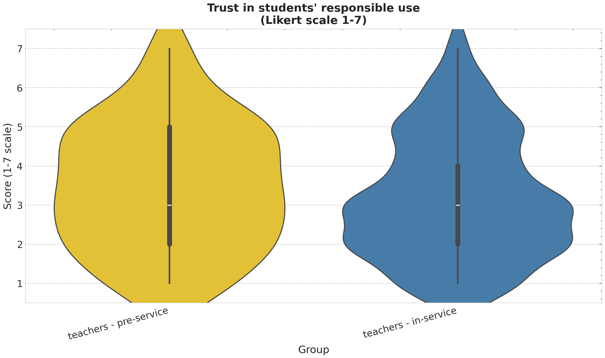{#fig:trust-responsibility-en width=100%}

### Skepticisms (S): Concerns about AI Integration

Students report relatively low concern (3.31/7) whereas teachers express higher unease (4.24/7) and reach 4.69/7 when judging the risk of student misuse. Students perceive peers as less problematic (3.31/7), highlighting a perception gap that fuels calls for clear governance and shared norms.

Table: Concern indicators (1–7 scale) {#tbl:concern-likert-en}

| Indicator                                  | Students (mean; median) | Teachers (mean; median) |
|:-------------------------------------------|:------------------------|:------------------------|
| General concern about AI in education      | 3.31; 3                 | 4.24; 4                 |
| Concern about peers/students using AI      | 3.31; 3                 | 4.69; 5                 |

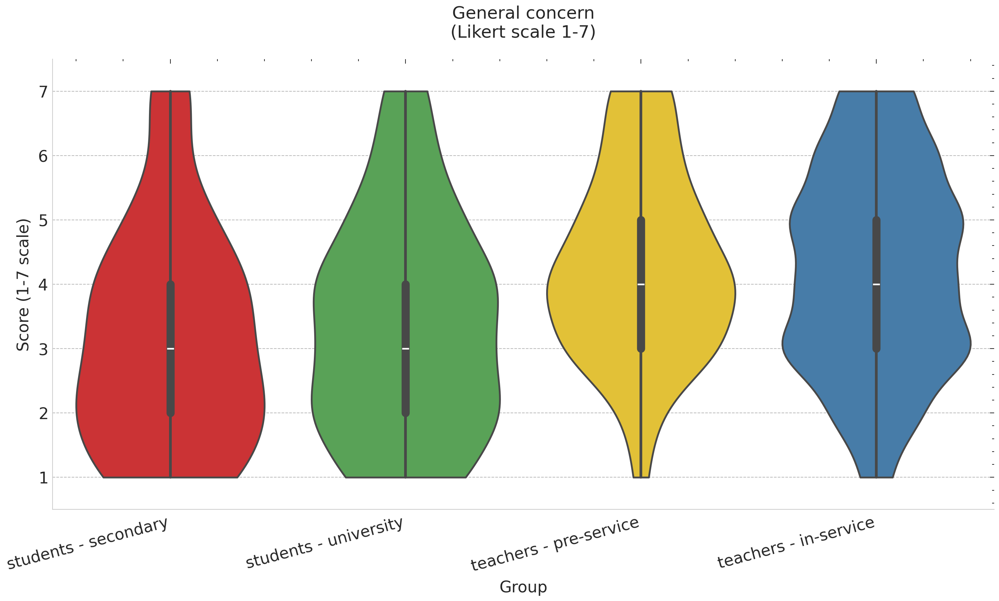{#fig:concern-general-en width=100%}

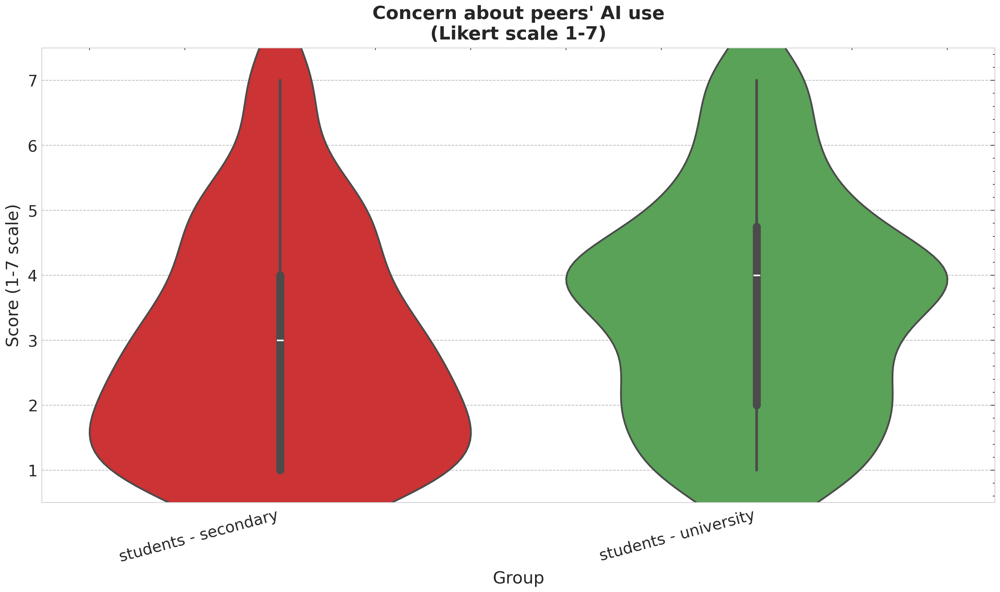{#fig:concern-students-en width=100%}

### eXpectations (X): Perceived Change

Teachers anticipate major systemic shifts (mean = 5.46) yet are more cautious about their personal practice (4.76). Students expect a substantial reshaping of study routines (4.91). The gradient remains generational: the younger cohorts foresee change as inevitable, while the teaching workforce frames it as aspirational but not yet operational.

Table: Perceived change (1–7 scale) {#tbl:change-likert-en}

| Indicator                                      | Students (mean; median) | Teachers (mean; median) |
|:-----------------------------------------------|:------------------------|:------------------------|
| AI will change teaching overall                | —                       | 5.46; 6                 |
| AI will change my teaching practice            | —                       | 4.76; 5                 |
| AI will change the way I study                 | 4.91; 5                 | —                       |

{#fig:change-teachers-en width=100%}

{#fig:change-students-en width=100%}

```{=latex}
\FloatBarrier
```

<!-- /lang:en -->

<!-- lang:en -->
## Discussion

### Massive Adoption Without Institutional Engagement

The first element emerging forcefully is the presence of massive but profoundly uneven AI adoption. Eighty percent of students use these tools daily, configuring a practice now consolidated and rooted in their study routines. This represents remarkable student initiative and adaptability—evidence of learners taking agency in their educational practices and responding to technological opportunities. However, this student-driven adoption has occurred in an institutional vacuum, without the complementary engagement that would maximize educational potential and mitigate risks.

*Monoculture and Tool Concentration*

Usage experience concentrates almost exclusively on ChatGPT, with substantial ignorance of more specific and pedagogically oriented tools. This technological monoculture prevents students from developing articulated understanding of different AI applications and their specific educational potentials. Students learn to interact with a single conversational interface without exploring:

- Specialized research assistants with citation tracking
- Subject-specific tutoring systems designed with pedagogical scaffolding
- Tools for collaborative learning and peer feedback
- Assessment and formative feedback platforms
- Multimodal learning environments combining text, audio, and visual AI capabilities

*Usage Polarization*

A sharp polarization exists between occasional users (one to two hours weekly) and power users demonstrating intensive usage. This fragmentation reflects the nature of informal, peer-driven adoption—where individual discovery and personal networks shape learning trajectories rather than systematic institutional guidance.

This pattern reveals that while AI has penetrated educational practices through bottom-up student initiative, formal education has failed to engage. Schools and universities have largely remained passive observers of a student-driven transformation rather than active partners who could enrich these emergent practices with critical frameworks, broaden tool awareness, and support development from practical competence to sophisticated literacy.

### The Competence Paradox: Knowing How Without Understanding Why

One of the most significant results concerns the gap between practical and theoretical competence, particularly marked among students. The capacity to use tools (mean = 4.32) exceeds understanding of underlying principles (mean = 3.16) by over one point.

This gap configures a learning model based on trial and error, where operational skill acquisition occurs empirically and unstructured, without passing through formal understanding of mechanisms, logic, and technology limitations.

*Implications of Surface-Level Literacy*

Such an approach, while enabling rapid tool familiarization, precludes development of critical and metacognitive competencies indispensable for conscious and responsible AI use. Students know how to query a GenAI system but don't understand:

- How it processes information and generates responses
- What biases it may contain and how these arise
- What epistemological limits it presents
- How to validate AI output critically
- When AI use is appropriate versus when human cognition is essential
- What ethical considerations govern responsible use

This constitutes superficial technological literacy risking production of uncritical users rather than competent digital citizens. The parallel to functional illiteracy is apt: just as functionally illiterate individuals can decode text without comprehending meaning, these students can operate AI tools without understanding their operation, limitations, or appropriate contexts for use.

*The Professional Preparation Crisis*

Teachers present a different but equally concerning pattern. Both practical (3.74) and theoretical (3.28) competence remain below scale midpoint, signaling general perceived inadequacy. Eighty-two teachers rated themselves at 2 for practical competence—a considerable teaching body portion feeling inadequate in practically using the very tools they should teach students to employ critically.

This creates a dangerous educational vacuum: students use AI intensively without critical frameworks, while teachers lack confidence and competence to provide necessary guidance. The traditional model of educator as informed guide breaks down when educators feel less competent than their students.

### The Institutional Training Void

Perhaps the most alarming finding concerns training adequacy evaluation. Both students (mean = 3.3) and teachers (mean = 2.93) express significantly negative judgments, with over a quarter of teachers considering it "not at all adequate."

*The Practice-Training Imbalance*

This judgment assumes dramatic contours when considered in relation to daily technology use: students are actively learning through practice, but formal education has withdrawn from engagement rather than building upon these emergent practices. The educational system faces an evident institutional void. While students develop AI competencies through informal peer-to-peer channels—leveraging the kinds of participatory learning networks that Jenkins and others have documented as powerful sites of knowledge construction [@Jenkins2009Confrontin; @Jenkins2015Participat]—educational institutions have failed to recognize and engage with these learning ecosystems, missing the opportunity to provide the critical frameworks, theoretical depth, and ethical scaffolding that would constitute formal education's complementary value.

*The Strengths and Limitations of Informal AI Learning*

The learning occurs through valuable but incomplete channels:
- Peer sharing of prompts and techniques (effective for practical knowledge transfer)
- Trial-and-error experimentation (builds operational competence)
- Imitation of observed practices (enables rapid skill acquisition)
- YouTube tutorials and online communities (accessible learning resources)
- Incidental discovery through use (experiential learning)

These informal learning mechanisms demonstrate significant strengths: they are accessible, responsive to learner needs, embedded in authentic contexts, and driven by intrinsic motivation. Research on participatory culture and connected learning has shown that such peer-driven knowledge networks can be highly effective for developing practical competencies [@Jenkins2009Confrontin; @Jenkins2015Participat].

Our findings provide empirical support for this theoretical framework. The practice patterns data, interpreted through the lens of participatory culture [@Jenkins2009Confrontin; @Jenkins2015Participat], reveal a significant pattern: high AI use is combined with perceived training inadequacy (28% rate it "not adequate"). This suggests that students and teachers are learning through experimentation, peer exchange, and trial-and-error rather than through structured institutional guidance.

While this informal learning proves effective in developing operational competencies—as demonstrated by high perceived practical competence (mean = 4.32/7)—it generally lacks the critical frameworks needed to understand AI limitations, biases, and appropriate use contexts, as evidenced by low theoretical competence (mean = 3.16/7). Practice patterns thus serve a diagnostic function: they reveal that adoption is underway but signal the urgent need for formal education to complement and deepen the practical knowledge acquired informally, bridging the gap between knowing how to do and knowing how to reflect critically.

However, without complementary formal engagement, this learning ecosystem produces unbalanced development. While practical skills flourish, critical dimensions remain underdeveloped: systematic understanding of AI mechanisms and limitations, frameworks for evaluating bias and reliability, ethical reasoning about appropriate use contexts, awareness of privacy and intellectual property implications, and metacognitive reflection on how AI use affects one's own thinking and learning processes.

The problem is not the informal learning itself—which represents valuable student agency and resourcefulness—but rather the institutional failure to engage with and build upon these emergent practices.

*Understanding the Student-Teacher Usage Gap: A Four-Group Perspective*

The four-group analysis reveals a more nuanced generational landscape than simple student-teacher dichotomies suggest. **Secondary school students emerge as "power users"** with 79% adoption rate and average weekly usage of 6.4 hours—nearly triple the intensity of university students (2.5 hours/week) and more than triple that of teachers (1.8-2.1 hours/week for in-service and pre-service respectively). Statistical analysis confirms these differences are highly significant (ANOVA F = 18.25, p < 0.001), with post-hoc tests showing that secondary students differ significantly from all other groups (all p < 0.001), while the other three groups (university students, pre-service teachers, in-service teachers) form a relatively homogeneous plateau of moderate use.

This finding is particularly striking: **the youngest participants in the sample have integrated AI most pervasively**, suggesting an accelerated generational phenomenon where familiarity with digital technologies and absence of pre-existing methodological barriers facilitate rapid adoption. Adolescents are not merely early adopters—they are intensive adopters, embedding AI into study routines with a thoroughness that diminishes with educational maturity and professional entry.

The substantial disparity in AI adoption between students (approximately 80% daily use overall: 90% secondary, 75% university) and teachers (56% for in-service, 51% for pre-service teachers) reflects multiple converging factors beyond mere technological access:

1. *Accessibility and immediacy*: AI tools prove more immediately accessible and useful for students, who can obtain quick explanations, homework support, and study assistance through simple conversational interfaces. The lower barriers to entry for student use cases—straightforward question-answering and content generation—contrast sharply with the more complex professional integration required for teaching.

2. *Professional complexity*: Teachers face more complex integration challenges. Their professional needs require targeted, structured resources that align with curricular objectives, pedagogical frameworks, and assessment criteria. The accumulated experience of teachers allows them to draw upon extensive traditional materials that, in the current phase, often prove more reliable and pedagogically appropriate than generic AI outputs. Integrating AI into teaching practice demands not merely tool competence but pedagogical redesign—understanding how AI can complement rather than replace human instruction, how to scaffold student use ethically, and how to assess learning in AI-mediated contexts.

3. *Skepticism and caution*: Teachers demonstrate greater skepticism toward an evolving technology, maintaining a prudent waiting stance to better understand its real potentials and limitations in educational contexts. This caution reflects professional responsibility: teachers cannot experiment freely with students' learning experiences in the way students can with their own study methods. The stakes of pedagogical decisions—affecting student achievement, equity, and development—justify measured evaluation before wholesale adoption.

4. *Generational factors*: Younger cohorts demonstrate greater propensity for adopting new technologies and a more exploratory attitude toward experimentation. Students integrate digital tools into their daily routines with naturalness, contrasting with the caution and skepticism often characterizing teacher approaches. This generational dimension intersects with the previous factors, as digital nativity shapes both comfort with new interfaces and willingness to tolerate ambiguity during exploratory learning.

*The Self-Directed Learning Paradox*

Perhaps most paradoxical is the finding regarding autonomous learning effort. Both students and teachers report that formal AI training is grossly inadequate (students mean = 3.3, teachers mean = 2.93), yet autonomous engagement with AI training remains remarkably low across both groups. The data reveal median self-directed AI learning time close to zero for students (median = 0 hours, Q1–Q3 = 0–1 hours) and only marginally higher for teachers (median = 1 hour, Q1–Q3 = 0–2 hours).

Notably, while both groups demonstrate low engagement, students show slightly more autonomous learning activity than teachers—with a longer right tail of intensive learners investing 40+ hours weekly in self-education about AI tools. This pattern suggests that while most participants remain passive consumers waiting for institutional training, a minority—predominantly younger learners—actively construct their own learning pathways.

This creates a troubling circularity: participants critique institutional training as inadequate, yet do not compensate through autonomous professional development. The expectation that institutions should provide comprehensive training coexists with minimal personal investment in self-directed learning. This phenomenon may reflect several dynamics:

- *Learned passivity*: Educational systems have conditioned participants to expect formal instruction rather than cultivate autonomous learning dispositions
- *Lack of meta-learning competence*: Participants may lack the metacognitive skills and information literacy necessary to identify quality learning resources and structure effective self-directed learning
- *Perceived futility*: Without institutional validation and integration, self-acquired competencies may seem professionally irrelevant
- *Temporal constraints*: Both students and teachers face demanding schedules, relegating non-mandatory learning to low priority

This paradox connects directly to the training adequacy crisis: the combination of inadequate institutional support and limited autonomous learning creates a competence vacuum. Participants recognize their insufficient preparation yet remain largely passive in addressing it, waiting for institutions that have thus far failed to respond.

The bimodal usage pattern documented earlier—occasional users versus power users—thus reflects not merely different adoption levels but fundamentally different approaches to learning and professional development. Power users, while still a minority, demonstrate the kind of agency and self-directed learning that would ideally characterize professional educators. The question becomes: how can institutions catalyze this minority pattern into majority practice, transforming passive expectation into active engagement while simultaneously providing the formal frameworks that self-directed learning alone cannot supply?

### The Third-Person Bias and Resistance to Change

Teachers manifest an interesting psychological phenomenon: while recognizing that AI will significantly change teaching generally (mean = 5.45), they are much more cautious in predicting impact on their own personal didactic practice (mean = 4.68).

This "third-person bias" can be interpreted as:

1. *Psychological defense mechanism*: Protection against change perceived as destabilizing to professional identity and established practices. After years or decades developing particular pedagogical approaches, the prospect of fundamental transformation provokes anxiety and resistance.

2. *Pragmatic uncertainty*: Concrete doubt about how to translate theoretical recognition of AI potential into effective didactic practices. Teachers may genuinely want to integrate AI but lack clear models, examples, and support structures for doing so.

3. *Professional conservatism*: Understandable hesitation to abandon proven methods for untested technologies, particularly given responsibility for student learning outcomes.

*Competence and Change Readiness*

This phenomenon accompanies generally low perceived competence levels (practical mean = 3.74) and a significant mass of teachers at lowest scale values. A teaching body emerges feeling inadequate regarding tools they should be able to teach critical use of, trapped between recognizing technology relevance and incapacity to integrate it effectively into professional practice.

This situation generates professional stress and cognitive dissonance: teachers recognize they should adapt but don't know how, creating anxiety, frustration, and sometimes defensive rejection of the technology.

### The Trust Paradox: Guides Who Distrust Those They Guide

A further critical element concerns trust asymmetry. Students demonstrate greater confidence in AI integration in education (mean = 4.47) than teachers (mean = 4.12), configuring an asymmetry where those who should be guided are more optimistic than those who should guide.

*Teachers' Concerns About Student Use*

More worrying is teacher trust data regarding students' critical capacity: concerns reach high values (mean = 4.71), with nearly 60% of responses concentrated at high scale values.

An educational paradox emerges: approximately 80% of students use AI daily (90% secondary, 75% university), while teachers distrust their capacity to do so consciously and critically, yet simultaneously don't possess formative tools and necessary competencies to intervene effectively.

*The Unlicensed Driver Metaphor*

It's as if numerous drivers operate without licenses under worried instructor gazes who lack means to teach proper driving. This metaphor captures several dimensions:

- *Ubiquitous unsupervised practice*: Students use AI extensively without proper training or oversight
- *Recognized incompetence*: Both teachers and students acknowledge the lack of adequate preparation
- *Inability to intervene*: Teachers lack confidence and tools to provide needed guidance
- *Accident risk*: The potential for serious negative consequences (academic dishonesty, skill atrophy, uncritical acceptance of biased or incorrect information)

Significantly, students themselves recognize this inadequacy, as demonstrated by negative evaluation of teacher AI preparation (median = 3). This creates a situation of mutual acknowledged incompetence that is both unusual and problematic in educational contexts.

### Three Attitudinal Dimensions: The Structure of AI Attitudes

Correlation analysis reveals that attitudes toward AI in education are not unidimensional but rather organize into **three distinct yet interconnected psychological constructs**, each with different implications for intervention and policy.

*Dimension 1: Competence as Integrated Construct*

The strongest correlation in the entire dataset (ρ = 0.72) links practical and theoretical competence, indicating that these develop in tandem rather than independently. This has crucial implications: **effective AI literacy programs cannot treat operational skills and conceptual understanding as separate learning objectives**. Users who develop "know-how" simultaneously develop "know-why," and vice versa. The moderate correlations of both competence dimensions with training adequacy (ρ = 0.57) confirm that formal education contributes meaningfully to both aspects.

However, while competence dimensions are tightly integrated, overall levels remain concerning: both students and teachers cluster below the scale midpoint on theoretical understanding, and teachers fall below midpoint on practical competence as well. This suggests that while informal learning builds practical skills, it insufficiently develops theoretical foundations—and current formal training fails to address either dimension adequately.

*Dimension 2: Training as Strategic Leverage Point*

The second cluster reveals a **causal chain structure** with profound policy implications:

**Training adequacy → Trust in AI integration (ρ = 0.63) → Perceived change expectations (ρ = 0.62)**

This chain identifies training as a **strategic lever** for fostering acceptance and positive transformation expectations. Adequate training doesn't merely build skills—it fundamentally reshapes psychological readiness for AI integration by:

1. Building confidence in the technology's reliability and appropriateness (trust)
2. Shaping expectations about its transformative potential (perceived change)
3. Creating cascading effects through the attitudinal system

The correlation magnitudes (ρ > 0.60) indicate substantial shared variance, meaning that interventions targeting training quality can produce multiplicative effects throughout educational actors' attitudes. This provides empirical justification for investing in comprehensive, well-designed training programs: the returns extend far beyond immediate skill acquisition to encompass broader psychological preparation for organizational change.

Critically, the current state is dire: training adequacy averages 3.3 for students and 2.93 for teachers (both significantly below scale midpoint), with 22-28% rating it as "not at all adequate" (minimum value). The correlation structure suggests this inadequacy cascades through the system, depressing trust and limiting change expectations.

*Dimension 3: Concern as Rational and Informed*

The third dimension—concern about AI integration—presents perhaps the most theoretically significant finding. While concerns show moderate internal consistency (ρ = 0.51 between general and specific worries), they demonstrate **virtually no negative correlation with competence** (ρ ≈ 0 to -0.12).

This dismantles a pervasive assumption in innovation diffusion literature: that resistance stems primarily from ignorance or unfamiliarity. Our data suggest the opposite: **concerns are informed and rational**. Those who understand AI better do not worry less—if anything, deeper knowledge may bring clearer comprehension of real risks. Teachers, who show higher concern levels than students (mean difference = 0.93, p < 0.001), likely perceive complexities and threats that students, despite intensive use, have not yet recognized.

This legitimizes educational actors' concerns rather than dismissing them as technophobia. The appropriate institutional response is not reassurance or "awareness-raising" campaigns aimed at reducing worry, but rather **substantive engagement with the legitimate issues underlying these concerns**: bias, privacy, academic integrity, skill atrophy, equity, and pedagogical disruption. Concerns should be treated as signals of critical engagement rather than barriers to overcome.

### The Gender Gap: A Digital Divide in AI Confidence

Perhaps the most troubling finding concerns gender disparities in AI attitudes. While most dimensions show no significant gender differences, two critical attitudes demonstrate **exceptionally large gaps** (Cohen's d > 1.2):

- **Trust in AI integration:** Males rate 1.96 points higher (28% of scale)
- **Perception of teacher preparedness:** Males rate 2.25 points higher (32% of scale)

These effect sizes are extraordinarily rare in social science research. For context, Cohen's guidelines classify d = 0.8 as "large"; our observed d > 1.2 exceeds this threshold substantially, indicating differences of more than one standard deviation between groups. In practical terms: the average male respondent's trust level exceeds that of 90% of female respondents.

*Implications and Urgency*

This digital gender divide in AI attitudes demands urgent attention for several reasons:

1. **Equity concerns**: If AI integration proceeds without addressing this gap, it risks creating or exacerbating gender disparities in educational and professional opportunities in AI-enhanced fields.

2. **Potential mechanisms**: The gap may reflect differential exposure to AI technologies, gendered sociocultural messaging about technical competence, stereotype threat effects, or legitimate differences in risk perception sensitivity. Understanding causation is critical for intervention design.

3. **Self-fulfilling prophecy risk**: Lower confidence and trust may inhibit engagement, which in turn prevents the mastery experiences necessary to build confidence—creating a negative spiral.

4. **Institutional blindness**: The current "one-size-fits-all" approach to AI integration ignores these profound attitudinal differences, potentially serving male participants better than female participants.

**Necessary interventions** include: gender-specific confidence-building programs, visible female role models in educational AI contexts, investigation of underlying sociocultural factors, and creation of inclusive, psychologically safe learning environments where all participants feel supported in developing AI literacy. The magnitude of this gap suggests that gender-neutral policies will likely perpetuate rather than address the divide.

**Methodological caveat**: The significant results emerged from analyses with small female subsamples (n = 3), requiring cautious interpretation. However, the consistency of direction and exceptional magnitude suggest this is a genuine phenomenon warranting replication with larger samples rather than statistical artifact.

### The Democratization of AI: Beyond Disciplinary Boundaries

In stark contrast to gender, disciplinary area (STEM vs. Humanities) shows **no significant differences across all 9 tested attitudinal dimensions**. This includes practical competence, theoretical competence, training adequacy, trust, concerns, and perceived change expectations—all show p > 0.05 for disciplinary comparisons.

This null result is theoretically significant. Common assumptions hold that:
- STEM participants, due to technical backgrounds, should demonstrate higher competence and confidence
- Humanities participants should show greater resistance or skepticism
- Disciplinary cultures should shape technology adoption patterns

Our data refute these assumptions. AI is perceived and experienced as a **universal, transdisciplinary phenomenon** affecting all domains equally. There is no "protection" in STEM fields (technical familiarity doesn't reduce concerns or increase trust significantly) nor "resistance" in Humanities (these participants are equally engaged and concerned).

*Implications for Intervention Design*

This finding has crucial practical implications:

1. **Interdisciplinary training is viable**: AI literacy programs need not be customized by discipline. The focus should be on general pedagogical principles, critical frameworks, and ethical reasoning that transcend disciplinary boundaries.

2. **Avoid stereotyping**: Institutional assumptions that "STEM faculty will adapt easily" or "Humanities faculty need special support" are empirically unfounded and potentially harmful.

3. **Cross-disciplinary communities of practice**: Since attitudes and challenges are shared, professional development can leverage interdisciplinary collaboration rather than siloing by department.

4. **Universal curriculum integration**: AI literacy should be integrated across the curriculum as a core competency rather than relegated to computer science or treated as a STEM-specific skill.

The one marginal exception—pre-service teachers in STEM reporting *lower* AI use than Humanities counterparts (p = 0.046, counter-intuitive direction)—likely reflects sample-specific characteristics rather than systematic patterns, and requires replication before interpretation.

### Broader Implications for Educational Theory and Practice

These findings intersect with several important theoretical frameworks:

*Social Cognitive Theory and Self-Efficacy*

The competence-confidence gap illuminates Bandura's concept of self-efficacy [@Bandura1977Selfeffic; @Bandura1986SocialFoun]. Students demonstrate high self-efficacy for practical AI use but lack the mastery experiences and vicarious learning that would build self-efficacy for critical evaluation [@Honicke2016Academicse]. Teachers show low self-efficacy across both dimensions, potentially creating a self-fulfilling prophecy where anxiety prevents the engagement necessary to build genuine competence.

*Technology Acceptance Models*

Classical technology acceptance models emphasize perceived usefulness and ease of use as adoption drivers [@Davis1989PerceivedU; @Venkatesh2000ATheoretic; @Venkatesh2003UserAccept]. Our findings suggest these factors operate differently for students and teachers. For students, immediate usefulness (homework help, quick answers) and ease of use (conversational interface) drive rapid adoption despite inadequate understanding. For teachers, professional complexity and pedagogical responsibility create higher thresholds for perceived usefulness, while lower confidence reduces perceived ease of use.

*Sociocultural Learning Theory*

Vygotsky's emphasis on mediated learning and the zone of proximal development highlights the problematic nature of unguided AI adoption. Students operate within their current capability zone but lack expert guidance to extend into new zones of understanding. The absence of knowledgeable others capable of providing appropriate scaffolding limits development of sophisticated AI literacy.

*Critical Digital Literacy*

Our findings underscore the urgent need for critical digital literacy frameworks that extend beyond operational skills to encompass [@Carretero2017DigComp21; @Vuorikari2016DigComp20]:
- Understanding of sociotechnical systems and their embedded values
- Recognition of algorithmic bias and its sources
- Evaluation of information credibility and AI output reliability
- Ethical reasoning about appropriate use contexts
- Metacognitive awareness of how AI use affects one's own thinking

### The Urgency of Systematic Intervention

These data, in their totality, delineate an educational urgency that cannot be further ignored or postponed. AI integration in educational contexts is occurring de facto, but chaotically, unguidedly, and pedagogically inadequately.

Systematic and structured intervention is necessary, simultaneously addressing multiple dimensions:

*1. Teacher Professional Development*

Investment in serious and continuous teacher training pathways is indispensable, moving beyond operational tool use to develop:
- Critical understanding of AI fundamentals (not computer science depth, but sufficient conceptual understanding)
- Pedagogical implications and integration strategies
- Ethical frameworks for responsible use
- Practical experience with diverse AI applications
- Confidence through supported experimentation and community of practice development

*2. Structured Student Curricula*

Building upon and enriching the informal learning already occurring requires introducing curricular pathways that combine:
- Practical competence with varied tools and contexts
- Theoretical understanding of AI capabilities and limitations
- Critical literacy for output evaluation
- Ethical reasoning about appropriate use
- Metacognitive awareness of AI's effects on learning and thinking

*3. Tool Diversification*

Promoting knowledge and use of tools specifically designed for educational contexts, overcoming exclusive dependence on generalist platforms like ChatGPT. This includes:
- Subject-specific tutoring systems
- Research and citation support tools
- Collaborative learning platforms
- Formative assessment and feedback tools
- Specialized applications for different learning needs and contexts

*4. Pedagogical Research*

Developing empirical research on:
- Most effective AI integration modalities in didactics
- Effects on learning outcomes, engagement, and skill development
- Strategies for preventing uncritical and superficial use
- Assessment approaches that account for AI availability
- Longitudinal impacts on cognitive development and learning dispositions

*5. Rethinking Didactic Practices*

Supporting teachers in rethinking their practices in light of AI-offered possibilities, overcoming both defensive attitudes and uncritical enthusiasm to develop pedagogically grounded and critically conscious approaches. This includes:
- Redesigning assignments and assessments to be AI-aware
- Developing pedagogies that leverage AI for enhanced learning
- Creating classroom cultures of critical AI engagement
- Modeling thoughtful AI use and limitations acknowledgment

*6. Institutional Policy and Infrastructure*

Developing clear institutional policies and support structures:
- Guidelines for appropriate and inappropriate AI use in different contexts
- Infrastructure supporting responsible AI access and use
- Mechanisms for ongoing policy review as technology evolves
- Resources for sustained professional development and curricular innovation

---

<!-- /lang:en -->

<!-- lang:en -->
## Conclusion

We stand at a critical juncture in educational technology integration. The findings of this study reveal a significant and troubling gap between the rapid, widespread adoption of GenAI by students and the capacity of educational institutions to provide appropriate guidance, critical frameworks, and pedagogical support.

*The Current State: A Perfect Storm of Challenges*

The data compose a picture of:
- *Massive adoption without institutional engagement*: Approximately 80% of students (90% secondary, 75% university) using AI daily through valuable informal peer-driven channels, but without complementary formal support
- *Competence imbalance*: High operational skills but low theoretical understanding and critical literacy—practical knowledge flourishing while critical frameworks remain absent
- *Institutional withdrawal*: Widespread dissatisfaction with formal AI training among both students and teachers, reflecting failure to engage with emergent learning practices
- *Teacher unpreparedness*: Educators feeling inadequate to guide students in tools they should be teaching critical use of
- *Trust asymmetry*: Students more confident than teachers, while teachers distrust students' critical capacity
- *Limited tool awareness*: Concentration around single generalist platform, missing specialized educational applications
- *Resistance and uncertainty*: Teachers recognizing AI's transformative potential generally while uncertain about personal integration

This configuration presents both urgent risks and significant opportunities.

*Generational Gradient in AI Adoption and Usage Intensity*

Statistical analysis of usage patterns revealed a marked **generational gradient** spanning the entire sample. AI adoption rates decrease systematically from secondary students (89.6%) to university students (74.7%), then drop significantly when transitioning to the teaching workforce (51.5% for pre-service teachers, 56.7% for in-service teachers). This pattern suggests that AI integration is not merely a matter of technical competence, but reflects profound generational differences in familiarity with technological ecosystems, usage expectations, and digital socialization processes.

Usage intensity, measured in weekly hours, further amplifies this stratification. Secondary students dedicate an average of 6.41 hours per week to AI, more than double that of university students (2.53 hours) and teachers (approximately 2 hours for both categories). This difference remains statistically significant even after post-hoc tests with Bonferroni correction, confirming it is not random variation but a robust, replicable phenomenon. The high standard deviation observed among secondary students (SD = 11.30) and extreme values recorded (up to 56 hours per week) also indicate strong **internal heterogeneity** within the group, with "power users" intensively experimenting with AI alongside occasional users.

This polarization can be interpreted through multiple lenses. On one hand, younger students raised in an era of pervasive digitalization may perceive AI as a natural extension of their everyday technological environment, integrating it into educational, creative, and recreational activities seamlessly. On the other hand, the absence of strict institutional or ethical constraints allows them greater exploratory freedom compared to university students, who might self-censor due to academic integrity concerns, or teachers, bound by professional and pedagogical responsibilities.

The fact that **no significant differences emerge** between university students and teachers (both around 2 hours per week) is particularly relevant. This pattern suggests that beyond adolescence, AI use stabilizes at more contained and probably more **instrumental and focused** levels, limited to specific tasks such as information research, teaching material preparation, or document synthesis, rather than broad, differentiated exploration. The uniformity between these two groups—so different in role and professional context—indicates that usage intensity may be more influenced by situational and generational factors than by individual or professional characteristics.

*Gender Equity and Disciplinary Democratization: Positive Signals in a Fragmented Context*

A particularly significant finding, counter to previous studies on the digital gender gap, is the **absence of systematic differences** between males and females in AI adoption and usage intensity. Among students—both secondary and university—no statistically significant disparities emerge, suggesting that current student cohorts access AI equitably, regardless of gender. This is an encouraging result that may reflect progressive overcoming of gender stereotypes related to technological competencies and greater accessibility and usability of generative AI tools compared to previous technologies.

However, a **notable exception** emerges among pre-service teachers, where males dedicate significantly more hours to AI than females (2.42 vs. 1.36 hours, p = 0.045) and show a marginal trend toward higher adoption rates (70.8% vs. 45.2%, p = 0.052). This pattern might reflect differences in professional motivations, with males more oriented toward technological exploration and females more focused on other formative priorities during the pre-service period. Alternatively, influences of gender stereotypes and perceived technological self-efficacy may persist in this age range and professional context—elements deserving qualitative investigation for full understanding.

Similarly, the **absence of differences between disciplinary areas** (STEM vs. humanities) in AI adoption and usage intensity is a counter-intuitive but extremely promising result. One might expect greater familiarity and propensity for AI use in scientific and technical sectors, historically more technology-oriented. Instead, data show substantially equivalent usage rates between STEM and humanities, both for daily adoption and weekly hours dedicated. This result testifies to the **cross-cutting applicability** of generative AI tools: if ChatGPT and similar tools are equally useful for writing code, analyzing data, and solving mathematical problems as for drafting texts, translating, synthesizing literature, and supporting critical thinking, then AI can indeed configure as a **democratizing technology** that crosses traditional disciplinary boundaries.

This disciplinary democratization opens positive prospects for education: interdisciplinary training pathways, communities of practice transcending departmental silos, and widespread AI curricular integration across the entire academic fabric, rather than confining it to computer science courses or STEM disciplines alone. However, it remains crucial to ensure that this cross-cutting accessibility translates into **critical and aware** use, capable of recognizing the limits, biases, and ethical implications of tools, regardless of the disciplinary domain of application.

*Methodological Limitations and Future Directions*

It is important to acknowledge the methodological limitations of the analysis conducted. Statistical tests revealed violations of normality assumptions (Shapiro-Wilk tests, all p < 0.001) and homogeneity of variances (Levene's test, p < 0.001) in weekly hours distributions, suggesting distributions exhibit positive skewness and heavy tails. While parametric ANOVA is considered robust to moderate violations with sufficiently large samples, it would be advisable to confirm results through non-parametric tests (e.g., Kruskal-Wallis) and robust models (e.g., bootstrap, permutation tests) in subsequent analyses.

Furthermore, weekly hours estimates are based on **self-assessment**, subject to recall and social desirability biases. The wide variability and extreme values observed (e.g., 56 hours/week among secondary students) suggest possible overestimation or heterogeneous interpretations of the question. Future research could benefit from more objective data collection methods, such as automatic usage logs, structured diaries, or experience sampling techniques, to triangulate measures and reduce biases.

Finally, the study adopts a **cross-sectional design**, which allows detecting associations but not inferring causality. It is not possible to determine whether observed differences are due to generational effects (cohorts raised in different technological eras), age effects (stages of cognitive and social development), or context effects (academic pressures, professional constraints). Longitudinal studies following the same cohorts over time, or quasi-experimental designs introducing controlled training interventions, would be essential to clarify causal relationships and evaluate the impact of targeted educational policies.

Despite these limitations, the results provide a **solid empirical foundation** for orienting educational policies and training practices, highlighting the need for differentiated interventions for generational groups, attention to gender specificities in pre-service professional contexts, and promotion of a cross-cutting and inclusive vision of AI literacy that transcends traditional disciplinary boundaries.

*Risks of Inaction*

If we allow AI to integrate into educational contexts spontaneously and disorderedly, we face serious risks:

1. *Erosion of critical thinking*: Uncritical reliance on AI outputs without developing capacity to evaluate, question, and verify
2. *Cognitive skill atrophy*: Outsourcing thinking processes that are essential for deep learning and intellectual development
3. *Perpetuation of biases*: Uncritical acceptance of biased AI outputs reinforcing existing inequalities and misconceptions
4. *Academic integrity crisis*: Difficulty distinguishing authentic student work from AI-generated content
5. *Widening divides*: Growing gaps between students with access to AI guidance and those without
6. *Professional teacher demoralization*: Increasing educator stress, inadequacy feelings, and potential exodus from profession

*Opportunities for Thoughtful Integration*

Conversely, with systematic intervention, we can realize AI's genuine educational potential:

1. *Personalized learning support*: AI as tutor providing customized explanations, practice, and feedback at scale
2. *Accessibility enhancement*: Support for diverse learners including those with disabilities, language learners, and students in under-resourced contexts
3. *Teacher empowerment*: AI handling routine tasks, enabling teachers to focus on relationship-building, complex instruction, and individual support
4. *Creativity and exploration*: AI as collaborative partner in creative projects, idea generation, and exploratory learning
5. *Development of new literacies*: Building critical AI literacy as essential 21st-century competence
6. *Research and innovation acceleration*: Using AI tools to advance educational research and develop innovative pedagogical approaches

*The Path Forward: Building a Pedagogy of AI*

Moving from current challenges to realized opportunities requires building what we term a "pedagogy of AI"—a comprehensive approach encompassing:

*Foundational principles:*
- AI as tool requiring critical engagement, not autonomous authority
- Transparency about AI use, capabilities, and limitations
- Emphasis on human judgment, creativity, and ethical reasoning
- Focus on learning processes, not just products
- Commitment to equity and inclusion in AI access and literacy

*Practical components:*
- Comprehensive teacher professional development
- Integrated student curricula building critical AI literacy
- Clear institutional policies and ethical frameworks
- Ongoing research informing evidence-based practice
- Community engagement involving all educational educational actors

*Cultural transformation:*
- Shifting from fear-based prohibition to critical engagement
- Embracing experimentation within ethical boundaries
- Developing shared norms and practices across institutions
- Building cultures of transparency and continuous learning
- Recognizing AI integration as ongoing process, not one-time event

*The Decisive Moment*

The data tell us unequivocally that we are at a bifurcation point. One path—continuing institutional absence—allows the current imbalance to persist, where valuable informal learning occurs without the complementary formal engagement necessary to develop critical literacy, theoretical depth, and ethical sophistication. The other path requires conscious, active institutional commitment to engaging with and building upon students' emergent practices, providing the pedagogical frameworks, professional capacities, and critical literacies necessary to realize AI's educational potential while mitigating its risks.

The choice is not whether AI will be part of education—that decision has already been made by students who have integrated it into their daily practices through their own agency and initiative. The choice is whether we, as educators, researchers, and institutional leaders, will play an active role as partners in shaping that integration toward educational purposes and critical engagement, or whether we will remain passive observers of a transformation happening without our participation.

*A Call to Action*

This study issues an urgent call to action for all educational educational actors:

*To policymakers*: Invest in comprehensive AI literacy initiatives, support teacher professional development, and develop thoughtful regulatory frameworks balancing innovation with protection.

*To educational institutions*: Move beyond reactive prohibition to proactive pedagogy, developing clear policies, support structures, and curricular innovations that embrace AI critically.

*To teacher educators*: Integrate AI literacy into pre-service and in-service teacher preparation, modeling thoughtful engagement and building educator confidence.

*To researchers*: Conduct rigorous empirical studies examining AI's educational impacts, effective integration strategies, and long-term consequences for learning and development.

*To teachers*: Engage courageously with AI despite uncertainty, seeking support, experimenting within ethical bounds, and contributing to emerging communities of practice.

*To students*: Advocate for the guidance you deserve, engage critically with AI tools you use, and recognize that superficial competence differs fundamentally from deep literacy.

The construction of a genuine "pedagogy of artificial intelligence" is no longer optional—it is an educational imperative. Only through systematic, thoughtful, evidence-based intervention can we ensure that this powerful technology becomes an authentic tool for enriching educational experience rather than a factor impoverishing critical thought and students' intellectual autonomy.

The moment for decision is now. The data have spoken. The path forward requires courage, commitment, and collective action. Our students—and the future of education—deserve nothing less.
<!-- /lang:en -->


## References {.unnumbered}
::: {#refs}
:::


## Appendix: Survey Questions {.unnumbered}

### Student Questionnaire

#### Demographic Questions

**#3**: Quanti anni hai?
*Translation: How old are you?* (Numeric)

**#4**: Il tuo genere è
*Translation: Your gender is* (Single choice)

**#5**: Che scuola frequenti
*Translation: What school do you attend?* (Single choice)

**#6**: Titolo di studio
*Translation: Educational qualification* (Single choice)

**#7**: Il tuo percorso attuale di studio è di tipo
*Translation: Your current study path is* (Single choice: STEM or Humanities)

#### Usage Pattern Questions (Yes/No)

**#16**: Nella tua vita quotidiana utilizzi l'intelligenza artificiale?
*Translation: In your daily life, do you use artificial intelligence?*

**#19**: Utilizzi l'intelligenza artificiale nello studio?
*Translation: Do you use artificial intelligence in your studies?*

#### Usage Pattern Questions (Numeric)

**#17**: Se sì, quante ore alla settimana, in media, utilizzi strumenti di intelligenza artificiale per le tue attività quotidiane?
*Translation: If yes, how many hours per week on average do you use AI tools for your daily activities?*

**#20**: Quante ore alla settimana mediamente utilizzi l'intelligenza artificiale per le tue attività quotidiane?
*Translation: How many hours per week on average do you use AI for your daily activities?*

**#21**: Quante ore alla settimana mediamente utilizzi l'intelligenza artificiale per le attività riguardanti lo studio?
*Translation: How many hours per week on average do you use AI for study-related activities?*

**#22**: Quante ore alla settimana mediamente dedichi ad informarti sui nuovi strumenti di intelligenza artificiale per lo studio?
*Translation: How many hours per week on average do you dedicate to learning about new AI tools for studying?*

**#23**: Sapresti quante ore ti fa risparmiare l'uso dell'intelligenza artificiale nel tuo studio in una settimana?
*Translation: Can you estimate how many hours using AI saves you in your studies per week?*

#### Competence and Training (7-point Likert Scale)

**#8**: Su una scala da 1 a 7, quanto ti consideri competente nell'uso pratico di strumenti o tecnologie legati all'intelligenza artificiale?
*Translation: On a scale from 1 to 7, how competent do you consider yourself in the practical use of AI tools or technologies?*

**#9**: Su una scala da 1 a 7, quanto ritieni adeguata la tua competenza teorica riguardo l'intelligenza artificiale?
*Translation: On a scale from 1 to 7, how adequate do you consider your theoretical competence regarding AI?*

**#11**: Su una scala da 1 a 7, quanto ritieni adeguata la formazione ricevuta in merito all'intelligenza artificiale?
*Translation: On a scale from 1 to 7, how adequate do you consider the training you received regarding AI?*

**#13**: Su una scala da 1 a 7, quanto ritieni che i tuoi attuali insegnanti siano preparati e competenti nell'insegnare l'uso dell'intelligenza artificiale?
*Translation: On a scale from 1 to 7, how prepared and competent do you consider your current teachers in teaching AI use?*

#### Trust, Confidence, and Concerns (7-point Likert Scale)

**#10**: Da una scala da 1 a 7, quanto pensi che l'intelligenza artificiale cambierà il tuo modo di studiare?
*Translation: On a scale from 1 to 7, how much do you think AI will change your way of studying?*

**#12**: Da una scala da 1 a 7, quanto sei fiducioso nell'integrazione dell'intelligenza artificiale nella scuola o università?
*Translation: On a scale from 1 to 7, how confident are you in the integration of AI in school or university?*

**#14**: Da una scala da 1 a 7, ti preoccupa l'inserimento dell'intelligenza artificiale nella scuola o nell'università?
*Translation: On a scale from 1 to 7, does the introduction of AI in school or university concern you?*

**#15**: Da una scala da 1 a 7, quanto sei preoccupato riguardo all'utilizzo dell'intelligenza artificiale da parte dei tuoi compagni di scuola o universitari?
*Translation: On a scale from 1 to 7, how concerned are you about the use of AI by your classmates or university peers?*

#### Multiple Choice Questions

**#24**: Quali sono gli strumenti di intelligenza artificiale che utilizzi?
*Translation: Which AI tools do you use?*

**#25**: Per quali scopi usi l'intelligenza artificiale nei tuoi studi?
*Translation: For what purposes do you use AI in your studies?*

**#26**: Per quali tipi di attività NON deve essere utilizzata l'intelligenza artificiale per apprendere?
*Translation: For what types of activities should AI NOT be used for learning?*

**#27**: Quali strumenti di intelligenza artificiale utilizzi regolarmente nel tuo studio?
*Translation: Which AI tools do you regularly use in your studies?*

**#33**: Quali difficoltà hai incontrato nell'implementazione di strumenti di IA nella tua pratica di studio?
*Translation: What difficulties have you encountered in implementing AI tools in your study practice?*

**#35**: In base alla tua esperienza, quali sono i pro e i contro dell'uso dell'intelligenza artificiale nello studio?
*Translation: Based on your experience, what are the pros and cons of using AI in studying?*

---

### Teacher Questionnaire

#### Demographic Questions

**#3**: Attualmente insegni o hai intenzione di intraprendere la professione docente?
*Translation: Do you currently teach or intend to pursue the teaching profession?* (Single choice)

**#4**: Quanti anni hai?
*Translation: How old are you?* (Numeric)

**#5**: Il tuo genere è
*Translation: Your gender is* (Single choice)

**#6**: Titolo di studio
*Translation: Educational qualification* (Single choice)

**#7**: In quale ordine di scuola insegni? O vorresti insegnare?
*Translation: In which school level do you teach? Or would you like to teach?* (Single choice)

**#8**: Insegna (o insegnerà) una materia
*Translation: Do you teach (or will you teach) a subject* (Single choice: STEM or Humanities)

**#9**: Qual è il tuo settore scientifico-disciplinare attuale?
*Translation: What is your current scientific-disciplinary sector?* (Multiple choice)

#### Usage Pattern Questions (Yes/No)

**#20**: Nella tua vita quotidiana utilizzi l'intelligenza artificiale?
*Translation: In your daily life, do you use artificial intelligence?*

**#23**: Utilizzi l'intelligenza artificiale nella didattica?
*Translation: Do you use artificial intelligence in teaching?*

#### Usage Pattern Questions (Numeric)

**#21**: Se sì, quante ore alla settimana, in media, utilizzi strumenti di intelligenza artificiale per le tue attività quotidiane?
*Translation: If yes, how many hours per week on average do you use AI tools for your daily activities?*

**#24**: Quante ore alla settimana mediamente dedichi alla formazione e all'aggiornamento sulle tecnologie di intelligenza artificiale per l'insegnamento?
*Translation: How many hours per week on average do you dedicate to training and updating on AI technologies for teaching?*

**#25**: Quante ore alla settimana dedichi mediamente per integrare strumenti di intelligenza artificiale nei tuoi piani di lezione settimanali?
*Translation: How many hours per week on average do you dedicate to integrating AI tools into your weekly lesson plans?*

#### Competence and Training (7-point Likert Scale)

**#10**: Su una scala da 1 a 7, quanto ti consideri competente nell'uso pratico di strumenti o tecnologie legati all'intelligenza artificiale?
*Translation: On a scale from 1 to 7, how competent do you consider yourself in the practical use of AI tools or technologies?*

**#11**: Su una scala da 1 a 7, quanto ritieni adeguata la tua competenza teorica riguardo l'intelligenza artificiale?
*Translation: On a scale from 1 to 7, how adequate do you consider your theoretical competence regarding AI?*

**#14**: Su una scala da 1 a 7, quanto ritieni adeguata la formazione ricevuta in merito all'intelligenza artificiale?
*Translation: On a scale from 1 to 7, how adequate do you consider the training you received regarding AI?*

#### Trust, Confidence, and Concerns (7-point Likert Scale)

**#12**: Da una scala da 1 a 7 quanto pensi che l'intelligenza artificiale cambierà la didattica?
*Translation: On a scale from 1 to 7, how much do you think AI will change teaching (in general)?*

**#13**: Da una scala da 1 a 7, quanto pensi che l'intelligenza artificiale cambierà la tua didattica?
*Translation: On a scale from 1 to 7, how much do you think AI will change your teaching (personal)?*

**#15**: Da una scala da 1 a 7, quanto sei fiducioso nell'integrazione dell'intelligenza artificiale nella pratica educativa?
*Translation: On a scale from 1 to 7, how confident are you in the integration of AI in educational practice?*

**#16**: Da una scala da 1 a 7, quanto sei fiducioso nell'utilizzo da parte degli studenti di un uso responsabile e maturo dell'intelligenza artificiale?
*Translation: On a scale from 1 to 7, how confident are you in students' responsible and mature use of AI?*

**#17**: Da una scala da 1 a 7, quanto sei preoccupato riguardo all'utilizzo dell'intelligenza artificiale nel mondo dell'educazione?
*Translation: On a scale from 1 to 7, how concerned are you about the use of AI in the world of education?*

**#18**: Da una scala da 1 a 7, quanto sei preoccupato riguardo all'utilizzo dell'intelligenza artificiale da parte degli studenti?
*Translation: On a scale from 1 to 7, how concerned are you about students' use of AI?*

#### Multiple Choice Questions

**#19**: Per quali tipi di attività NON deve essere utilizzata l'intelligenza artificiale nell'insegnamento?
*Translation: For what types of activities should AI NOT be used in teaching?*

**#26**: Quali sono gli strumenti di intelligenza artificiale che utilizzi?
*Translation: Which AI tools do you use?*

**#27**: Per quali tipi di attività usi l'intelligenza artificiale?
*Translation: For what types of activities do you use AI?*

**#34**: Quali difficoltà hai incontrato nell'implementazione di strumenti di IA nella tua didattica?
*Translation: What difficulties have you encountered in implementing AI tools in your teaching?*
